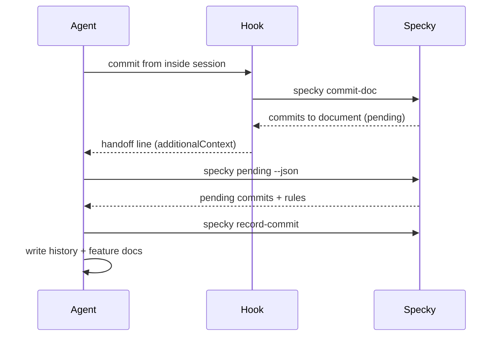

# Ai — Skill Handoff

## What It Does
When specky's documentation provider is set to `agent` and a commit is made from inside that agent's own session, specky hands the documentation work back to the running agent instead of starting a fresh headless copy of it. The agent then writes the history docs for those commits (and updates any feature docs they touch) using skills it already has in context. This keeps documentation inside a session that already knows the repo, rather than a cold copy with no tools.

## How It Works
1. **A commit runs inside the agent's session** while `provider = "agent"` is configured.
2. **The git hook calls `specky commit-doc`**, which detects that the commit came from inside that agent's own session.
3. **specky records the commits as pending** and prints a line telling the session agent to run the `document-commits` skill.
4. **The hook passes that line back to the agent** as session context.
5. **The `document-commits` skill lists pending commits** with `specky pending --json`.
6. **The skill writes a history doc for each commit** and updates any feature doc those commits changed, using `specky record-commit` to mark them done.
7. **`specky document` in the same session** points the agent at the `document-domain` skill instead of running headless.

## Outcomes
| Outcome | Meaning |
|---|---|
| Agent documents the commits itself | The session agent ran `document-commits`, wrote the history and feature docs, and marked the commits recorded. |
| Headless provider still runs | A non-`agent` provider (Anthropic, Bedrock, OpenAI-compatible, `command`) documented the commit the way it always did. |
| Handoff disabled by config | `[ai] skill_handoff = false` turned the feature off; specky behaves as before. |

## Edge Cases

| Situation | What happens | Why |
|---|---|---|
| Commit is made from a terminal or CI | Nothing is handed off; specky documents the commit as before. | The hook only hands off when the commit came from inside the agent's session. |
| Provider is not `agent` (Anthropic, Bedrock, OpenAI-compatible, `command`) | Nothing changes; the provider documents the commit as before. | Handoff is specific to `provider = "agent"`. |
| Agent sets no session marker (Kiro, Cursor) | The commit is documented by specky as before. | Handoff depends on the agent's session env markers, which those agents don't set. |
| Commit is made from a Devin Desktop session | Handoff fires like it does for the other agents. | Devin sets no marker of its own, but every Desktop shell inherits `VSCODE_IPC_HOOK` pointing into the app's data directory — `…/Application Support/Devin/…` where VS Code's says Code and Windsurf's says Windsurf — so that path is the marker. |
| `[ai] skill_handoff = false` | Handoff is skipped; specky documents the commits itself. | This is the explicit opt-out. |
| `specky document` is run inside the agent's session | The agent is pointed at the `document-domain` skill instead of a headless run. `--headless` restores the old behaviour. | The session agent already has the repo in context. |
| The hook's stdout would normally never reach the agent | The handoff line is returned as hook `additionalContext` instead. | Plain hook stdout doesn't reach the agent. |

## Acceptance Tests

| Given | When | Then |
|---|---|---|
| `provider = "agent"` and a commit made inside that agent's session | The git hook fires | specky prints `specky: commits to document: …` and leaves the commits pending for the `document-commits` skill. |
| The handoff line is produced by the hook | The hook returns | The line is delivered to the agent as `additionalContext` in a PostToolUse hook output. |
| Commits are pending | The `document-commits` skill runs | It lists them with `specky pending --json` and records each with `specky record-commit`, writing history and feature docs. |
| `provider = "agent"` and `specky document` runs inside the session | The command runs | The agent is pointed at the `document-domain` skill; `--headless` restores the old headless behaviour. |
| Provider is Anthropic, Bedrock, OpenAI-compatible, or `command` | A commit is made | Nothing is handed off; specky documents the commit as before. |
| A commit is made from a terminal or CI | The hook fires | No handoff; specky documents the commit as before. |
| The agent sets no session marker (Kiro, Cursor) | A commit is made | No handoff; specky documents the commit as before. |
| `provider = "agent"`, `agent = "devin"`, and `VSCODE_IPC_HOOK` points into `…/Devin/…` | A commit is made | specky hands the commits off to the `document-commits` skill. |
| `VSCODE_IPC_HOOK` points into VS Code's or Windsurf's data directory | specky checks for a Devin session | It is not treated as a Devin session. |
| `[ai] skill_handoff = false` | A commit is made inside an `agent` session | Handoff is skipped and specky documents the commits itself. |
