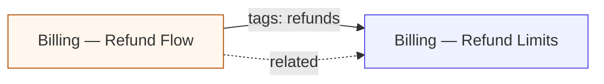

# Catalog — Feature and Workflow Graph

## What It Does
The catalog answers "what documentation exists, and how is it connected?" It lists every doc classified as a **feature** or a **workflow**, groups them by **tag**, and draws a graph of links between them — either as machine-readable data or as a Mermaid diagram. It is read-only: it never writes docs, it only reports on what the Index already knows.

## How It Works
1. **Read the Index, not the files.** All four commands query the `documents` table, so `specky index` must have run at least once first. With a stale or missing Index, the commands report stale or empty results rather than re-reading `specs/`.
2. **Exclude unclassified docs.** Only docs whose frontmatter carries a `type` of `feature` or `workflow` are considered. A note, a `specs/history/<sha8>.md` micro-doc, or a root index like `MODULES.md` is invisible — not listed, not graphed, not counted under a tag.
3. **List by type or by tag.** `specky features` and `specky workflows` print one line per doc — path, title, tags, commit count, and an "ask: <owner>" suffix if an `owner:` is set. `specky tags` groups the same docs under each tag, alphabetically by tag. Both are also exposed as MCP tools (`list_features`, `list_workflows`, `list_tags`).
4. **Build the graph.** `specky graph` emits a Mermaid `flowchart LR` block: one node per classified doc, plus edges from two sources. An edge joins a **workflow** to a **feature** that shares at least one tag (label `tags: <the shared tags>`), and a separate edge follows each hand-authored `related:` entry in a doc's frontmatter. `get_graph` returns the same graph as `{nodes, edges}` data.
5. **Colour nodes by type.** Features render with an indigo fill, workflows with amber.
6. **Draw tag edges with solid arrows, `related:` edges with dashed ones.** The arrow style is the only visual difference between the two link kinds.
7. **Never duplicate an edge.** Edge pairs are deduplicated, so a `related:` pointer between two docs already linked by a shared tag adds nothing.

*A workflow links to features it shares a tag with; a `related:` pointer is drawn dashed.*

## Outcomes
| Command / tool | Result |
|---|---|
| `specky features` / `specky workflows` | One line per matching doc; if none exist, prints "none yet — run `specky tag` to classify existing docs" |
| `specky tags` | Tag (count) header, then each doc under it; if there are no tags at all, the same "none yet" hint |
| `specky graph` | A fenced Mermaid `flowchart LR` block on stdout |
| `get_graph` (MCP) | `{nodes: [...], edges: [...]}` — each node has id, path, title, type; each edge has from, to, reason |
| `list_tags` (MCP) | `{tag: [doc, ...]}` |
| Any handler failure | One line on stderr, `specky <command>: <message>`, exit code 1 |

## What Surprises Readers
- **Feature-to-feature and workflow-to-workflow edges are never invented from tags.** Two features sharing the tag `refunds` are *not* linked. Tag edges only ever point from a workflow to a feature, so the graph is deliberately one-directional and bipartite by tag. Only a hand-authored `related:` can connect two features, or two workflows.
- **A `related:` entry that does not resolve is silently dropped.** The value must be `<domain>/<topic>` (e.g. `billing/refund-limits`), with no `specs/` prefix and no `.md` suffix, and it must match a classified doc. A typo, a path including `specs/`, or a pointer to an unclassified doc produces no edge and no warning.
- **A `related:` entry does not have to be reciprocated.** If A's frontmatter names B, the edge exists even if B never names A, and the Mermaid arrow points one way.
- **`related:` is hand-written and preserved across regeneration**, unlike type and tags, which the classifier writes on every automatic update.
- **Titles are escaped for two characters only in Mermaid output.** `]` becomes `#93;` and `"` becomes `#quot;`, because either one silently truncates or breaks the node label in the renderer. Characters a quoted label already survives — `(`, `)`, `|`, `<`, `>`, `#` — are left as themselves, so a title renders readably rather than as entity codes.
- **Node ids are mechanical, not friendly.** They are the doc path with non-alphanumerics replaced by underscores, so `specs/billing/refund-flow.md` becomes `specs_billing_refund_flow`.
- **Commit counts come from the post-commit hook's links, not from git history.** A fresh clone that has not run `specky sync` or committed anything through the hook shows `0 commits` for every doc, even if its code has a long history. The broader "which files does this doc cover" map used by `specky check` is derived from git instead; see [cli/check](../cli/check.md).
- **The graph is a command-line and MCP output only.** Nothing in the static viewer or the chat companion draws it: the viewer shows type/tag filters and per-doc "Related" links. The blank page at a docs root is a doc that was never classified, not a hidden graph.
- **Unclassifiable docs hide in whole domains.** The tagger skips the `root` and `history` domains outright, so a doc at the top of the docs tree can never be listed or tagged without being moved into its own domain folder.

## Acceptance Tests
| Given | When | Then |
|---|---|---|
| A workflow `specs/billing/refund-flow.md` (tags `refunds, billing`) and a feature `specs/billing/refund-limits.md` (tag `refunds`) are indexed | `specky graph` is run | Three nodes; an edge `refund-flow → refund-limits` with reason `tags: refunds` |
| A feature `specs/search/indexing.md` declares `related: [billing/refund-flow]` | The graph is built | An edge `search/indexing → billing/refund-flow` with reason `related`, drawn `-.->`; tag edges drawn `-->` |
| A workflow declares `related:` to a feature it already shares a tag with | The graph is built | Exactly one edge for that pair, not two |
| A doc at `specs/notes.md` has no `type:` frontmatter | `specky features` runs | The doc does not appear; the count of nodes in the graph excludes it |
| A doc declares `related: [billing/refund-limits.md]` (with suffix) or a path that doesn't exist | The graph is built | No edge is added, and no warning is printed |
| Two features both carry the tag `billing`, and no workflow does | The graph is built | No edge between the two features |
| A classifiable doc's title is `Billing [v2] (draft) "quoted" | #edge <b>` | `specky graph` is run, then rendered | The label has exactly the `]` and `"` substituted, and `(draft)`, `|`, `#edge`, `<b>` survive literally |
| Docs are indexed with one commit linked to `specs/billing/refund-flow.md` and none to `specs/billing/refund-limits.md` | `specky workflows` runs | The workflow line shows `(1 commits)` and the feature line shows `(0 commits)` |
| A doc carries `tags: [refunds, billing]` and another carries `tags: [refunds]` | `specky tags` runs | `refunds (2)` appears first alphabetically, listing both docs; `billing (1)` lists only the first |
| No docs carry `type:` at all | `specky features` runs | Prints `specky features: none yet — run \`specky tag\` to classify existing docs` |
| The provider or config is broken | `specky graph` runs | One stderr line `specky graph: <message>`, no traceback, exit code 1 |
| A commit exists with no linked docs | `commit_info(sha)` is called | `tags` and `docs` are both empty lists, not an error |

**Not testable from this doc:** whether a given real-world repo's graph is *correct* depends on tags the classifier assigned, which is out of scope here — the tag vocabulary itself is covered by [documentation/feature-classification-and-tags](../documentation/feature-classification-and-tags.md).
