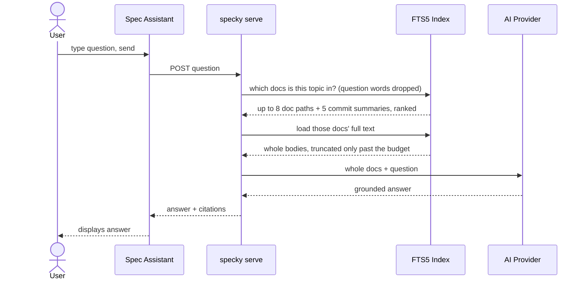

# Chat — Local RAG Server

## What It Does

Optional chat widget on the generated docs site. Lets you ask questions and get answers pulled directly from your docs and commit history, grounded and cited. Runs on your machine — no cloud, no API key exposure, works offline. Site works fully without it.

## How It Works

1. **Start the server** — Run `specky serve`; it listens on `127.0.0.1:8420` unless `--port`/`--host` or the `[serve]` table in `specky.toml` say otherwise. A page served on another port still finds its own server: the widget asks its own origin first and only falls back to the port baked in at render time.
2. **Ask a question** — Click the **Spec Assistant** button in the viewer, type your question.
3. **The index locates the docs, it doesn't answer from them** — FTS5 ranks matching docs (up to 8) and commit summaries (up to 5). The search hit is used to decide *which* docs the question is about, and nothing more.
4. **A question is ranked on what it's about, not on how it's phrased** — The words that make a sentence a question ("how", "is", "does", "what") are dropped before the index is searched, and a term in a doc's file name, title or tags counts for more than the same term buried in a long body. Otherwise every question ranks the pages that mention every term — `MODULES.md`, `GLOSSARY.md`, `PRODUCT.md` — above the one doc that answers it. A question of nothing but question words is searched as typed rather than not at all.
5. **Those docs are sent whole** — Each matching doc's full text goes to the provider, not the fragment around the match. A ~40-token excerpt is enough to rank a doc and nowhere near enough to answer from it; sending excerpts produced answers of the form "the docs mention payment settlement, but its contents are not in the context".
6. **The context has a budget, and says when it binds** — Doc bodies share a total character budget with a per-doc cap, so one enormous doc can't crowd out the others. A doc past the cap is truncated and marked as truncated; a doc past the total budget falls back to its search excerpt and is labelled as an excerpt, so the answer names it as worth reading instead of answering from a fragment. The best-ranked doc is always sent whole, even when it alone fills the budget. The budget, not the number of hits, is what bounds a question's cost — which is why 8 docs are pulled rather than a nervous 3.
7. **A commit summary is sent whole too** — It is already a summary, so it needs no excerpting; only its own paragraph-sized bound applies.
8. **AI generates answer** — Calls your configured provider (Anthropic, OpenAI-compatible, or local CLI) with context + question.
9. **Widget shows answer** — Displays response with citations showing which doc path or commit sha each part came from.

## Outcomes

| Server Status | Chat Widget Behavior |
|---|---|
| Running | **Spec Assistant** works; answers appear with citations |
| Stopped | **Spec Assistant** shows an inline message to start `specky serve` |
| Running, no matching context | AI responds: "Couldn't find the answer in your docs" |

## What one question sends

| Context | Sent as | Bound |
|---|---|---|
| Best-ranked matching doc | Whole body, always | Per-doc cap (24,000 characters) |
| Further matching docs | Whole body while the budget lasts | 8 ranked docs, 60,000 characters of doc bodies in total |
| A doc past the total budget | Its search excerpt, labelled as an excerpt | ~40 tokens around the match |
| A doc past the per-doc cap | Head of the body, marked truncated | Per-doc cap |
| A commit's micro-doc summary | Whole summary | 2,000 characters |

## Acceptance Tests

| Scenario | Given | When | Then |
|---|---|---|---|
| Chat enabled | Server running; docs indexed | User opens the Spec Assistant and types a question | Widget displays answer with doc paths/commit shas cited |
| Graceful degradation | Server stopped | User opens the Spec Assistant and asks | Widget shows prompt to start server; rest of site (nav, search, pages) works normally |
| Safe search | Server running | User asks question with FTS5 operator syntax (e.g., `"what -about"` or `"near*"`) | Server treats operators as literal text; search succeeds with no errors |
| Empty index | Server running; docs exist but question matches nothing | User asks very specific or out-of-scope question | AI says it couldn't find the answer in the docs; does not fabricate |
| Whole doc is the grounding | An indexed doc whose answer is in its middle sections | A question that matches its opening line | The doc's full body is sent, not the fragment around the match |
| Budget binds on the extra docs | Five matching docs whose bodies exceed the total budget | A question matching all five | The best-ranked ones are sent whole; the rest are sent as excerpts and labelled as excerpts |
| The top hit is never excerpted | One matching doc larger than the whole budget | A question matching it | It is still sent whole, up to the per-doc cap |
| Truncation is declared | A doc longer than the per-doc cap | A question matching it | The body is cut and the cut is stated in the context, so the model cannot mistake half a doc for all of it |
| Commit summaries are not excerpted | A commit with a micro-doc summary | A question matching it | The whole summary is sent |
| Phrasing doesn't outrank topic | An index page repeating "how", "is" and "what"; one doc named for the topic | "how is a refund implemented" | The topic's own doc ranks first; the index page is not pulled in on the strength of the question words |
| A doc's own name counts for more than a mention | `chat/chat-attachments.md`, plus a long billing doc mentioning attachments in passing | "how do chat attachments work" | `chat/chat-attachments.md` ranks first |
| An all-question-word question still searches | Any indexed repo | "what does this do" | The question is searched as typed rather than reduced to nothing |
