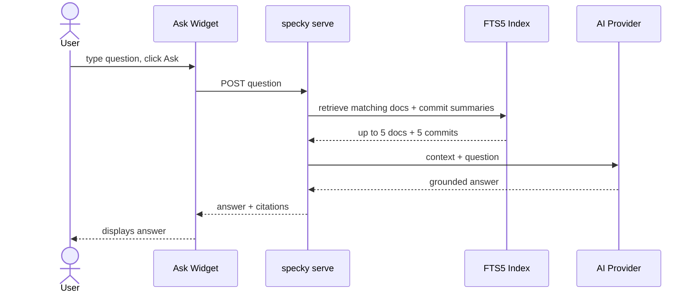

# Chat — Local RAG Server

## What It Does

Optional chat widget on the generated docs site. Lets you ask questions and get answers pulled directly from your docs and commit history, grounded and cited. Runs on your machine — no cloud, no API key exposure, works offline. Site works fully without it.

## How It Works

1. **Start the server** — Run `specky serve`; it listens on `127.0.0.1:8420` unless `--port`/`--host` or the `[serve]` table in `specky.toml` say otherwise. A page served on another port still finds its own server: the widget asks its own origin first and only falls back to the port baked in at render time.
2. **Ask a question** — Click "Ask" button in the viewer, type your question.
3. **Server retrieves context** — Searches FTS5 index for matching docs and commit summaries (up to 5 of each).
4. **AI generates answer** — Calls your configured provider (Anthropic, OpenAI-compatible, or local CLI) with context + question.
5. **Widget shows answer** — Displays response with citations showing which doc path or commit sha each part came from.

## Outcomes

| Server Status | Chat Widget Behavior |
|---|---|
| Running | "Ask" button works; answers appear with citations |
| Stopped | "Ask" button shows inline message: "Start `specky serve` to enable chat" |
| Running, no matching context | AI responds: "Couldn't find the answer in your docs" |

## Acceptance Tests

| Scenario | Given | When | Then |
|---|---|---|---|
| Chat enabled | Server running; docs indexed | User clicks "Ask" and types a question | Widget displays answer with doc paths/commit shas cited |
| Graceful degradation | Server stopped | User clicks "Ask" | Widget shows prompt to start server; rest of site (nav, search, pages) works normally |
| Safe search | Server running | User asks question with FTS5 operator syntax (e.g., `"what -about"` or `"near*"`) | Server treats operators as literal text; search succeeds with no errors |
| Empty index | Server running; docs exist but question matches nothing | User asks very specific or out-of-scope question | AI says it couldn't find the answer in the docs; does not fabricate |
