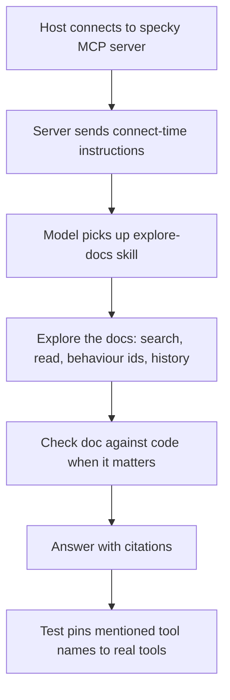

# Chat — Mcp Host Guidance

## What It Does
When an MCP host connects to the specky server, the server hands the host's model a short set of instructions telling it to check the repo's docs before reading source code for behaviour questions. It points the model at a bundled `explore-docs` skill that spells out the lookup, so a question like "how do refunds work?" gets a cheaper, citable answer from the docs instead of a read through the code. This matters most for hosts like Claude Code that defer MCP tools and show the model only their names.

## How It Works
1. **Connect**: the host connects to the specky MCP server.
2. **Receive instructions**: the server sends its connect-time instructions, telling the model to check specky first for what a feature does, how a flow works or why it changed, to cite the doc, and to verify against the doc's `sources` before changing code on its word. Which instructions it sends is decided once, when the server starts: only a repo whose docs root holds markdown gets "check specky first". Anywhere else (no docs root, a docs root with no markdown, or not a git repo at all) it gets a short note that specky has nothing to answer from there, that its tools should be left alone unless the user asks about specky, and that `/specky:setup` sets a repo up.
3. **Pick up the skill**: the host's model has the bundled `explore-docs` skill available, which spells out the lookup — search, read, the doc's behaviour ids, its history, and the sources check.
4. **Explore the docs**: on a behaviour question, the model follows the skill: `search_docs`, then `read_doc`, then `doc_behaviours` for the doc's stable behaviour ids, then `search_history` or `commits_for_doc` for the why when asked.
5. **Check against the code when it matters**: before an answer drives a code change, the model compares the doc's last commit against its sources' to catch a doc that may be stale.
6. **Answer with citations**: the model leads with the short answer and the doc it came from, cites every doc path and behaviour id the answer rests on, and says what it verified in code.
7. **Tool names stay real**: a test pins every tool name the instructions and the skill mention to a tool that actually exists.

## Outcomes
| End state | What it means |
|---|---|
| Behaviour question answered from the docs | The model cites the doc path (and behaviour id) the answer rests on, having checked the doc first. |
| Doc checked against code before a change | The model compared the doc's last commit with its sources' and said what it verified before the answer drives code changes. |
| Gap flagged | The docs don't cover the question; the model says so and points at writing the missing doc. |
| Tool-name test fails | A tool name the instructions or skill mention doesn't exist, and the test catches it. |

## Edge Cases
| Situation | What happens | Why |
|---|---|---|
| The server starts in a repo with no specky docs | The model is told to leave the tools alone unless the user asks about specky. | The plugin is enabled per user, so the server starts in every repo the user opens. "Check it first" there is a round trip that can only come back empty, on every behaviour question. |
| The docs root exists but holds no markdown (an OpenAPI `specs/`) | Treated as no docs. | That tree belongs to something else, not to specky. |
| The repo has no docs tree at all | The skill says so in one line and answers from the code, without running `specky index` or `specky init`. | Setting specky up is the user's call, not a side effect of a question. |
| Host defers MCP tools (Claude Code) | The host lists only tool names, so the connect-time instructions are what tell the model to check specky first. | Without them nothing tells the model a behaviour question has a cheaper, citable answer here. |
| Question is about the code itself (where a function is defined, what calls it) | The skill hands those questions to code search, not the docs. | The docs state behaviour; they aren't a substitute for code when the question is about the code. |
| `search_docs` says nothing is indexed, but docs exist | The skill runs `specky index` (no AI call) and searches again. | Search needs an index to have anything to find. |
| `search_docs` misses on the user's words | The skill retries with the terms `specs/GLOSSARY.md` uses. | The docs use those exact terms. |
| A doc's source changed after the doc's last commit | The doc may be stale; the skill reads that source to confirm. | Docs state intended behaviour and can lag the code. |
| Code and doc disagree | The skill says so plainly, offers to update the doc, and doesn't pick one silently. | The code is what runs; the doc is what was intended. |
| Plain "how does X work?" with no change in sight | The doc is the answer; the skill doesn't audit the code. | Auditing every question would cost more than the question is worth. |
| The MCP server isn't connected | The CLI covers the same ground: `specky search "<query>"` after `specky index`, then read the matching files under the docs root. | The skill needs a fallback when the tools aren't there. |

## Acceptance Tests
| Given | When | Then |
|---|---|---|
| A host connects to the specky MCP server | The connection is made | The server sends connect-time instructions telling the model to check specky first for behaviour questions, cite the doc, and verify against the doc's `sources` before changing code. |
| The bundled `explore-docs` skill is available to the model | A behaviour question arrives | The model follows the skill's lookup: search, read, the doc's behaviour ids, its history, and the sources check. |
| The instructions and skill mention a tool name | The tool-name test runs | Every mentioned tool name is pinned to a tool that actually exists. |
| The server starts in a repo whose docs root holds no markdown, or outside a git repo | The host connects | The instructions tell the model to leave specky's tools alone unless the user asks, and name `/specky:setup`. |
| The repo has no docs tree | A behaviour question arrives | The skill says the repo doesn't use specky and answers from the code, without running `specky index`. |
| The host is Claude Code (defers MCP tools) | It lists only tool names | The connect-time instructions are what tell the model to check specky first. |
| A question is about where a function, class or file is defined | The skill is consulted | The skill hands the question to code search. |
| Docs exist and `search_docs` says nothing is indexed | It is caught | The skill runs `specky index` (no AI call) and searches again. |
| `search_docs` misses on the user's words | It is caught | The skill retries with the terms `specs/GLOSSARY.md` uses. |
| A doc's source changed after the doc's last commit | A code change is in sight | The skill reads that source to confirm before the answer drives the change. |
| Code and doc disagree | They are compared | The skill says so plainly, offers to update the doc, and doesn't pick one silently. |
| The MCP server isn't connected | A behaviour question arrives | The CLI covers the same ground: `specky search "<query>"` after `specky index`, then read the matching files under the docs root. |
