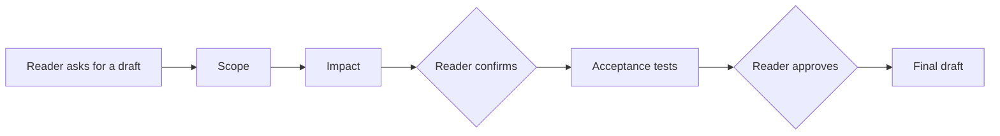

# Chat — Spec Drafting Workflow

## What It Does

When a reader asks the Spec Assistant to draft a spec, it doesn't write the doc straight away. It first settles where the change belongs, what it changes about what the docs already promise, and how anyone would know it was done — asking the reader wherever a guess would be costly — and only then writes the draft, with the acceptance tests the reader approved. It works from the docs and their git history, never the source code, and nothing is written to disk: the finished draft is for the reader to copy.

Drafting runs over a read-only docs-and-history toolbox (`doc_tools.py`) that the MCP server also exposes, and the explore/draft_spec prompts are built from the same rules as the workflow. The draft's state lives in the reader's tab (`spec_draft.py`), is re-validated on every step, and the server keeps none of its own.

## How It Works

1. **Reader asks for a draft** — a request like "draft a spec for retrying failed questions" (or any question with the **Draft spec** chip pinned) starts the workflow instead of an ordinary answer.
2. **Scope** — the model searches the docs and names the domain, the doc the change updates or the new topic it needs, and whether it is a feature or a workflow.
3. **Impact** — with the target doc and its numbered behaviours in hand, the model lists the sections that change and every behaviour that changes, with what happens today and what will happen after.
4. **Reader confirms the impact** — **Write acceptance tests** moves on.
5. **Acceptance tests** — the model writes Given/When/Then rows covering every changed or new behaviour, keeping the existing rows that still hold.
6. **Reader approves the tests** — **Approve tests** moves on.
7. **Final draft** — the model writes the whole doc in the project's convention, specky inserts the approved table into it word for word, and the panel shows the draft with **Copy markdown** and, for an update, what changes in the existing doc.

## Outcomes

| Outcome | What it means |
|---|---|
| Question | The workflow is waiting for the reader to pick an option or type an answer |
| Impact | Where the change goes and what it changes, waiting for the reader to confirm or correct it |
| Acceptance tests | Given/When/Then rows waiting for the reader to approve or correct them |
| Final draft | The complete doc, ready to copy; typing a correction revises it again |
| Error | A step couldn't finish; the previous step's buttons work again so the reader can retry |

## Edge Cases

| Situation | What happens | Why |
|---|---|---|
| More than one place is plausible, or the request is too vague to place | The reader is asked one question with clickable options | A doc in the wrong module is a doc nobody finds; one click is cheaper |
| The reader clicks an option that names a doc or a domain | The scope is settled without another model call | The option already says where it goes |
| The reader typed `@feature:<doc>` | The scope step is skipped and the draft updates that doc | The reader has already said which doc |
| The reader typed `@module:<domain>` | The model places the change in that domain unless it clearly doesn't fit, and asks if so | The mention is a strong hint, not an order |
| The model stops without placing the change | The reader is asked which module it belongs to, with the best-matching domains as options | A question the reader can answer beats an error they can't |
| The model stops without working out the impact | An error asks the reader to try again or add detail | There is no safe default for what a change changes |
| A behaviour in the request is genuinely open | The impact step asks the reader a question, then resumes | Two readings would produce different tests |
| The reader types a correction at any step | That step runs again, shown its previous answer and the correction | Revising is cheaper and more faithful than starting over |
| **Change module** is clicked | The workflow goes back to Scope | The reader disagreed with where it was placed |
| The model rewrites the approved tests in the final draft | The approved table replaces whatever the model wrote there | What was approved is what ships |
| The final draft drops or guts sections of the doc it updates | A warning is shown above the draft | Losing hand-written content is the worst outcome; the reader decides |
| The provider has no tool channel (`provider = "command"`) | Scope and Impact each run as one call, with matching docs pasted in, and the answer is checked the same way | The workflow must work with every provider |
| The reader navigates to another page mid-draft | The current step is rebuilt there from the tab's session storage | The draft's state lives in the reader's tab, not the server |
| `specky serve` restarts mid-draft | The next step still works | The server keeps no draft state of its own |
| The state sent back has been tampered with or no longer checks out | The step is refused with a message to start again | Every field is re-validated; a target path is always rebuilt, never trusted |
| The reader clicks **Cancel draft** or **New** | The draft is dropped | What they type next is a new question |

## Acceptance Tests

| Scenario | Given | When | Then |
|---|---|---|---|
| Happy path | The docs index is built | Reader asks "draft a spec for retrying failed questions in the panel" | The Impact card names `specs/chat/…` as the target and lists changed behaviours with Today and After |
| Confirm impact | The Impact card is showing | Reader clicks **Write acceptance tests** | A Given/When/Then table appears with an **Approve tests** button |
| Approve tests | The acceptance card is showing | Reader clicks **Approve tests** | The final draft appears with **Copy markdown**, and its Acceptance Tests section is exactly the approved table |
| Ambiguous place | Two modules could own the change | Reader asks for a draft | A question card appears with an option per module |
| One-click scope | A question card offers a doc as an option | Reader clicks it | The Impact card appears for that doc without another scope step |
| Feature mention | `specs/chat/spec-assistant-panel.md` exists | Reader asks "@feature:spec-assistant-panel draft retries" | No scope question is asked; the target is that doc |
| Scope never decided | The model stops without placing the change | Reader asks for a draft | A question card asks which module it belongs to |
| Impact never decided | The model stops without an impact | Reader asks for a draft | An error is shown and the previous step's buttons work again |
| Correction | The Impact card is showing | Reader types "retry twice, not once" | A revised Impact card appears |
| Change module | The Impact card is showing | Reader clicks **Change module** | The workflow returns to Scope |
| Model rewrites tests | Tests are approved | The model writes a different table in the draft | The draft carries the approved table, not the model's |
| Lost content | The draft would drop a section of the existing doc | The final draft appears | A warning names the dropped section |
| No tool channel | `provider = "command"` | Reader asks for a draft | The Impact card still appears |
| Navigation | A draft is waiting on its Impact card | Reader opens another page | The Impact card is rebuilt there with working buttons |
| Tampered state | The stored state points outside the docs tree | Reader takes the next step | The step is refused with a message to start again |
| Cancel | A draft is in progress | Reader clicks **Cancel draft** | The reply bar disappears and the next question is answered as a new one |
| Nothing written | Any draft | The final draft appears | No file under `specs/` has changed |
