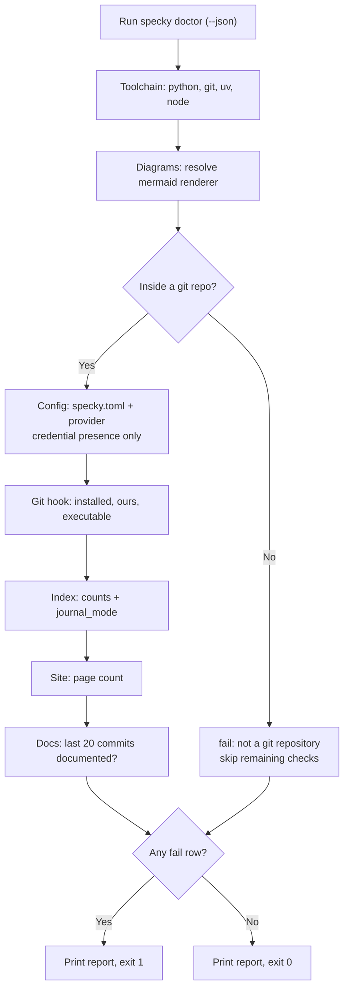

# Cli — Doctor

## What It Does

`specky doctor` answers one question: *why didn't a doc get generated?* It reports the state of every
moving part of a specky installation — the toolchain it shells out to, the mermaid renderer, the AI
provider configuration, the post-commit git hook, the SQLite index, the rendered site, and whether
recent commits actually got documented — as `[ok]` / `[warn]` / `[fail]` lines grouped by section.

It is free and fast: no AI provider is ever called, and no check walks the repository's full history,
so it stays sub-second on a repo with hundreds of thousands of commits.

`fail` is reserved for "specky cannot work here and won't fix itself". Anything a plain command would
fix — no config, no index, no rendered site — is a `warn`, so the command exits 0 on a repo that has
simply never been set up and can be dropped into CI as-is. Exit 1 means something needs a human.

## How It Works

1. **Toolchain** — Report the running Python, then `git`, `uv` and `node` versions. A missing `git` is
   a `fail` (specky is git-shaped); missing `uv` or `node` are `warn`s, because each is only needed
   for one optional path (running from a checkout, rendering diagrams).
2. **Diagrams** — Ask `mermaid_tool` which copy of the Node renderer is installed. If none is, list
   every directory that was searched and point at `specky setup-diagrams`, since the failure mode
   otherwise is invisible: diagrams silently stay fenced text.
3. **Repo** — Resolve the repository root with `git rev-parse --show-toplevel`. Outside a repo this is
   a `fail` and every later check is skipped rather than reported against the wrong directory.
4. **Config** — If `specky.toml` is absent, `warn` and point at `specky init`. Otherwise parse it and
   build a provider through `load_provider_from_toml()` — the same construction path generation uses,
   so this check can't drift from what the hook will actually do. Report the configured provider,
   whether the credential's environment variable is **set** (never any part of its value), and
   whether a `command` provider's executable is on `PATH`.
5. **Git hook** — A missing `post-commit` hook is a `warn`. A hook that exists but has no specky
   marker is a `fail`: `install-git-hook` refuses to overwrite someone else's hook, so this state
   needs a human to merge the two. A hook that isn't executable is also a `fail`, because git skips
   it without a word, which looks exactly like specky being broken.
6. **Index** — Open `.specky/index.db` read-only, report doc and commit counts, and `warn` if
   `journal_mode` isn't `wal` (that's the reason a commit landing during `specky serve` could hit a
   locked database). A file that's missing its tables is a `fail` pointing at `specky index`.
7. **Site** — Report the page count under `.specky/site`, or `warn` that `specky render-html` hasn't
   run yet.
8. **Docs backlog** — Over the last 20 commits only, skipping specky's own doc-sync commits, count
   how many have no `specs/history/` doc. This answers "is the hook working *now*"; counting the full
   backlog is `specky sync --dry-run`'s job, which is where the message sends the reader.

Each section is wrapped so that a check which itself throws becomes one `fail` row rather than a
traceback — this is the command someone runs when things are already broken.

## Flags

| Flag | Purpose |
|------|---------|
| `--json` | Emit the checks as a JSON array of `{section, status, detail}` objects for machine use |

## Outcomes

| Condition | Behavior |
|-----------|----------|
| Fully configured, working repo | Every section `[ok]`; exit 0 |
| Fresh repo — no config, hook, index or site | Four `[warn]` lines, each naming the command that fixes it; exit 0 |
| Run outside a git repository | One `[fail]` row; repo-dependent checks are skipped entirely; exit 1 |
| `specky.toml` isn't valid TOML | `[fail]` with the parse error, no traceback; exit 1 |
| Provider config is incomplete (e.g. no `base_url`) | `[fail]` carrying the same `ConfigError` the next commit would hit; exit 1 |
| Credential env var named in config is unset | `[fail]` naming the variable; exit 1 |
| Credential env var is set | `[ok]` saying it is set — the value is never printed, in any mode |
| A foreign `post-commit` hook is installed | `[fail]`, since `install-git-hook` won't overwrite it |
| specky's hook is installed but not executable | `[fail]` — git silently never runs it |
| Index exists but has no tables | `[fail]` pointing at `specky index`; exit 1 |
| Index isn't in WAL mode | `[warn]` — reads and writes can collide; re-run `specky index` |
| Mermaid renderer not installed anywhere | `[warn]` listing the directories searched; diagrams stay plain text |
| Some recent commits have no history doc | `[warn]` with the count, pointing at `specky sync --dry-run` |
| A check raises an unexpected error | That one section becomes a `[fail]` row; every other check still reports |

## Acceptance Tests

| Scenario | Given | When | Then |
|----------|-------|------|------|
| Fresh repo is not a failure | A git repo with no `specky.toml`, hook, index or site | Run `specky doctor` | Config, hook, index and site are each `warn`; exit code is 0 |
| Broken hook fails | A `post-commit` hook that specky didn't write | Run `specky doctor` | The git-hook section is `fail` and says `install-git-hook` won't overwrite it; exit 1 |
| Non-executable hook fails | specky's own hook installed with mode 644 | Run `specky doctor` | The git-hook section is `fail` naming the permission; exit 1 |
| Secrets never leak | Config names `api_key_env` and that variable holds a real key | Run `specky doctor` | Output says the variable is set; the value appears nowhere in the report |
| Unparseable config fails cleanly | `specky.toml` containing `[ai` | Run `specky doctor` | One `fail` row with the TOML error; no traceback; exit 1 |
| Provider command missing | `[ai] provider = "command"` naming a binary not on `PATH` | Run `specky doctor` | Config section is `fail` naming the executable; exit 1 |
| Counts are reported | Repo with one doc, indexed | Run `specky doctor` | Index section is `ok` and reports the doc and commit counts |
| Backlog probe is bounded | Any repo | Run `specky doctor` | The `git log` call is capped at 20 commits — history is never fully walked |
| specky's own commits don't count | A repo whose newest commit is a `docs: sync specky docs [skip specky]` commit | Run `specky doctor` | That commit isn't counted as an undocumented one |
| Machine-readable output | Any repo | Run `specky doctor --json` | Valid JSON array of `{section, status, detail}` objects, statuses drawn from ok/warn/fail |
| Outside a repo | Current directory isn't a git repo | Run `specky doctor` | A `fail` row for the repo check; config/hook/index/site rows are absent; exit 1 |
