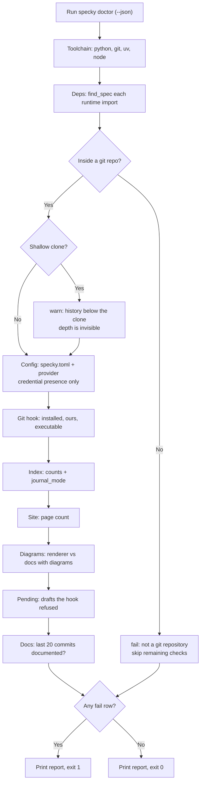

# Cli — Doctor

## What It Does

`specky doctor` answers one question: *why didn't a doc get generated?* It reports the state of every
moving part of a specky installation — the toolchain it shells out to, specky's own Python
dependencies, the mermaid renderer, the AI provider configuration, the post-commit git hook, the
SQLite index, the rendered site, any doc update the hook refused to write, and whether recent commits
actually got documented — as `[ok]` / `[warn]` / `[fail]` lines grouped by section.

It is free and fast: no AI provider is ever called, and no check walks the repository's full history,
so it stays sub-second on a repo with hundreds of thousands of commits.

`fail` is reserved for "specky cannot work here and won't fix itself" — including an install whose
own dependencies aren't there, which no specky command repairs. Anything a plain command would fix —
no config, no index, no rendered site — is a `warn`, so the command exits 0 on a repo that has simply
never been set up and can be dropped into CI as-is. Exit 1 means something needs a human.

## How It Works

1. **Toolchain** — Report the running Python, then `git`, `uv` and `node` versions. A missing `git` is
   a `fail` (specky is git-shaped); missing `uv` or `node` are `warn`s, because each is only needed
   for one optional path (running from a checkout, rendering diagrams).
2. **Dependencies** — Resolve each of specky's own runtime imports — `markdown`, `jinja2`, `mcp`,
   `anthropic`, `httpx` — with `importlib.util.find_spec`, in the interpreter `doctor` is running
   under, which is the interpreter the `specky` entry point uses. Resolving rather than importing, so
   the check costs nothing and runs no third-party module's top-level code. A missing one is a `fail`
   naming the module, what stops working without it, and the `uv tool install --editable <checkout>
   --force` that repairs *this* install. This exists because `uv tool install --editable` resolves
   dependencies once: a dependency added to `pyproject.toml` afterwards is absent from the installed
   tool while the code importing it ships from the checkout on every run, so `render-html` dies on
   `No module named 'markdown'` while every other section reads `[ok]`.
3. **Repo** — Resolve the repository root with `git rev-parse --show-toplevel`. Outside a repo this is
   a `fail` and every later check is skipped rather than reported against the wrong directory. Then
   ask `git rev-parse --is-shallow-repository`, and `warn` if it is. A shallow clone is the one repo
   state that makes every check below it *lie* rather than fail: the commits under the clone depth
   aren't undocumented, they're absent from `git log`, so the backlog probe reports a clean bill of
   health, `specky sync` finds nothing to backfill and `specky index` records a fraction of the
   history. CI runners and some cloud coding-agent VMs clone shallow by default, which is exactly
   where nobody is reading the output. Silent on a normal clone — an `[ok] not shallow` row would be
   noise on every developer machine.
4. **Config** — If `specky.toml` is absent, `warn` and point at `specky init`. Otherwise parse it and
   build a provider through `load_provider_from_toml()` — the same construction path generation uses,
   so this check can't drift from what the hook will actually do. Report the configured provider,
   whether the credential's environment variable is **set** (never any part of its value), and
   whether a `command` provider's executable is on `PATH`.
5. **Git hook** — A missing `post-commit` hook is a `warn`. A hook that exists but has no specky
   marker is a `fail`: `install-git-hook` refuses to overwrite someone else's hook, so this state
   needs a human to merge the two. A hook that isn't executable is also a `fail`, because git skips
   it without a word, which looks exactly like specky being broken. `SPECKY_DISABLE_HOOK` set in the
   environment is reported first, as a `warn`, because it makes every row under it moot — all three
   hooks can be installed and correct and still document nothing.
6. **Index** — Open `.specky/index.db` read-only, report doc and commit counts, and `warn` if
   `journal_mode` isn't `wal` (that's the reason a commit landing during `specky serve` could hit a
   locked database). A file that's missing its tables is a `fail` pointing at `specky index`.
7. **Site** — Report the page count under `.specky/site`, or `warn` that `specky render-html` hasn't
   run yet.
8. **Diagrams** — Ask `mermaid_tool` which copy of the Node renderer is installed, and count the
   docs (outside `specs/history/`) carrying a ```mermaid``` block. Installed is `ok`. Missing while
   any doc has a diagram is a `fail` naming how many and pointing at `specky setup-diagrams`:
   two things are silently broken then, not one — the viewer shows those diagrams as source text,
   and the write-time check that refuses a doc whose diagram doesn't parse has nothing to parse with,
   so it passes everything. This used to be a `warn`, and a repo whose docs were written by agents
   ran with both broken for weeks, because nobody reads a warning in an otherwise green report.
   Missing with no diagrams yet stays a `warn` listing every directory searched: nothing is broken,
   but the next workflow doc will need it.
9. **Refused drafts** — Count the drafts waiting in `.specky/pending/`, naming the first three. Those
   are regenerated docs the hook declined to write, because writing them would have dropped
   hand-written content or because they named a flag this CLI doesn't have. A `warn`, not a `fail`:
   nothing is broken and nothing was lost — a doc is just knowingly behind its code until someone
   reads the draft against the doc it would have replaced and then keeps it or deletes it. The hook
   says so once, into terminal output nobody scrolls back to; this is where it stays visible.
10. **Docs backlog** — Over the last 20 commits only, skipping specky's own doc-sync commits, count
    how many have no `specs/history/` doc. This answers "is the hook working *now*"; counting the
    full backlog is `specky sync --dry-run`'s job, which is where the message sends the reader.

Each section is wrapped so that a check which itself throws becomes one `fail` row rather than a
traceback — this is the command someone runs when things are already broken.



## Flags

| Flag | Purpose |
|------|---------|
| `--json` | Emit the checks as a JSON array of `{section, status, detail}` objects for machine use |

## Outcomes

| Condition | Behavior |
|-----------|----------|
| Fully configured, working repo | Every section `[ok]`; exit 0 |
| Fresh repo — no config, hook, index or site | Four `[warn]` lines, each naming the command that fixes it; exit 0 |
| Run outside a git repository | One `[fail]` row; repo-dependent checks are skipped entirely; exit 1 |
| `specky.toml` isn't valid TOML | `[fail]` with the parse error, no traceback; exit 1 |
| Provider config is incomplete (e.g. no `base_url`) | `[fail]` carrying the same `ConfigError` the next commit would hit; exit 1 |
| Credential env var named in config is unset | `[fail]` naming the variable; exit 1 |
| Credential env var is set | `[ok]` saying it is set — the value is never printed, in any mode |
| A foreign `post-commit` hook is installed | `[fail]`, since `install-git-hook` won't overwrite it |
| specky's hook is installed but not executable | `[fail]` — git silently never runs it |
| `SPECKY_DISABLE_HOOK` is set | `[warn]` first in the hook section — every fire returns without documenting anything |
| The repo is a shallow clone | `[warn]` naming `git fetch --unshallow`; the checks below it can only see the commits that were cloned |
| Index exists but has no tables | `[fail]` pointing at `specky index`; exit 1 |
| Index isn't in WAL mode | `[warn]` — reads and writes can collide; re-run `specky index` |
| Every runtime dependency imports | One `[ok]` row reporting how many were probed |
| A runtime dependency is missing from this environment | `[fail]` per missing module, naming what breaks and the `uv tool install --editable <checkout> --force` that fixes it; exit 1 |
| Mermaid renderer not installed, and no doc has a diagram yet | `[warn]` listing the directories searched |
| Mermaid renderer not installed, and docs carry ```mermaid``` blocks | `[fail]` naming how many docs and `specky setup-diagrams`; exit 1 |
| No refused drafts waiting | `[ok]` saying so |
| One or more refused drafts in `.specky/pending/` | `[warn]` with the count and the first three names; exit 0 |
| Some recent commits have no history doc | `[warn]` with the count, pointing at `specky sync --dry-run` |
| A check raises an unexpected error | That one section becomes a `[fail]` row; every other check still reports |

## Edge Cases

| Situation | What happens | Why |
|---|---|---|
| Run outside a git repository | One `[fail]`, and every repo-dependent check is skipped rather than run | Reporting them against the wrong directory would be worse than not reporting them |
| The clone is shallow | A `[warn]` naming `git fetch --unshallow` | It is the one repo state that makes every check below it *lie* rather than fail: the commits under the depth aren't undocumented, they're absent from `git log`. CI runners and cloud agent VMs clone shallow by default — exactly where nobody reads the output |
| The clone is not shallow | Nothing is printed for it | An `[ok] not shallow` row would be noise on every developer machine |
| A credential's environment variable is set | The row says it is set, and never prints the value | In any mode, including `--json` — a diagnostic someone pastes into an issue must be safe to paste |
| A runtime dependency is missing | A `[fail]` naming the module, what stops working, and the `uv tool install --editable <checkout> --force` that repairs *this* install | `uv tool install --editable` resolves dependencies once, so a dependency added later is absent from the installed tool while the code importing it ships from the checkout — `render-html` dies on `No module named 'markdown'` while every other section reads `[ok]` |
| Dependencies are probed | They are resolved, not imported | Resolving costs nothing and runs no third-party module's top-level code |
| A foreign `post-commit` hook is installed | A `[fail]` | `install-git-hook` won't overwrite somebody else's hook, so this is a state only a human can resolve |
| specky's hook is there but not executable | A `[fail]` | Git silently never runs it, which looks exactly like specky doing nothing |
| `SPECKY_DISABLE_HOOK` is set | A `[warn]` first in the hook section | Every fire returns without documenting anything, and the rest of the section would otherwise read as healthy |
| Nothing is configured yet — no config, hook, index or site | Four `[warn]` rows naming their fixes, and exit 0 | Nothing is broken on a fresh repo; a `doctor` that fails on one is a `doctor` nobody runs first |
| A refused draft is waiting in `.specky/pending/` | A `[warn]` with the count and the first three names, exit 0 | Nothing was lost — a doc is knowingly behind its code until somebody reads the draft and keeps or deletes it |
| One check raises an unexpected error | That section becomes a `[fail]` and every other check still reports | A diagnostic tool that stops at the first surprise is the least useful exactly when it is most needed |
| The renderer is missing and docs have diagrams | A `[fail]`, not a `[warn]` | The viewer's diagrams and the write-time diagram check are both off, silently — and a warning among green rows went unread for weeks on a real repo |
| Only `specs/history/` docs have diagrams | Still a `[warn]` | History docs aren't rendered as diagrams anyone relies on, and nothing specky writes checks them |

## Acceptance Tests

| Scenario | Given | When | Then |
|----------|-------|------|------|
| Fresh repo is not a failure | A git repo with no `specky.toml`, hook, index or site | Run `specky doctor` | Config, hook, index and site are each `warn`; exit code is 0 |
| Broken hook fails | A `post-commit` hook that specky didn't write | Run `specky doctor` | The git-hook section is `fail` and says `install-git-hook` won't overwrite it; exit 1 |
| Non-executable hook fails | specky's own hook installed with mode 644 | Run `specky doctor` | The git-hook section is `fail` naming the permission; exit 1 |
| Secrets never leak | Config names `api_key_env` and that variable holds a real key | Run `specky doctor` | Output says the variable is set; the value appears nowhere in the report |
| Unparseable config fails cleanly | `specky.toml` containing `[ai` | Run `specky doctor` | One `fail` row with the TOML error; no traceback; exit 1 |
| Provider command missing | `[ai] provider = "command"` naming a binary not on `PATH` | Run `specky doctor` | Config section is `fail` naming the executable; exit 1 |
| Counts are reported | Repo with one doc, indexed | Run `specky doctor` | Index section is `ok` and reports the doc and commit counts |
| A healthy install says so | An install with all dependencies present | Run `specky doctor` | The deps section is one `ok` row naming how many modules were probed |
| A missing dependency fails | An install whose environment has no `markdown` | Run `specky doctor` | The deps section is `fail` naming `markdown`, the commands it breaks, and a `uv tool install ... --force` remedy; exit 1 |
| A dependency probe that raises is still a row | `find_spec` raises because a parent package is unimportable | Run `specky doctor` | Each entry becomes a `fail` row; no traceback escapes |
| The probe list can't go stale | Any install | Compare `RUNTIME_IMPORTS` against the dependencies specky's installed metadata declares | Every declared dependency is probed |
| No refused drafts | A repo with an empty `.specky/pending/` | Run `specky doctor` | The pending section is `ok` |
| A refused draft is surfaced | One draft under `.specky/pending/` | Run `specky doctor` | The pending section is `warn` naming that doc; nothing is a `fail` |
| Many refused drafts are summarised | Five drafts under `.specky/pending/` | Run `specky doctor` | The count is reported with three named and the rest as "and N more" |
| Backlog probe is bounded | Any repo | Run `specky doctor` | The `git log` call is capped at 20 commits — history is never fully walked |
| A shallow clone is called out | A `git clone --depth 1` of a repo with several commits | Run `specky doctor` | The repo section has a second row, `warn`, naming `git fetch --unshallow` |
| A normal clone says nothing about depth | A full clone | Run `specky doctor` | The repo section is exactly one `ok` row |
| Disabled hooks are reported before the hooks themselves | All three hooks installed and `SPECKY_DISABLE_HOOK=1` | Run `specky doctor` | The first git-hook row is a `warn` naming the variable; the three `ok` rows follow it |
| specky's own commits don't count | A repo whose newest commit is a `docs: sync specky docs [skip specky]` commit | Run `specky doctor` | That commit isn't counted as an undocumented one |
| Machine-readable output | Any repo | Run `specky doctor --json` | Valid JSON array of `{section, status, detail}` objects, statuses drawn from ok/warn/fail |
| Outside a repo | Current directory isn't a git repo | Run `specky doctor` | A `fail` row for the repo check; config/hook/index/site rows are absent; exit 1 |
| No renderer, no diagrams | Renderer not installed; no doc has a ```mermaid``` block | Run `specky doctor` | The diagrams row is `warn` |
| No renderer, docs with diagrams | Renderer not installed; one feature doc has a ```mermaid``` block | Run `specky doctor` | The diagrams row is `fail`, says 1 doc, names `specky setup-diagrams`; exit 1 |
| History diagrams don't count | Renderer not installed; only a `specs/history/` doc has a diagram | Run `specky doctor` | The diagrams row is `warn` |
| Renderer installed | Renderer present | Run `specky doctor` | The diagrams row is `ok` |
