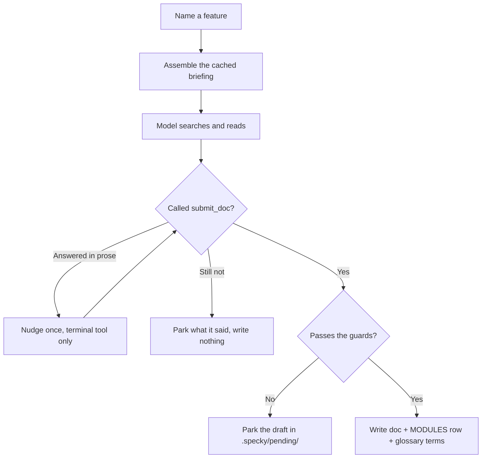

# Cli — Document

## What It Does

Writes the reference doc for **one** feature or workflow that you name, by letting a model search
this repository's code for it. You say `specky document "the refund flow"`; it finds the code,
reads it, and writes `specs/billing/refund-flow.md` along with its index row and any shared
vocabulary it introduced.

This is the one part of specky that reads source code, and the one place a model is given tools
rather than a pasted prompt. Everything else reads git — which is the right shape for keeping a doc
current, because a diff is a precise statement of what changed about something already described
somewhere, and the wrong shape for writing a doc that doesn't exist yet. A module written once and
stable since produces no diff to write from at all.

It is also how a repo starts using specky. There is no pass to run first: the commit-driven path
works from day one, and reference docs are added one feature at a time, when somebody wants one.

## How It Works

1. **Assemble the briefing** — No AI call. The procedure, the doc template, `PRODUCT.md`, the
   glossary, every doc that already exists with its tags, and the repo's directory tree. All of it
   is identical across every run in this repo, so it travels as the prompt's cacheable half — which
   matters more here than anywhere else in specky, because a tool conversation resends it on every
   turn.

2. **Hand over the tools** — Six verbs: `search_code` and `list_files` to find code, `outline` to
   triage it without opening it, `read_file` to read it, `read_doc` to see what is already
   documented, and `history` for the commit that explains a value the code only states. There is no
   write tool and no shell. Every path resolves against `git ls-files` filtered by the docs tree,
   the vendored-path list and `[check] ignore`, so anything gitignored, vendored or already
   disowned is unreachable by construction rather than by a rule the model is asked to follow.

3. **Let it search** — The model decides what to read: a search for the words a user would use, an
   outline to triage the hits, then the files that actually decide the behaviour. This is what the
   commit path cannot do — it can follow a route into the service it calls and the service into its
   helpers, rather than being handed whatever a budget in Python guessed was relevant.

4. **Bound the run** — Two budgets, because a loop without them is unbounded spend. At most
   sixteen turns — a turn is one *round*, not one tool call, and a model that calls its tools one at
   a time spends one per file it opens. At most 80,000 characters of tool output, after which every
   tool says so and returns nothing more — a prompt the model can act on, not an error.

5. **Make it finish** — A model asked to write a document often writes it as prose in its reply
   instead of calling the tool, and discarding that throws the whole run away. So a reply with no
   tool call earns one nudge, carrying its own draft back with only the terminal tool on the table;
   the final turn forces that tool the same way. Forced turns offer *only* that tool, because a
   model left the full list will reach for one more read instead — observed against a real endpoint.

6. **Take the submission** — A seventh tool, `submit_doc`, ends the conversation with typed fields:
   domain, topic, type, tags, purpose, sources, the markdown, and any glossary terms. A typed tool
   schema rather than a JSON envelope in prose, so there is nothing to parse out of a 4 kB answer
   and no way to trail a sentence after the closing brace.

7. **Refuse it, or write it** — The diagram is repaired where the fix is unambiguous, then five
   guards decide, below. A refusal parks the draft in `.specky/pending/`
   rather than discarding it: it may well be better than what is on disk, and that is a judgement
   for a human. `specky doctor` warns while one is waiting there. A doc that already exists
   keeps its own `type` and `tags` — the submitted ones only fill in a new doc, or one missing
   either — so a re-run can't undo a type somebody corrected, the same rule the commit hook
   follows ([documentation/feature-sync.md](../documentation/feature-sync.md)).

8. **Update the index and the glossary** — `specs/MODULES.md` gains a row if the doc is linked
   nowhere in it, and any new terms are appended to `specs/GLOSSARY.md`. Both cost no extra call:
   the terms came back with the doc, from a model that had the doc in front of it.



## Scope, And What It Doesn't Hide

`--scope src/billing` says where the subject lives. It narrows listing, searching and reading — with
one deliberate exception: **a repo's tests stay reachable**. They live in `tests/` by convention,
which is outside every plausible scope, and they are the best material in the repo for this job. A
test case is an expected behaviour somebody had to make pass, which is precisely the Acceptance
Tests table the model is asked to produce. Scope is about where the subject is, not about what may
be consulted to describe it.

They are readable and searchable but not *listed*: `list_files` shows only the scope, so the tests
are something the model reaches for deliberately rather than something it wades through.

## What Stops A Doc Being Written

Letting a model choose what to read buys depth, and everything it can get wrong it gets wrong
invisibly — prose reads the same whether or not it is true. So the guards are the load-bearing part.

| Guard | Refuses |
|---|---|
| **Nothing read** | A doc backed by no `read_file` call at all. Such a doc is fabricated end to end and reads exactly like a real one |
| **Ungrounded flags** | A doc naming a `--flag` neither the CLI accepts nor any real code mentions — the one error class a machine can settle by itself |
| **Lost content** | An update that drops a `##` section, guts one, or keeps less than 80% of the doc. A model shown an existing doc will sometimes summarise it away |
| **Repeated section** | A doc carrying a `##` heading twice when the doc it replaces didn't: two docs stacked. Nothing is lost, so the lost-content check can't see it |
| **`authored: human`** | Any doc somebody took ownership of. Unlike the commit path, this cannot be checked up front — the model picks the target — so `read_doc` says a doc is frozen while that can still change course, and the draft is parked if it goes ahead anyway |
| **Unparseable diagram** | A fenced ```mermaid block the renderer cannot read. The viewer degrades one into a block of raw syntax, dropped into the middle of a doc written for people who don't read syntax |

`sources:` is not taken on trust either: the model's claim is intersected with the files it actually
opened, so a path it merely saw in a search result cannot claim coverage.

That intersection is a floor, not a ceiling — nothing can stop a model naming every file it read,
and the first version of this prompt invited exactly that by asking for "files you actually opened".
It matters because `sources:` is weighted at `MIN_LINK_COMMITS` in the code-to-doc map, *above* the
git-derived pairs: a file listed by mistake is a file nobody is warned about when it changes. So the
prompt asks for the one to three files the doc is about, and says why.

## Diagrams Are Checked, And Partly Repaired

A broken diagram is the quietest defect a generated doc can carry, because the two ways it breaks
both look fine from the outside.

**Repaired, not refused.** A node whose class suffix names nothing — `A["Refunds"]:::`, or
`:::feature` with no matching `classDef` — parses perfectly and simply renders unstyled. Nothing
reports it, and a model writing a diagram by hand produces it often enough that it appeared on the
first real run of this command. The suffix is dropped and the run says so. That follows the
precedent already set by `catalog._mermaid_label`, which silently escapes the two characters that
would end a node label early rather than rejecting the title: where the fix is unambiguous, fix it.
A `:::` inside a quoted label is left alone — there it is somebody's text, not syntax.

**Refused.** A diagram the renderer cannot parse at all. Specky has no basis for guessing what was
meant, and the alternative is writing it and hoping somebody notices.

The second check is a coarse net and is meant as a backstop rather than the main defence. Measured
against the vendored renderer, it catches an unknown diagram type and prose that is not a diagram;
it does **not** catch an unclosed bracket, a malformed arrow, or a header with no body — all of
which render into something. When the renderer isn't installed at all the check says nothing rather
than condemning every diagram, since `render_mermaid_svg` reports a missing Node, a missing install
and a parse failure identically.

The commit path applies both, for the same reason: it rewrites whole sections, and a section
carrying a diagram can come back with it mangled.

## Where The Docs Come From

| Path | Written from | AI calls | Overwrites? |
|---|---|---|---|
| `specs/<domain>/<topic>.md` | the code the model read | 1 conversation, up to 16 turns | Updates in place; refuses a rewrite that loses content |
| `specs/MODULES.md` | the submission's `purpose` | 0 | No — a row is added only if the doc is linked nowhere |
| `specs/GLOSSARY.md` | the submission's `glossary_terms` | 0 | No — appends unseen terms only |

## Providers

The conversation needs a tool channel, which not every provider has.

| `[ai] provider` | Behaviour |
|---|---|
| `anthropic` | The full path — specky offers the tools and sees every file opened |
| `openai-compatible` | The same, where the endpoint supports tool calling. One that doesn't is reported as a config error naming the lever, not an HTTP failure |
| `command` | No tool channel at all. Degrades to a single call: the same prompt and the same guards, minus the one that checks a file was read. It warns on every run |
| `agent` | Runs as `command` with the agent's headless command line. Exception: run from inside that agent's own session (its env marker is set), nothing is launched. The command prints `run the document-domain skill for "<request>" in this session` and exits 0, because the session agent has the repo in context and real tools. `--headless` (or `[ai] skill_handoff = false`) launches the agent anyway. `--dry-run` is unaffected |

The `command` degradation is worth being precise about, because the command is often an agent that
plainly does have tools — `claude -p` can read and grep. They are simply invisible to specky, which
can neither offer its own nor see what was opened, so `sources:` is taken on trust.

`[ai] document_model` points this task at its own model. It is the hardest thing specky asks of a
model and the only task where a weak one shows up directly in what lands in `specs/` — see
[ai/provider-cost-controls.md](../ai/provider-cost-controls.md).

## Re-running

No state file, and none needed. The docs tree is the record: a re-run is shown every doc that
exists, told to update in place rather than write a twin, and held to `lost_content` when it does.
Deleting a doc is how you ask for it to be written afresh.

## Outcomes

| Condition | Behaviour |
|---|---|
| A feature with code behind it | The doc is written, indexed and glossed |
| A feature already documented | The existing doc is updated in place; a second doc on one subject is a defect |
| That doc is `authored: human` | Left alone and reported — it may still need a look |
| An update that loses content | Refused, parked in `.specky/pending/`, reported |
| A doc naming a flag this repo doesn't accept | Refused, parked, reported |
| A diagram whose class suffix names nothing | Repaired in place, and the repair is reported |
| A diagram the renderer cannot parse | Refused, parked, reported |
| The diagram renderer isn't installed | No claim either way — diagrams are written as submitted |
| The model never reads a file | Refused before anything is written |
| The model answers in prose instead of calling the tool | One nudge, with only the terminal tool offered |
| It does it twice | Nothing is written; what it said is parked in `.specky/pending/unsubmitted/` so the turns aren't wasted |
| Sixteen turns without a submission | The last turn is forced to submit |
| The tool budget runs out | Tools say so; the model writes from what it has |
| A path scope is given | Listing, searching and reading are confined to that subtree — except the repo's tests, which stay readable |
| `list_files` matches more paths than it will name | It names the directories and their counts instead, and says to narrow the prefix |
| A path outside the repo, or gitignored, vendored, or `[check] ignore`d | Unreachable — the tools resolve against a fixed allowlist |
| No tracked source at all | Nothing is read and nothing is called |
| `--dry-run` | Prints the prompt and stops. Calls nothing — there is no discovery step to pay for |
| A provider with no tool channel | Degrades to one call, with a warning |
| Anything is written | Left uncommitted, like `specky sync` — a generated doc is a change a human should read first |

## Cost

One conversation per doc, bounded at sixteen turns. The briefing is identical across them, so a
provider that caches a prefix reads it seventeen times and bills it once.

What the prefix cache does *not* cover is the transcript. Every turn resends every earlier turn's
tool results, so the cost of a run grows with the square of its length: a measured 28-turn run sent
13,346 characters on its first turn and 62,084 on its last, 1.17 million in total, to produce a
thousand-word document. That is the real reason for the tool-output budget — not the 80,000
characters themselves, but that characters spent early are resent on every turn after.

`specky cost` records one row per turn rather than one per run, which is the truth about what was
sent. Nothing here is memoized: the prompt-cache key describes a single-call question and cannot see
which files the model chose to open, so a hit after a code change would serve a doc describing the
repo as it used to be — silently, and exactly on the re-runs where somebody is checking their edit.

## Doc Coverage

Docs written here record their source files in `sources:`, and `specky index` folds those pairs into
the code-to-doc map. Without it these docs would have **no** `specky check` coverage: that map is
otherwise derived from git log, and a doc written about a module nobody has touched in two years has
no commit pairing it with that module at all. The commit path preserves the key across later
updates.

## Edge Cases

Each of these is one branch off the happy path; [What Stops A Doc Being Written](#what-stops-a-doc-being-written) is
the same set of refusals stated as guards, with the reasoning behind each one.

| Situation | What happens | Why |
|---|---|---|
| The model never opens a file | The submission is refused before anything is written | A doc backed by no read is fabricated end to end and reads exactly like a real one |
| The subject is already documented | The existing doc is updated in place | A second doc on one subject is a defect: it reads as authoritative, it is the copy nobody updates, and the two drift apart |
| The update would drop or gut a section | It is refused and the draft is parked in `.specky/pending/` | A model shown an existing doc will sometimes summarise it away. The draft is kept because it may still be the better doc |
| The doc repeats a `##` heading the existing one didn't | Refused and parked | A doc stacked on itself loses nothing, so no size check notices it |
| The target is `authored: human` | `read_doc` says so while the model can still change course; going ahead anyway parks the draft | Unlike the commit path, this can't be checked up front — the model picks the target, so by the time we know, the doc has been written and paid for |
| The doc names a `--flag` nothing in the repo accepts | Refused and parked | It is the one error class a machine can settle by itself |
| An update stops stating a number, formula or defined term the doc had | Written, and the summary line names them — `removed N fact(s): …`, constants first | The code may have changed the value; the person who ran it is the one who knows, so it's said rather than refused |
| A diagram's class suffix names no `classDef` | It is repaired in place and the repair is reported | The only diagram defect specky can fix outright, rather than hand back |
| A diagram the renderer can't parse | Refused and parked | The viewer degrades it into a block of raw syntax, in the middle of a doc written for people who don't read syntax |
| The diagram renderer isn't installed | No claim is made either way, and diagrams are written as submitted | "Nothing can be said" is not the same as "they are all fine", and treating it as the latter would flag every diagram on a machine without Node |
| The model answers in prose instead of calling the tool | One nudge, with only `submit_doc` offered; a second time, what it said is parked under `.specky/pending/unsubmitted/` | The turns were paid for, and what a model says on its way out is usually the doc itself, written as prose instead of handed over |
| Sixteen turns pass with no submission | The last turn is forced to submit | A run that never calls `submit_doc` produces nothing at all |
| A `--scope` is given | Listing, searching and reading are confined to that subtree — except the repo's tests | A test name is often the clearest statement of a behaviour in the repo, and its cases are the Acceptance Tests being written |
| A path is outside the repo, gitignored, vendored, or `[check] ignore`d | It is unreachable | The tools resolve against a fixed allowlist rather than filtering what they are asked for |
| The provider has no tool channel (`provider = "command"`) | It degrades to one call, with a warning, and `sources:` is taken on trust | The command is often an agent with perfectly good tools of its own — they are just invisible to specky, which can neither offer them nor see what was opened |
| `--dry-run` | The prompt is printed and nothing is called | There is no discovery step to pay for, so a preview has no reason to cost anything |
| Anything is written | It is left uncommitted | A generated doc is exactly the change somebody should read in `git status` first |
| `provider = "agent"`, run from inside that agent's session | No agent is launched; the output names the document-domain skill and the request | The agent that ran the command is the better author: it has the repo in context and its own tools, where the headless copy has neither |

## Acceptance Tests

| Scenario | Given | When | Then |
|---|---|---|---|
| A feature is documented | Source under `src/billing/` | `specky document "the refund flow"` | The doc, its MODULES row and its glossary terms are written |
| The tools offered are exactly six plus the submission | Any repo | A run starts | `search_code`, `list_files`, `outline`, `read_file`, `read_doc`, `history`, `submit_doc` — no write tool, no shell |
| Nothing read, nothing written | A model that searches but never reads | `specky document` | Refused, and the refusal says why |
| Prose instead of a tool call is recovered | A model that replies with the finished doc as text | `specky document` | It is nudged once and the doc is written |
| A second refusal to use the tool ends it | A model that ignores the nudge | `specky document` | Nothing is written and what it said is parked |
| A frozen doc is announced early | `authored: human` on the target | `read_doc` on it | The reply says it will not be overwritten, before the run is spent |
| Claimed sources are checked | A model that lists a file it never opened | `specky document` | Only the files it read reach `sources:` |
| No claim falls back to the read set | A model that lists no sources | `specky document` | Every file it read is recorded |
| An invented flag is refused | A doc naming `--refund-everything` | `specky document` | Refused, parked in `.specky/pending/`, reported |
| A dangling class suffix is repaired | A diagram containing `A["Refund"]:::` | `specky document` | The node survives without the suffix, and the repair is reported |
| A class naming no `classDef` is repaired | `:::feature` with no `classDef feature` | `specky document` | The suffix is dropped |
| A valid diagram is untouched | `:::feature` with its `classDef` | `specky document` | It reaches disk byte-for-byte |
| A `:::` inside a label is left alone | A node titled `a ::: b` | `specky document` | Unchanged — there it is text, not syntax |
| An unparseable diagram is refused | A fenced block the renderer returns nothing for | `specky document` | Nothing is written; the draft is parked |
| No renderer, no claim | The mermaid tool is not installed | `specky document` | Diagrams are written as submitted rather than all being refused |
| A gutted section is refused | An existing doc with a long `## What It Does` | An update that shortens it | The doc on disk is unchanged and the draft is parked |
| Dropped facts are named | An existing doc stating ``Cap 250.00 (`refund_cap`)`` | An update that states neither | The doc is written; the output says ``removed 2 fact(s): 250.00, `refund_cap` `` |
| A human-authored doc is frozen | `authored: human` on the target | `specky document` | Left alone and reported, with the draft parked rather than discarded |
| A parked draft carries no borrowed keys | A frozen doc with an `owner:` | The draft is parked | It has this run's `type`/`tags` only — the frozen doc's hand-written keys are its own |
| An existing doc is updated, not twinned | `specs/billing/refund-flow.md` exists | `specky document "refunds"` | One file, updated; a hand-written `owner:` survives |
| A re-run keeps the doc's type and tags | `specs/billing/refund-flow.md` is a `workflow` tagged `refunds` | A run submits it as a `feature` tagged `billing` | Still a `workflow` tagged `refunds` — a type is changed by hand, never by one run's guess |
| Echoed frontmatter is stripped | A model that emits its own `---` block | `specky document` | One frontmatter block, rendered from the submitted fields |
| A path in a domain or topic is flattened | A submission naming `../etc` | `specky document` | The doc lands inside the docs root |
| An untracked path is unreachable | An untracked file in the repo | `read_file` on it | Refused, and it is not added to the read set |
| A vendored or ignored path is unreachable | A tracked `vendor/` tree | `search_code` matching inside it | No hit from it is returned |
| The docs tree is not source | A `.py` file under `specs/` | The allowlist is built | It is excluded, so one doc's invention can't ground the next |
| Scope confines every tool | Source under two subtrees | `specky document --scope src/billing` | The other subtree is invisible to listing, search and reads |
| The budget stops further reads | Repeated reads of a large file | The budget is spent | Tools say so and return nothing more |
| A bad argument doesn't end the run | A tool called with the wrong keyword | The loop continues | The error comes back as that tool's result |
| Tests survive a scope | Source in `src/billing/`, tests in `tests/` | `specky document --scope src/billing` | The tests are searchable and readable, but not listed as part of the subject |
| A long listing becomes a shape | More matches than `list_files` will name | `list_files` with no prefix | The directories and their counts, and a nudge to narrow it |
| History explains a value | A file with commits behind it | `history` on it | Recent commit subjects, newest first |
| History respects the allowlist | An untracked file | `history` on it | Refused, like every other path-taking tool |
| Turns are bounded | A model that never submits | `specky document --max-turns 3` | Exactly three turns are taken |
| Never submitting writes nothing | A model that stops talking | `specky document` | Nothing is written and what it said is reported |
| The briefing is cacheable | Two runs, no doc set change | Prompts are compared | The prefix is byte-identical, and the request appears only in the volatile half |
| Existing docs steer the run | `specs/billing/refund-flow.md` exists | `specky document` | The prefix lists it, so the model updates rather than twins |
| Hand-written glossary definitions win | `Refund` already defined by hand | A run proposes a new definition | The hand-written one survives |
| A glossary row round-trips | A definition containing a pipe | The viewer's parser reads it back | Every term parses |
| Declared sources give check coverage | A documented repo, committed and indexed | The code-to-doc map is read | Each source file is paired with the doc that named it |
| A dry run calls nothing | Any repo | `specky document --dry-run` | The prompt is printed, no call is made, no file appears |
| An empty repo calls nothing | No tracked source | `specky document` | It says so and stops |
| A provider without tools degrades | `provider = "command"` | `specky document` | One call, the same guards minus the read check, and a warning |
| An unparseable degraded answer is refused | A command returning prose | `specky document` | Nothing is written and it says why |
| Handed to the session's skill | `[ai] provider = "agent"`, `agent = "claude"`, `CLAUDECODE` set | `specky document the refund flow` | No provider is loaded; the output says to run the document-domain skill for "the refund flow" |
| `--headless` overrides it | The same | `specky document --headless the refund flow` | The provider is loaded as usual |
