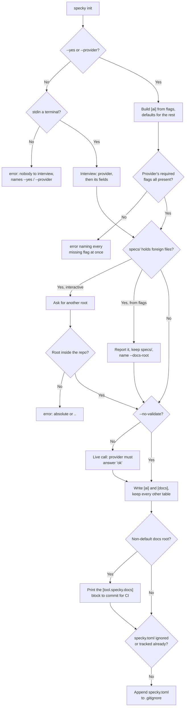

# Cli — Init

## What It Does

`specky init` picks an AI provider, proves it works with one live call, and writes the result to
`specky.toml`. It is the only command that writes that file, and it makes sure `specky.toml` is
gitignored. The file names the *environment variable* holding the API key, never a key, but which
provider a developer uses is per-machine.

Interactive by default, because the interview is the friendliest way to hand someone a working
provider config. Every answer it asks for is also a flag, because anywhere specky is installed by a
machine rather than a person — a Devin blueprint, a Dockerfile, a CI job priming a cache — has no
terminal to answer on.

## How It Works

1. **Decide whether anyone is being asked** — `--yes` means "the defaults are fine", the same choice
   the first prompt offers. Naming `--provider` also implies non-interactive: the interview exists to
   find out which provider, and a caller that already said has stopped having a question to answer.
   There is no partial interview — either every answer comes from flags and defaults, or every answer
   comes from the terminal.
2. **Refuse to interview a pipe** — Without either flag, the CLI checks `stdin.isatty()` and errors
   naming `--yes` and `--provider` if it isn't a terminal. This is the whole reason the flags exist:
   `input()` on a closed stdin raises `EOFError` *mid-interview*, after some questions have been
   answered and before anything has been written, so the failure names neither the cause nor a fix.
3. **Interview, or build the config from flags** — Interactively, the first prompt offers Anthropic
   with the default model; declining it asks which of `anthropic` / `openai-compatible` / `command`,
   then that provider's own fields. From flags, an unnamed provider defaults to `anthropic` with the
   default model and `ANTHROPIC_API_KEY`.
4. **Require a provider's fields before writing, naming all of them at once** — `openai-compatible`
   needs `--base-url`, `--model` and `--api-key-env`; `command` needs `--command`. A missing one
   raises listing *every* missing flag, so a scripted setup isn't fixed one round-trip at a time. It
   happens before the file is written, so the failure isn't a `specky.toml` that only breaks on the
   first commit.
5. **Only ask about the docs root when there's a reason to** — The question appears when
   `specs/` already holds files specky can't have written (any non-markdown file: a `specs/openapi.yaml`,
   a `specs/src/lib.rs`), because generating into that directory mixes two unrelated trees together
   and no command unpicks it afterwards. On the overwhelming majority of repos, where `specs/` is
   free, this is silent. Non-interactively the collision is reported and *accepted* — refusing to
   write a config would be worse than the mixed tree — with `--docs-root` named as the fix.
6. **Reject a docs root that escapes the repo** — An absolute path or one containing `..` raises. The
   absolute check reads the raw answer, not the tidied one, because stripping the slashes that turn
   `documentation/` into `documentation` would also turn `/etc/specs` into the innocuous-looking
   relative `etc/specs`.
7. **Validate before writing** — Load the provider through the same `load_provider()` generation
   uses and ask it to reply `ok`, so the credential is proven by the command whose job is to prove it
   rather than by the first commit. `--no-validate` skips it: a snapshot build that bakes the config
   in has no key in its environment yet and shouldn't fail — or bill — for that.
8. **Write, and say what CI still needs** — Render the `[ai]` and `[docs]` tables (`[docs]` always,
   spelling out the default root too). They are the only tables `init` owns: in an existing
   `specky.toml` they replace the old ones whole, and every other table (`[serve]`, `[skills]`, …)
   is kept as written, comments included, with a line naming what was kept. A comment directly
   above a header goes with that table. The existing file is parsed before the interview, and the
   merge is parsed and compared with it before the provider call; if either fails, `init` stops
   and writes nothing. Because `specky.toml` is gitignored, a chosen root is also printed as the
   `[tool.specky.docs]` block to commit to `pyproject.toml`: CI never sees the gitignored file, and
   a `specky check` pointed at the wrong tree finds no docs and reports no coverage.
9. **Keep specky.toml out of commits** — Unless git already ignores it, append `specky.toml` to the
   repo's `.gitignore` (creating the file if needed) and say so in one line. A repo adopting specky
   has no rule for it yet, so without this the first `git add -A` after `init` would commit one
   developer's provider choice for everyone. A `specky.toml` that is already *tracked* is left
   alone: someone chose to commit it, and a `.gitignore` line wouldn't untrack it anyway. Outside a
   git repo, or without git, nothing is touched.

## Flags

| Flag | Purpose |
|------|---------|
| `--yes` | Take the defaults and ask nothing — Anthropic, the default model, `ANTHROPIC_API_KEY` |
| `--provider` | `anthropic`, `openai-compatible` or `command`. Implies non-interactive |
| `--model` | Model name. Defaults to the built-in one for `anthropic`; required for `openai-compatible` |
| `--api-key-env` | *Name* of the environment variable holding the key, never the key itself |
| `--base-url` | Endpoint for `openai-compatible` (e.g. `https://api.deepseek.com`) |
| `--command` | Shell command for the `command` provider: reads the prompt on stdin, writes the completion to stdout |
| `--docs-root` | Directory to generate docs into, instead of `specs/`. Must be inside the repo |
| `--no-validate` | Skip the live provider call, for a build with no credential in its environment yet |

## Outcomes

| Condition | Behavior |
|-----------|----------|
| No flags, on a terminal | The interview runs; the first prompt offers the default Anthropic provider |
| No flags, stdin is not a terminal | Error naming `--yes` and `--provider`; nothing written, no `EOFError` from inside the interview |
| `--yes` alone | Anthropic, default model, `ANTHROPIC_API_KEY`; validated and written with no prompt |
| `--provider` given without `--yes` | Still fully non-interactive — no remaining question is asked from the terminal |
| `--provider openai-compatible` missing some of `--base-url` / `--model` / `--api-key-env` | One error listing *all* the missing flags; no file written |
| `--provider command` without `--command` | Error naming `--command`; no file written |
| A provider name that isn't one of the three | Error quoting what was passed |
| `specs/` is free | No docs-root question; `[docs]` records `root = "specs"` |
| `specs/` holds non-markdown files, interactively | The colliding files are named and another root is asked for |
| The answer is empty or `specs` again | `specs/` is kept, with a line saying specky's docs will sit alongside what's there |
| `specs/` holds non-markdown files, non-interactively | Reported and kept; `--docs-root` is named as the fix; the config is still written |
| `--docs-root` is absolute or contains `..` | `ConfigError`; nothing written |
| `--docs-root documentation/` | Trailing slash stripped; `[docs] root = "documentation"` written |
| The provider call fails | The error is raised and `specky.toml` is *not* written — no half-configured repo |
| `--no-validate` | No provider is constructed and no call is made; the file is written as given |
| A non-default docs root was chosen | The `[tool.specky.docs]` block is printed, because CI can't read the gitignored `specky.toml` |
| Nothing ignores `specky.toml` yet | `specky.toml` is appended to `.gitignore`, with one line saying so |
| `.gitignore` already covers it (`specky.toml`, `*.toml`, …) | `.gitignore` is untouched and nothing is printed about it |
| An existing `specky.toml` has other tables (`[serve]`, `[skills]`) | `[ai]` and `[docs]` are replaced; the rest is kept as written, comments included, and a line names the kept tables |
| An existing `specky.toml` isn't valid TOML | `ConfigError` naming the file, before any question or provider call; the file is untouched |

## Edge Cases

| Situation | What happens | Why |
|---|---|---|
| Neither `--yes` nor `--provider`, and stdin isn't a terminal | It errors naming both flags, before anything is written | `input()` on a closed stdin raises `EOFError` *mid-interview*, naming neither the cause nor a fix — this check is the whole reason those flags exist |
| `--provider` is given without `--yes` | The run is fully non-interactive anyway | The interview exists to find out which provider; a caller who already said has stopped having a question to answer. There is no partial interview |
| `openai-compatible` is named with some of its fields missing | One error listing *every* missing flag | A scripted setup shouldn't be fixed one round-trip at a time — and it happens before the write, so the failure isn't a `specky.toml` that only breaks on the first commit |
| `specs/` already holds non-markdown files | Interactively another root is asked for; non-interactively the collision is reported and accepted, naming `--docs-root` | Generating into it mixes two unrelated trees together and no command unpicks that afterwards — but refusing to write a config at all would be worse than the mixed tree |
| The docs-root answer is empty, or `specs` again | `specs/` is kept, with a line saying specky's docs will sit alongside what's there | Declining the offer is a real answer, and the consequence is worth stating once rather than discovering later |
| `--docs-root` is absolute or contains `..` | It raises and nothing is written | The absolute check reads the *raw* answer: stripping the slashes that turn `documentation/` into `documentation` would also turn `/etc/specs` into the innocuous-looking relative `etc/specs` |
| The validation call fails | The error is raised and `specky.toml` is **not** written | A half-configured repo is worse than an unconfigured one: it fails at the first commit, far from this command |
| There is no credential in the environment yet | `--no-validate` writes the file without constructing a provider or making a call | A snapshot build that bakes the config in shouldn't fail — or bill — for a key it isn't meant to have |
| A non-default docs root was chosen | The `[tool.specky.docs]` block is printed for `pyproject.toml` | `specky.toml` is gitignored, so CI never sees it, and a `specky check` pointed at the wrong tree finds no docs and reports no coverage |
| `init` is run twice | `.gitignore` gains one `specky.toml` line, not two | The second run finds the file already ignored |
| `specky.toml` is already tracked | `.gitignore` is left alone | Someone decided to commit it, and ignoring a tracked file doesn't untrack it |
| `.gitignore` doesn't end in a newline | A newline is added before the new line | Otherwise the entry would be glued onto the last pattern |
| `init` is re-run on a `specky.toml` holding `[serve]` or `[skills]` | Those tables are kept with their comments; only `[ai]` and `[docs]` are rewritten | `init` owns the provider and the docs root. The viewer's port and the skills' model belong to whoever set them, and switching provider mustn't quietly take them along |
| The old `[ai]` had keys `init` doesn't ask about (`max_tokens`, `<task>_model`) | They go with the table | `[ai]` is rewritten whole: a limit tuned for one provider isn't carried to the next |
| The existing `specky.toml` isn't valid TOML | `init` stops before the interview, naming the file, and writes nothing | With no parse there's no telling which tables to keep, and overwriting would lose them silently |
| Keeping a table would change it (a `[`-led line inside a multi-line string, read as a header) | `ConfigError`, nothing written | The merge is compared with the old file before it's written, so a misread can't drop a table silently |

## Acceptance Tests

| Given | When | Then |
|-------|------|------|
| A repo with no `specky.toml` | Run `init` with `--yes` | `[ai]` names `anthropic`, the default model and `ANTHROPIC_API_KEY`; no question is asked |
| The same | Run `init --provider anthropic` with no `--yes` | It is still non-interactive — the interview's input function is never called |
| `--provider openai-compatible` and only `--model` | Run `init` | The error names both `--base-url` and `--api-key-env`; `specky.toml` does not exist afterwards |
| `--provider openai-compatible` with all three fields | Run `init` | The written file round-trips: provider, base URL, model and key env var all present |
| `--provider command` with no `--command` | Run `init` | The error names `--command` |
| `--no-validate` and a provider that would fail | Run `init` | No provider is constructed, nothing is generated, and the file is written |
| A provider whose `generate` raises | Run `init` without `--no-validate` | The error propagates and no file is written |
| `--docs-root documentation/` | Run `init` | The file contains a `[docs]` table with `root = "documentation"` |
| `--docs-root /etc/specs`, `../outside` or `docs/../../outside` | Run `init` | `ConfigError` for each; nothing is written |
| `specs/openapi.yaml` exists and no `--docs-root` is given | Run `init --yes` | The output names the colliding file and `--docs-root`; the config is written with `root = "specs"` |
| stdin is not a terminal and neither `--yes` nor `--provider` is given | Run `specky init` | The CLI raises before the interview, and the message names `--yes` and `--provider` |
| A repo with no `.gitignore` | Run `init --yes` | `.gitignore` is exactly `specky.toml`, a line says it was added, and `git status` doesn't list `specky.toml` |
| `.gitignore` is `node_modules/` with no trailing newline | Run `init --yes` twice | `.gitignore` is `node_modules/`, then `specky.toml`, each on its own line |
| `.gitignore` is `*.toml` | Run `init --yes` | `.gitignore` is unchanged and nothing is printed about it |
| `specky.toml` is committed | Run `init --yes` | No `.gitignore` is created |
| Any flag added to `init` | Compare against `known_flags()` | It is listed, so `generator.ungrounded_flags` doesn't report a doc that mentions it as invented |
| `specky.toml` holds an openai-compatible `[ai]`, `[docs]`, a commented `[serve]` and `[skills]` | Run `init --yes` | `[ai]` is Anthropic with no `base_url`; `[serve]` and `[skills]` parse as before; the comment is still above `[serve]`; a line names both kept tables |
| `specky.toml` isn't valid TOML | Run `init` | `ConfigError` saying so; no question is asked, no provider is called, and the file is unchanged |
| `[serve]` holds a multi-line string with a line reading `[ai]` | Run `init --yes` | `ConfigError`; the file is unchanged |
