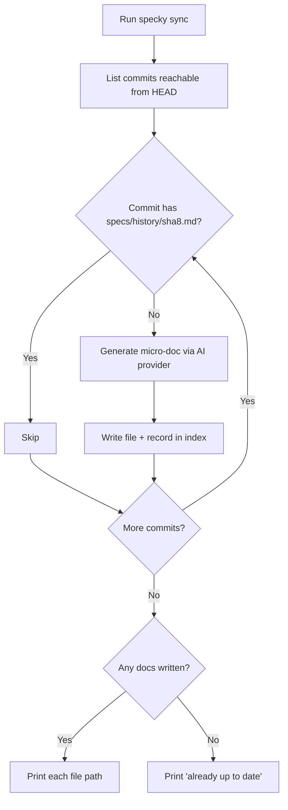

# Cli — Sync

## What It Does

`specky sync` generates a micro-doc for any commit in the repository's history that doesn't have one yet. Use it to backfill docs for existing commits when you first install specky on a repo, or to catch up on commits the post-commit hook missed (for example, because `specky` wasn't on your PATH at the time). The command is idempotent—running it multiple times is safe and will only generate docs for commits that are still missing them.

## How It Works

1. **Scan history** — Git lists every commit reachable from HEAD in reverse chronological order.
2. **Check for existing docs** — Compare commit SHAs against files already present in `specs/history/`.
3. **Identify gaps** — Build a list of commits that have no corresponding `specs/history/<sha8>.md` file.
4. **Generate and save** — For each missing commit, fetch its metadata, generate a micro-doc using your configured AI provider, write the file to `specs/history/`, and record it in the index database.
5. **Report results** — Print which files were written, or report "already up to date" if nothing was missing.

## Outcomes

| Condition | Behavior |
|-----------|----------|
| All commits already have docs | Prints "specky sync: already up to date" and exits cleanly |
| One or more commits missing docs | Generates and writes each missing doc; prints path for each file written |
| Provider configuration is missing or invalid | Exits with error message; no docs are written |
| Provider call fails (API error, network issue, etc.) | Exits with error; partially written docs remain on disk |

## Acceptance Tests

| Scenario | Given | When | Then |
|----------|-------|------|------|
| Backfill existing history | Repo with 5 commits, no docs yet, specky installed and configured | Run `specky sync` | All 5 docs are generated; output shows 5 file paths |
| Already caught up | Repo with 3 commits, all have docs | Run `specky sync` | Prints "already up to date"; no files written |
| Partial backfill | Repo with 5 commits, 2 already have docs | Run `specky sync` | Only 3 missing docs are generated |
| Idempotent on rerun | Successful `specky sync` just completed | Run `specky sync` again immediately | Prints "already up to date"; no new files written |
| Configuration missing | Repo with commits but no `specky.toml` | Run `specky sync` | Exits with error; no docs written |
