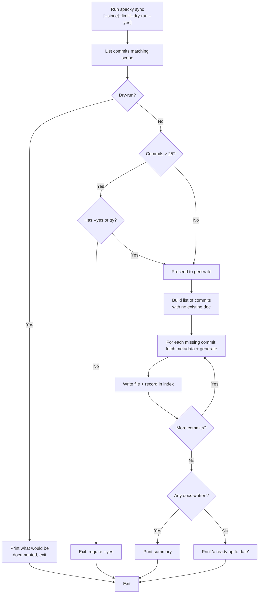

# Cli — Sync

## What It Does

`specky sync` generates a micro-doc for any commit in the repository's history that doesn't have one yet. Use it to backfill docs for existing commits when you first install specky on a repo, or to catch up on commits the post-commit hook missed. The command is idempotent—running it multiple times is safe and will only generate docs for commits that are still missing them. Specky automatically skips its own doc-sync commits to avoid self-referential loops.

## How It Works

1. **Determine scope** — List commits reachable from HEAD in reverse chronological order, optionally filtered by `--since REV|DATE` and `--limit N`.
2. **Check for existing docs** — Compare commit SHAs against files already present in `specs/history/`.
3. **Identify gaps** — Build a list of commits that have no corresponding `specs/history/<sha8>.md` file.
4. **Preview (optional)** — With `--dry-run`, print what would be documented and exit without calling the AI provider.
5. **Confirm if needed** — For backlogs over 25 commits, require explicit user confirmation (via `--yes` or tty prompt). Refuse to prompt if stdin is not a tty.
6. **Generate and save** — For each missing commit, fetch its metadata, generate a micro-doc using your configured AI provider, write the file to `specs/history/`, and record it in the index database. Commit summaries are fetched four at a time for efficiency; classification and file writes remain serial and in commit order to prevent duplicate docs.
7. **Report results** — Print per-commit progress and final summary.

## Flags

| Flag | Purpose |
|------|---------|
| `--since REV\|DATE` | Only sync commits after the given revision or date (e.g., `--since main`, `--since 2024-01-01`) |
| `--limit N` | Only sync the N most recent commits |
| `--dry-run` | Preview what would be documented without calling the AI provider |
| `--yes` | Skip confirmation prompt for backlogs over 25 commits (required if stdin is not a tty) |

## Outcomes

| Condition | Behavior |
|-----------|----------|
| All commits already have docs | Prints "already up to date" and exits cleanly |
| One or more commits missing docs | Generates and writes each missing doc; prints per-commit progress and file paths |
| Backlog over 25 commits, no `--yes` flag, stdin not a tty | Exits with error; no docs are written |
| `--dry-run` flag supplied | Prints estimated commit count and cost, exits without generating |
| Provider configuration is missing or invalid | Exits with error message; no docs are written |
| Provider call fails (API error, network issue, etc.) | Exits with error; partially written docs remain on disk |

## Acceptance Tests

| Scenario | Given | When | Then |
|----------|-------|------|------|
| Backfill existing history | Repo with 5 commits, no docs yet, specky installed and configured | Run `specky sync` | All 5 docs are generated; output shows per-commit progress and 5 file paths |
| Already caught up | Repo with 3 commits, all have docs | Run `specky sync` | Prints "already up to date"; no files written |
| Partial backfill | Repo with 5 commits, 2 already have docs | Run `specky sync` | Only 3 missing docs are generated |
| Idempotent on rerun | Successful `specky sync` just completed | Run `specky sync` again immediately | Prints "already up to date"; no new files written |
| Dry run preview | Repo with 5 missing commits, specky configured | Run `specky sync --dry-run` | Prints estimated cost (5 commits) and exits; no provider called, no docs written |
| Large backlog without confirmation | Repo with 30 missing commits, specky configured, stdin not a tty | Run `specky sync` without `--yes` | Exits with error; no docs are written |
| Large backlog with confirmation | Repo with 30 missing commits, specky configured | Run `specky sync --yes` | All 30 docs are generated |
| Scope filtering | Repo with 10 commits, 8 missing docs | Run `specky sync --limit 3` | Only 3 newest commits are checked; if all 3 are missing, 3 docs generated |
| Configuration missing | Repo with commits but no `specky.toml` | Run `specky sync` | Exits with error; no docs written |
| Excludes specky's own docs | Repo with 3 commits (2 feature changes, 1 specky doc-sync commit) | Run `specky sync` | Only 2 feature docs are generated; specky's own doc-sync commit is skipped |
