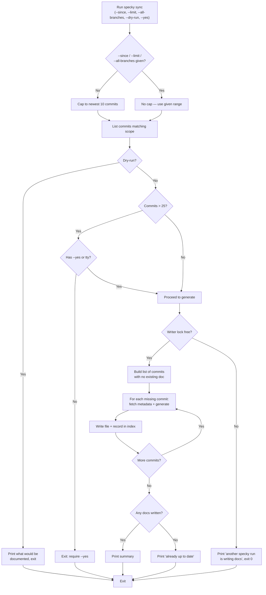

# Cli — Sync

## What It Does

`specky sync` generates a micro-doc for any commit in the repository's history that doesn't have one yet. Use it to backfill docs for existing commits when you first install specky on a repo, or to catch up on commits the git hooks missed. The command is idempotent—running it multiple times is safe and will only generate docs for commits that are still missing them. Specky automatically skips its own doc-sync commits to avoid self-referential loops.

Bare `specky sync` — no `--since`, `--limit`, or `--all-branches` — only inspects the newest 10 commits (`SYNC_DEFAULT_DEPTH`). That keeps the first run on an existing repo from silently walking its entire history: the whole-history backfill the 25-commit confirmation below exists to make deliberate would otherwise become the default rather than something asked for. Passing any one of those three flags removes the cap entirely — e.g. `--since <first commit>` to document a repo's full history on a fresh adopt, or `--limit 200` to go past 10 without going unbounded.

`sync` and the git hooks are the same backlog pass over the same list of undocumented commits (see [documentation/auto-commit-docs.md](../documentation/auto-commit-docs.md)); the only difference is how much of it each one is allowed to do. A hook fire inspects the newest 20 commits and documents at most 5 of them, because it is spending money inside a git hook. `sync`'s own default window is smaller (10) but liftable — pass a range flag and it walks the whole history if you ask it to — which makes it the command for the two things a hook deliberately won't do: an explicit backfill of a repo's entire history, and any commit older than the hook's window. That's why the hook's own output points at it, and why `specky doctor` names it when it finds a backlog.

By default `sync` doesn't commit what it writes. The docs are left in the working tree for you to read and commit yourself, which is what you want for a run that may have touched hundreds of files.

`--commit` commits them as one `docs: sync specky docs [skip specky]` commit, staged by path the way a hook fire stages them: only the docs this run wrote, plus `MODULES.md` when the run changed it. It's for a repo with the hooks off (`install-git-hook --on none`): instead of a doc commit after every commit, a developer runs `specky sync --commit` on a shared branch now and then. That documents the branch's newest 10 commits in one commit.

## How It Works

1. **Determine scope** — List commits reachable from HEAD in reverse chronological order, optionally filtered by `--since REV|DATE` and `--limit N`. With `--all-branches`, walk every ref instead of just HEAD, so work that only exists on a side branch is documented too. With none of those three flags, only the newest 10 commits (`SYNC_DEFAULT_DEPTH`) are inspected at all; passing any one of them lifts that cap. `--limit` caps the list *after* the already-documented commits are filtered out, so `--limit 5` means five commits processed rather than five inspected. (The hooks use their own such bound, a `depth` of 20 — `git log -n <depth>`. It's spelled as a depth rather than as `--since HEAD~20` on purpose: on a repo with fewer commits than that, `HEAD~20` isn't a revision, so it would be taken for a date and silently match everything.)
2. **Check for existing docs** — An entry lists the full shas it covers in its `commits:` frontmatter, and a legacy `<sha8>.md` doc records the one it documents as `sha:`. That is what a commit is matched against. A legacy doc written before the sha was recorded falls back to its 8-hex filename. Eight hex digits aren't unique on a large repo, so for a doc that does record its sha, matching on the filename alone would silently mark an undocumented commit as done.
3. **Identify gaps** — Build a list of commits with no history doc.
4. **Preview (optional)** — With `--dry-run`, print what would be documented and exit without calling the AI provider.
5. **Confirm if needed** — For backlogs over 25 commits, require explicit user confirmation (via `--yes` or tty prompt). Refuse to prompt if stdin is not a tty. Bare `sync` can never trigger this on its own — its 10-commit cap is well under the threshold — so it's only reachable once a range flag surfaces a bigger backlog.
6. **Take the writer lock** — A non-blocking `flock` on `.specky/run.lock`, shared with the hooks. A hook firing partway through a long `sync` would otherwise pick the same pending commit and write the same file twice. If the lock is already held, `sync` says so and exits 0 without writing.
7. **Generate and save** — For each missing commit, fetch its metadata, generate a micro-doc using your configured AI provider, write it to an entry in `specs/history/` (under the configured docs root — see [documentation/doc-adoption.md](../documentation/doc-adoption.md)), and record it in the index database. A commit that is its branch's recent work extends the branch's open entry instead of opening its own, exactly as a hook fire does ([documentation/auto-commit-docs.md](../documentation/auto-commit-docs.md), One entry per branch). Commit summaries are fetched four at a time for efficiency. A commit that may extend an entry is asked for last, at its turn, because its reply depends on what the entry says by then. Classification and file writes remain serial and in commit order to prevent duplicate docs.
8. **Report results** — Print per-commit progress and final summary. The written files are left uncommitted, unless `--commit` was given: then they're committed as one marker commit while the lock is still held, with a `Specky-Documents` trailer naming the commits the run documented.

## Flags

| Flag | Purpose |
|------|---------|
| `--since REV\|DATE` | Only sync commits after the given revision or date (e.g., `--since main`, `--since 2024-01-01`); also lifts the 10-commit default cap |
| `--limit N` | Only sync the N most recent commits; also lifts the 10-commit default cap |
| `--all-branches` | Document commits on every ref, not just HEAD — more commits, so more AI calls; also lifts the 10-commit default cap |
| `--commit` | Commit the docs it wrote as one `docs: sync specky docs [skip specky]` commit, the way a hook fire commits them — for a repo with the hooks off |
| `--dry-run` | Preview what would be documented without calling the AI provider |
| `--yes` | Skip confirmation prompt for backlogs over 25 commits (required if stdin is not a tty) — does *not* lift the 10-commit default cap by itself |
| `--refresh-history` | Work on *documented* commits instead: rewrite each history doc still in the legacy one-paragraph shape as a headline, an impact, What changed and Why ([documentation/auto-commit-docs.md](../documentation/auto-commit-docs.md)). Same range flags and confirmation; one AI call per doc; feature docs are not reclassified |

## Outcomes

| Condition | Behavior |
|-----------|----------|
| All commits already have docs | Prints "already up to date" and exits cleanly |
| One or more commits missing docs | Generates and writes each missing doc; prints per-commit progress and file paths |
| Backlog over 25 commits, no `--yes` flag, stdin not a tty | Exits with error; no docs are written |
| `--dry-run` flag supplied | Prints estimated commit count and cost, exits without generating |
| `--all-branches` supplied | Commits reachable from any ref are considered, not just HEAD's; a side-branch commit gets a doc |
| Bare `sync` (no range flags), even with a large undocumented backlog | Only the newest 10 commits are inspected — never enough to hit the 25-commit confirmation threshold on its own |
| Any of `--since`/`--limit`/`--all-branches` supplied | The 10-commit default cap is lifted entirely; the given range is inspected in full |
| Two commits share the same 8 hex digits | Neither is mistaken for the other: a legacy doc records its full sha, and an entry is named for its branch or subject |
| Several of the branch's recent commits are undocumented | They share the branch's entry, asked for one at a time; commits older than `[history] window_days` get one entry each and are fetched concurrently |
| A commit is older than the hooks' 20-commit window | No hook fire will ever reach it; `sync` documents it, which is why `doctor` and the hook output both point here |
| A hook fire (or another `sync`) already holds the writer lock | Prints that another specky run is writing docs and exits 0; nothing is written |
| Docs are written without `--commit` | They are left uncommitted in the working tree — unlike a hook fire, `sync` makes no doc-sync commit |
| Docs are written with `--commit` | They are committed as one `docs: sync specky docs [skip specky]` commit, staged by path: only the docs this run wrote, plus `MODULES.md` when the run changed it |
| Provider configuration is missing or invalid | Exits with error message; no docs are written |
| Provider call fails (API error, network issue, etc.) | Exits with error; partially written docs remain on disk |
| `--refresh-history` supplied | Only commits whose history doc has no headline are picked; each is rewritten in place, keeping its filename and its `features:` link (or, for a doc that never had one, the link this machine's index recorded) |
| A merge commit in the range | Never picked, with or without `--refresh-history`: a merge's history lives in the docs of the commits it brought in |

## Edge Cases

| Situation | What happens | Why |
|---|---|---|
| Bare `sync` on a repo with a long backlog | Only the newest 10 commits (`SYNC_DEFAULT_DEPTH`) are inspected | A first run on an existing repo would otherwise walk its whole history and bill for it — the deliberate backfill is what the range flags are for |
| Any of `--since` / `--limit` / `--all-branches` | The 10-commit cap is lifted entirely | Passing a range is how you ask for one; `--yes` alone does not lift it, because agreeing to a prompt isn't the same as naming a range |
| The backlog is over 25 commits | Confirmation is required, and refused outright when stdin isn't a tty | That many commits is real money, and a non-interactive run has nobody to ask |
| A hook fire or another `sync` holds the writer lock | It says so and exits 0 without writing | Both would pick the same pending commit and write the same file twice; a busy lock is a wait, not a failure |
| Two commits share the same 8 hex digits | A legacy doc is matched on the full sha it records, so the other commit is still undocumented; when a legacy doc is rewritten it takes `<sha12>.md` rather than overwrite the other's | Eight hex digits aren't unique on a large repo, and overwriting silently marked a documented commit as done |
| A history doc predates full-sha frontmatter | It falls back to matching on its 8-hex filename | Otherwise every doc written before that field existed would look like a gap and be regenerated |
| A commit is older than the hooks' 20-commit window | No hook fire will ever reach it | The hook is bounded because it spends money inside a git hook; `sync` is the command with no such bound, which is why `doctor` points here |
| The commit is one of specky's own `[skip specky]` doc syncs | It is skipped | Documenting the doc commit would document the documentation, forever |
| The provider fails partway through | The run exits with the error and the docs already written stay on disk | They are correct; discarding them would mean paying for them twice |
| Docs are written without `--commit` | They are left uncommitted | Unlike a hook fire, a `sync` may have touched hundreds of files — that is a diff somebody should read before it lands |
| Docs are written with `--commit` | One marker commit lands the run's docs, staged by path | With the hooks off, a developer documents a shared branch now and then; the result should be committed the way a hook fire would have committed it |
| `--refresh-history` on a doc that is already structured | It is skipped | A refresh is for the legacy shape; a structured doc may have been hand-edited, and a second pass would pay to undo that |
| `--refresh-history` makes no classification call | Feature docs stay as they are | The refresh is about how a commit is described, not about which doc it belongs to — that was decided when it was first documented |

## Acceptance Tests

| Scenario | Given | When | Then |
|----------|-------|------|------|
| Backfill existing history | Repo with 5 commits, no docs yet, specky installed and configured, `[history] consolidate = "off"` | Run `specky sync` | All 5 commits get an entry; output shows per-commit progress and 5 file paths |
| A branch's commits share an entry | Three undocumented commits on `feat/x`, made today | Run `specky sync` | `specs/history/feat-x.md` lists all three; the second and third calls were given the entry so far |
| Already caught up | Repo with 3 commits, all have docs | Run `specky sync` | Prints "already up to date"; no files written |
| Partial backfill | Repo with 5 commits, 2 already have docs | Run `specky sync` | Only 3 missing docs are generated |
| Idempotent on rerun | Successful `specky sync` just completed | Run `specky sync` again immediately | Prints "already up to date"; no new files written |
| Dry run preview | Repo with 5 missing commits, specky configured | Run `specky sync --dry-run` | Prints estimated cost (5 commits) and exits; no provider called, no docs written |
| Large backlog without confirmation | Repo with 30 missing commits, specky configured, stdin not a tty | Run `specky sync --limit 30` without `--yes` | Exits with error; no docs are written |
| Large backlog with confirmation | Repo with 30 missing commits, specky configured | Run `specky sync --limit 30 --yes` | All 30 docs are generated |
| Bare sync caps to the default depth | Repo with 30 undocumented commits, specky configured | Run `specky sync` | Only the newest 10 commits are inspected; if all 10 are undocumented, 10 docs are generated and the older 20 are left untouched, no confirmation needed |
| A range flag lifts the cap | Repo with 30 undocumented commits, specky configured | Run `specky sync --limit 20` | The newest 20 commits are inspected, not capped to 10; if all are undocumented, 20 docs are generated |
| Scope filtering | Repo with 10 commits, 8 missing docs | Run `specky sync --limit 3` | Only 3 newest commits are checked; if all 3 are missing, 3 docs generated |
| Configuration missing | Repo with commits but no `specky.toml` | Run `specky sync` | Exits with error; no docs written |
| Excludes specky's own docs | Repo with 3 commits (2 feature changes, 1 specky doc-sync commit) | Run `specky sync` | Only 2 feature docs are generated; specky's own doc-sync commit is skipped |
| Side-branch commit | Repo whose only undocumented commit lives on a branch that isn't checked out | Run `specky sync --all-branches` | That commit is documented; without the flag it isn't considered at all |
| Short-sha collision | A history doc named `<sha8>.md` records a different commit's full sha in its frontmatter | Run `specky sync` | The colliding commit is treated as undocumented and gets its own entry; the existing doc is untouched |
| Beyond the hook window | A repo with 30 undocumented commits, the hooks installed | A hook fires, then `specky sync --since <old rev>` runs | The hook documents 5 and reports the rest; `sync` documents everything still missing back to the given revision |
| Another writer holds the lock | A hook fire is in progress | Run `specky sync` | It prints that another specky run is writing docs and exits 0; no files are written and the backlog is unchanged |
| Sync leaves the commit to the human | Repo with 2 undocumented commits | Run `specky sync` | The docs exist on disk and `git status` shows them as new; HEAD is the same sha as before the run |
| Sync lands one doc commit | Repo with the hooks off and 2 undocumented commits on a branch | Run `specky sync --commit` | The docs are written and committed as one `docs: sync specky docs [skip specky]` commit; HEAD moves by one commit and the working tree is clean |
| Refresh rewrites legacy docs only | One commit with a legacy doc linked to a feature, one with a structured doc | Run `specky sync --refresh-history` | The legacy doc gains a headline and keeps its `features:`; the structured one is untouched; exactly one provider call is made |
