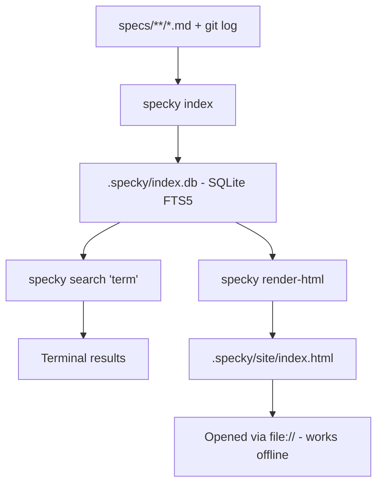

# Docs — Search And Indexing

## What It Does

Search-and-indexing builds a searchable database of all specs and git history. Users can look up docs from command line, or generate a self-contained static website with built-in search that works offline—no server, no build step, just open `index.html` in a browser.

## How It Works

1. **Build the index** — `specky index` reads all markdown files from `specs/` and git history, then stores searchable content in `.specky/index.db` (a SQLite database optimized for keyword search).
2. **Search from terminal** — `specky search "<query>"` finds matching docs and prints results with titles and text snippets.
3. **Generate static site** — `specky render-html` reads the index and writes a complete website to `.specky/site/index.html` with sidebar navigation grouped by topic, individual doc pages, and a search box.
4. **Search works offline** — The search index is embedded directly into each page (not fetched from a server), so users can double-click the HTML file or open it with `file://` URL and search without any network connection.
5. **The offline index carries a budget, not every word** — Each entry ships a lowercased, markdown-stripped slice of its doc's text, so a phrase from a doc's last paragraph is findable, not only its opening sentences. The slice size adapts to how many docs the repo has: a total payload budget of one million characters is divided by the doc count, capped at 8,000 characters per doc and floored at 400. Past roughly 2,500 docs — one repo with 2,500 commits, since every commit gets a history doc — no bodies ship at all, matching falls back to titles and excerpts, and the render prints one line saying where full-text search lives instead. That asset is a plain `<script src>` loaded by every page with no compression on `file://`, so an unbounded one would be paid on every single navigation.
6. **A served viewer searches the whole index** — When the site is opened over `http(s)` rather than `file://`, the search box asks `GET /search?q=` on its own origin, which answers from the same FTS5 index `specky search` uses: every doc, whole bodies, ranked, nothing downloaded up front. Results from the shipped slice appear first so typing never waits on the network, then the exact ones replace them. On `file://` the shipped slice is all there is.
7. **Reading and writing can overlap** — The index uses write-ahead-log (WAL) mode, so the post-commit hook can record a new commit's doc while `specky serve` is answering a question and `specky index` is rebuilding, all without database locks or failures. A reader keeps the snapshot it started with until its query finishes, so results are always consistent even mid-rebuild.

## Outcomes

| Scenario | Result |
|----------|--------|
| After running `specky index` | `.specky/index.db` created; terminal shows count of indexed docs and commits |
| After `specky search "term"` | Matching docs listed with title and matching text snippet |
| Search term has no matches | "no matches" message appears |
| After running `specky render-html` | Complete website written to `.specky/site/` |
| Opening website in browser from file manager | Site loads fully functional; no server error; sidebar, pages, and search work |
| Searching for a phrase deep inside a doc, offline | Found, with the matched words highlighted in their surrounding sentence |
| Searching for `busy_timeout` offline | Found — identifiers keep their underscores in the shipped text |
| Searching a repo with thousands of docs, offline | Titles and excerpts match only; the search box says full-text search needs `specky serve` |
| Searching the same repo over `http://` | Exact ranked hits from the full index, with no payload shipped to the page |
| A commit lands while `specky serve` is running | Both succeed; neither reports "database is locked" |
| Machine loses power mid-write | Index may be missing the last few commits, never corrupt — `specky index` rebuilds it |

## Acceptance Tests

| Given | When | Then |
|-------|------|------|
| A process holding an open read query on the index | Another process writes a new row and commits | Both succeed; the reader sees its original snapshot until its query ends, then the new row |
| Project with specs/ directory and git history | `specky index` is run | Index file created; success message shows doc and commit counts |
| Index file exists | User runs `specky search "refund"` | Terminal lists matching documents with titles and snippets |
| Index file exists | User runs `specky search "xyzabc123"` (nonexistent term) | "no matches" message; command exits cleanly |
| Index file exists | `specky render-html` is run | Website files appear in `.specky/site/`; main page is `index.html` |
| Website file saved locally | `.specky/site/index.html` opened in browser (no server) | All pages load; sidebar shows topic groupings; search box responds to typing; search results appear instantly |
