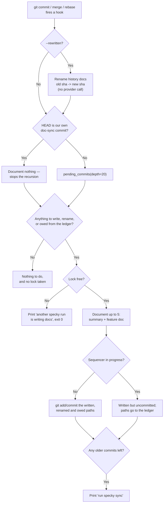

# Documentation — Auto Commit Docs

## What It Does

Commits get a one-paragraph AI-generated summary describing what changed and why, written to
`specs/history/<sha8>.md` (`<docs root>/history/` — see
[documentation/doc-adoption.md](doc-adoption.md) — keyed by the first 8 characters of the sha) and
mirrored into the search index.

The unit of work is the **backlog**, not the commit that just happened. Every fire computes the
diff between the git history and `specs/history/` and closes as much of it as one fire is allowed
to. That distinction is the whole design: git only fires hooks for some of the ways a commit can
arrive, so a hook that documented `HEAD` left a permanent gap behind every merge, rebase,
cherry-pick, squash-merge and colleague who never installed the hook — the next fire looked at
`HEAD` too, so nothing ever came back for them. Reconciling the backlog means a hook only has to
fire *eventually*, which is the only property git actually gives us.

Three hooks are installed, because `post-commit` is invoked by `git commit` **only**: `post-merge`
covers `git merge`/`git pull`, and `post-rewrite` covers `git commit --amend` and `git rebase`.
Nothing fires for a cherry-pick, a revert, a `git am`, or a squash-merge in the forge's UI — those
are caught by the next fire's catch-up, by `specky sync`, or by the CI job.

The Claude Code plugin adds a fourth trigger: a `PostToolUse` hook that runs `specky commit-doc`
right after Claude runs a `git commit` through its Bash tool. It is a convenience for faster
feedback, not a mechanism. The git hooks already fire for that commit, and a fire that finds its
work done costs nothing. The plugin is enabled per user rather than per repo, so this hook runs
after every Bash call in every repo. It acts only in a repo that has a `specky.toml`, written by
`specky init`. Anywhere else, `commit-doc` would have no provider to call: it would print a config
error after every commit and leave a `.specky/` behind in a repo that never asked for one.

## How It Works

1. **Configure AI provider** — Run `specky init` and choose your AI backend (Anthropic,
   OpenAI-compatible — e.g. DeepSeek — or a local command). Specky validates the choice with a test
   call before saving it to specky.toml. Every answer the interview asks for is also a flag
   (`--yes` for the defaults, `--provider`/`--model`/`--api-key-env`/`--base-url`/`--command`,
   `--docs-root`, `--no-validate` to skip the test call), because a setup script has no terminal to
   answer on: without them `input()` raises `EOFError` mid-interview, after some answers have been
   given and before anything has been written. A flag a chosen provider needs and didn't get is an
   error *before* the file is written, rather than a specky.toml that only breaks on the first
   commit.

2. **Install git hooks** — `specky install-git-hook` writes `post-commit`, `post-merge` and
   `post-rewrite`, all calling `specky commit-doc` (`post-rewrite` adds `--rewritten`), so a doc gets
   generated regardless of which agent — or none — created the commit. They go in the directory git
   actually runs hooks from: `core.hooksPath` when it's set (pre-commit, husky and lefthook all set
   it), else the common git dir, so a linked `git worktree` (where `.git` is a *file*) works too. A
   hook file specky didn't write is never overwritten, and one foreign hook aborts the whole install
   rather than leaving half the set in place. `SPECKY_DISABLE_HOOK` set in the environment turns every
   fire into one printed line and a return, without uninstalling anything — the opt-out for a checkout
   that didn't choose its own hooks. A repo that commits its hooks and points `core.hooksPath` at them
   hands specky's to every clone, and a cloud coding agent's throwaway VM wants its commits in the
   pull request it opens rather than in a doc-sync commit nobody asked for.

3. **Find `specky` even from a login-less shell** — The installed script tries `specky` on `PATH`,
   then falls back to the absolute path of the `specky` that installed it. GUI git clients
   (IntelliJ, Fork, Tower) run hooks with a PATH that often has no `~/.local/bin` in it, and the
   old `command -v specky … || true` script was a silent no-op there — the single most common reason
   a repo has the hook installed and no docs to show for it.

4. **Reconcile the backlog** — The fire lists undocumented commits, newest `HOOK_CATCHUP_DEPTH`
   (20) inspected, and documents at most `HOOK_CATCHUP_MAX` (5) of them. Anything left over is
   reported as `N older commit(s) still undocumented — run specky sync`. Both bounds exist for
   different reasons: the depth keeps a fire's cost independent of how long the history is, and the
   cap stops a `git pull` that fast-forwards 300 undocumented commits from turning one fire into
   hundreds of provider calls. Each commit also goes through feature-doc sync (see
   [documentation/feature-sync.md](feature-sync.md)).

5. **Follow rewrites instead of re-paying for them** — `post-rewrite` reads `<old-sha> <new-sha>`
   pairs on stdin and *renames* each old history doc onto the new sha, rewriting its `sha:`
   frontmatter and metadata block and repointing its index rows. The summary is read back off disk,
   so no provider call is made and a hand-edited summary survives. Without this, an amend orphans
   the doc it already paid for and the new sha looks undocumented. Pairs whose old doc is missing
   fall through to the ordinary catch-up. Both halves of the rename are then committed — the new
   file *and* the deletion of the old one — which is why the fire continues past the recursion guard
   in step 7 even when HEAD is one of specky's own doc-sync commits: a rebase replays those too.

6. **One writer at a time** — The run holds a non-blocking `flock` on `.specky/run.lock`. Two
   fires (rapid commits, or a hook firing during a manual `specky sync`) would otherwise both pick
   the same pending commit. A held lock prints and exits 0; it never blocks a hook.

7. **Commit exactly what was written** — The docs this run wrote, plus `specs/MODULES.md`, are
   staged and committed by path as a follow-up commit marked `docs: sync specky docs [skip specky]`.
   The marker is what the next fire recognizes to stop recursing. Committing by path rather than
   `git add specs` matters twice: a human mid-sentence in a feature doc doesn't get their draft
   committed under specky's name, and anything else they had staged stays staged.

8. **Never commit mid-sequencer, but never forget either** — If git is midway through a rebase,
   cherry-pick, revert, merge or bisect (`rebase-merge`, `rebase-apply`, `MERGE_HEAD`,
   `CHERRY_PICK_HEAD`, `REVERT_HEAD`, `BISECT_LOG`, `sequencer`), the docs are written but left
   uncommitted with a line saying so. A `git commit` in the middle of someone else's replay confuses
   the sequencer at best and has to be untangled by hand at worst. The paths go to a ledger in
   `.specky/`, and the next fire commits them — which is the only way that promise can be kept for a
   rebase, because `post-rewrite` fires while `rebase-merge` still exists, so a rebase's own rename
   can never be committed by the fire that made it. A deletion the ledger is carrying is re-applied
   if the file came back in the meantime: a fast-forward or a checkout restores the *committed*
   old-sha doc, and re-committing that would leave exactly the orphan the rename removed.

9. **Index for search** — Summaries are mirrored into the local SQLite `micro_docs` table, keyed by
   full commit sha, so they're searchable by `specky search` and the chat companion.

Per-fire runtime flow, once steps 1-2 are set up once:

## Outcomes

| Outcome | When | Result |
|---------|------|--------|
| **Summary created** | A fire finds pending commits | One doc per commit written to `specs/history/<sha8>.md`; entries added to `micro_docs`; a follow-up doc-sync commit is made |
| **Backlog closed late** | A commit arrived by a route no hook fires for (cherry-pick, `git am`, squash-merge, a contributor with no hook) | The next fire of *any* hook documents it, up to the per-fire cap |
| **Backlog capped** | More than `HOOK_CATCHUP_MAX` (5) commits are pending | 5 are documented; the rest are reported with `run specky sync` and picked up by later fires |
| **Older than the window** | A commit is more than `HOOK_CATCHUP_DEPTH` (20) commits back | Never documented by a hook; `specky doctor` reports it and `specky sync` fixes it |
| **Doc follows a rewrite** | `git commit --amend` or `git rebase` | The existing history doc is renamed onto the new sha with its summary intact; no provider call; the new sha isn't pending |
| **Rewrite committed as a rename** | The rename can be committed (no sequencer in progress) | One commit carrying the new file and the deletion of the old, so the old-sha doc is out of the tree rather than only out of the working copy |
| **Docs written, not committed** | A rebase, cherry-pick, revert, merge or bisect is in progress | Files land on disk; the commit is skipped with the operation named; the paths go to the `.specky/` ledger |
| **Ledger drained** | A later fire runs with the sequencer finished | Those paths are committed — including a deletion whose file a checkout or fast-forward has since restored — and the ledger is removed |
| **Nothing owed, nothing pending** | A fire finds an empty backlog and an empty ledger | Returns without taking the lock, so the nested fire of a doc-sync commit reports nothing |
| **Nothing committed** | The regeneration is byte-for-byte identical to what's on disk | No commit is created; HEAD is unchanged |
| **Second run skipped** | Another specky run holds `.specky/run.lock` | Prints and exits 0; nothing is written; the backlog stays pending |
| **Hook skipped** | `specky install-git-hook` not yet run | Commits proceed normally; no summary generated |
| **Plugin hook inert** | Claude commits in a repo with no `specky.toml` | The plugin's `PostToolUse` hook exits at once: no output, no `specky` call, no `.specky/` created |
| **Hook opted out** | `SPECKY_DISABLE_HOOK` is set to anything but `0`/`false`/`no`/`off`/empty | The fire prints one line naming the variable and returns before building a provider; nothing is written, nothing is spent |
| **Generation fails** | AI provider misconfigured or unreachable | Commit succeeds; summary is skipped; the reason is printed |
| **Hook not overwritten** | A `post-commit`/`post-merge`/`post-rewrite` from another tool exists | `install-git-hook` installs none of the three and says which file blocked it |

## Acceptance Tests

| Given | When | Then |
|-------|------|------|
| `specky.toml` has valid `[ai]` config and the hooks are installed | A commit is made | Within seconds, `specs/history/<sha8>.md` exists with a one-paragraph summary of the commit changes |
| Three commits landed with no hook installed, then the hook is installed | Any hook fires | All three are documented in one fire; documenting `HEAD` alone would have left the first two undocumented forever |
| `HOOK_CATCHUP_MAX + 3` commits are pending | A hook fires | Exactly `HOOK_CATCHUP_MAX` docs are written and the output says the rest are still undocumented |
| A repo with 5 commits | `pending_commits(depth=2)` | Two commits are returned; `depth=500` returns all of them rather than failing on a short history |
| Three pending commits, a working provider, and `SPECKY_DISABLE_HOOK=1` | A hook fires | No history doc is written and the output names the variable — the check happens before the provider is built |
| `SPECKY_DISABLE_HOOK` set to `0`, `false`, `no`, `off` or the empty string | A hook fires | The commit is documented as normal; the obvious way to write "no" doesn't mean "yes" |
| A repo setting `core.hooksPath = .githooks` | Run `specky install-git-hook` | All three hooks are written to `.githooks/`, and nothing is written to `.git/hooks/` |
| A linked worktree created by `git worktree add` | Run `specky install-git-hook` from inside it | The hooks land in the common git dir, shared by every worktree |
| A `post-merge` from another tool exists | Run `specky install-git-hook` | It raises, the foreign file is untouched, and no `post-commit` is written either |
| The hooks are installed | The hook script runs with `PATH=/usr/bin:/bin` | `specky commit-doc` still runs, via the recorded absolute path |
| The hooks are installed and `specky` exits non-zero | The hook script runs | The hook exits 0 — a non-zero hook is noise in every commit and a broken build in some clients |
| A fire has just made its own doc-sync commit | The commit fires `post-commit` again | The marker is recognized and no provider call is made |
| Another process holds `.specky/run.lock` | A hook fires | Output says another specky run is writing docs; no docs are written |
| A repo with no `specky.toml` and `specky` on PATH | The plugin's `PostToolUse` hook gets a `git commit` Bash call | It exits 0 with no output, `specky` is never run, and no `.specky/` is created |
| The same repo after `specky init` | The plugin hook gets `git add -A && git commit -m x` | `specky commit-doc` runs once |
| A repo with `specky.toml` | The plugin hook gets `git status` | `specky` is never run |
| A directory that isn't a git repo | The plugin hook gets a `git commit` Bash call | It exits 0 without running `specky` |
| The provider raises on load | A hook fires | `failed, commit is unaffected` is printed and the commit stands |
| A human's half-written doc is uncommitted in the docs root | A hook fires and writes docs | The draft is not in the doc-sync commit and still has its uncommitted edits |
| Unrelated work is staged (`git add src.py`) | A hook fires and commits docs | `src.py` is still staged afterwards |
| `.git/CHERRY_PICK_HEAD`, `.git/REVERT_HEAD` or `.git/MERGE_HEAD` exists | A hook fires | The history doc is written, HEAD is unchanged, and the output says the docs were left uncommitted and names the operation |
| A documented commit is amended | `specky commit-doc --rewritten` gets `<old> <new>` on stdin | The doc is renamed to `<new-sha8>.md`, carries the new message and the old hand-edited summary, and the provider is never called |
| The same | After the rename | The new sha is not in `pending_commits`, and `micro_docs` holds the new sha and not the old |
| A rewrite pair whose old sha has no doc | `--rewritten` runs | Nothing is renamed; the commit is left for the ordinary catch-up |
| A rebase replays a commit and specky's own doc-sync commit | `post-rewrite` fires with HEAD carrying the marker | The rename is still committed: `git ls-tree HEAD` has the new sha's doc and not the old one, and the working tree is clean |
| The same, with a sequencer file present | The next ordinary fire runs | The ledger's paths are committed, the working tree is clean, and the ledger file is gone |
| A rename deferred, then the old doc restored by a fast-forward | The next fire commits the ledger | The restored old-sha doc is deleted again rather than re-committed, so no orphan doc survives |
| A doc the rename deleted was never committed (written by `specky sync`) | The follow-up commit runs | It succeeds — git is only handed the deletion of paths it actually tracks |
| A fire with an empty backlog and an empty ledger | Any hook fires | The lock is never acquired |
| Malformed `post-rewrite` stdin (blank, one field, a short token) | `--rewritten` runs | The line is skipped rather than raising in the middle of somebody's rebase |
| `specky init` is run with Anthropic selected | Provider is configured | A live API call is made; if successful, config is written; if it fails, setup aborts and the user sees the error |
| The hooks are installed but `specky.toml` is missing or invalid | A commit is made | Commit succeeds; no summary is written; the reason is printed |
| `specky init` is run with a local command provider | Provider is configured and validated | The user is prompted for a shell command; specky pipes a test prompt to it and verifies non-empty output before saving |
