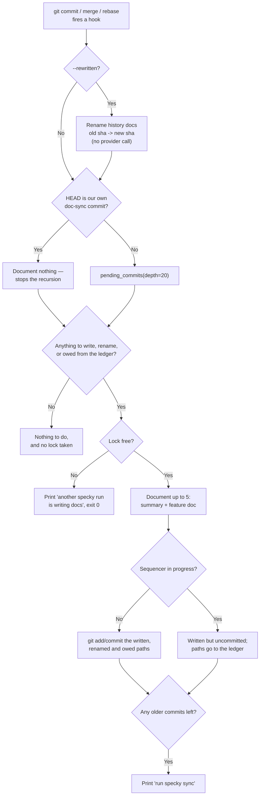

# Documentation — Auto Commit Docs

## What It Does

Every commit ends up in an AI-written history entry in `specs/history/` (`<docs root>/history/` —
see [documentation/doc-adoption.md](doc-adoption.md)). A branch's recent commits share one entry
(see One entry per branch below). The entry has a fixed structure because three readers use
different parts of it:

- A **headline** is the doc's title: one line in its users' terms about what the product now does
  differently. The home page's activity brief lists these
  ([rendering/home-activity-brief.md](../rendering/home-activity-brief.md)), and the viewer's
  History group shows them instead of "Commit 02738efb".
- An **`impact`** is one of `feature`, `improvement`, `fix` or `internal`. `internal` means no
  behaviour a user can observe, and the brief folds those commits away.
- **What changed** and **Why** sections hold the prose the Spec Assistant retrieves when asked why
  something changed. `Why` is left out when neither the commit message nor the diff states a
  reason, rather than letting the model make one up.
- **`features:`** names the feature or workflow docs the entry's commits were classified under.
  The entry is committed, so the link travels with the repo. A feature page's list of recent
  changes relies on that.
- **`commits:`** lists the full sha of every commit the entry covers, oldest first. The metadata
  block under the title shows one commit's date, author and message, or for several commits the
  span, the people and the commits themselves.

Docs written before entries existed are named `<sha8>.md` and record one `sha:`. They are still
read everywhere, and nothing renames them. Docs older still (`# Commit <sha8>` and one paragraph)
are shown by their first sentence. `specky sync --refresh-history` rewrites them in the new shape
([cli/sync.md](../cli/sync.md)).

### One entry per branch

With the hook on every commit, one entry per commit would be one entry per "wip", "address review"
and "fix typo". Instead, a commit **extends** an entry of its branch when all of these hold:

1. `[history] consolidate` isn't `"off"` (the default is `"branch"`), and HEAD is on a named
   branch. A detached HEAD, such as a rebase in progress or CI on a merge ref, has none.
2. The commit is the branch's own recent work: authored less than `[history] window_days` (default
   4) days ago, and on HEAD's first-parent chain, so nothing a merge brought in is folded in.
   - On a **feature branch**, it must also not be on the mainline yet. The mainline is
     `[activity] branch`, else `origin/dev`, `origin/develop` or `origin/HEAD`, else a local `dev`,
     `develop`, `main`, `master` or `trunk`.
   - A **long-lived branch** is `main`, `master`, `dev`, `develop`, `trunk`, `[activity] branch`,
     or a branch listed in `[history] long_lived`. List there any integration branch that pull
     requests merge into (a `sprint`, a `release`). Otherwise it is treated as one feature branch
     with one entry everyone rewrites.
3. The entry was opened on the same branch by a commit that is itself still recent work. On a
   long-lived branch it must also be the same author's.

The extending commit's micro-doc call gets the entry so far and rewrites it to describe the change
as a whole, with the intermediate steps left out. `features:` becomes the union. A reply that isn't
the JSON asked for keeps what the entry said, and still adds the commit.

Otherwise the commit opens a new entry. If rules 1–2 hold, the new entry records `branch:` so later
commits can extend it.

Each rule guards against a specific problem:
- The **window** keeps a week of hotfixes on `main` or `dev` from growing into one file: a commit
  after the entry's first commit is 4 days old starts a new one.
- The **same-author rule on long-lived branches** keeps two people fixing things on `main` from
  rewriting one file between them.
- Checking that the entry's first commit **isn't merged** yet means a reused branch name starts
  fresh.

Because the window is measured from now, a backfill of older commits (`specky sync --since …`) gets
one entry per commit, fetched concurrently as before.

**Names.** An entry is named when it is created, and never renamed after. A feature branch's entry
is its branch name (`feat/refund-limits` → `feat-refund-limits.md`). Any other entry is named for
its first commit's subject, minus a conventional-commit type (`fix(api): Unmatched lines…` →
`unmatched-lines-….md`). Names are ASCII-folded, lowercase and at most 60 characters, and a taken
name gets `-2`, `-3`, …. A name that could be read as a sha gets `-change`, because a file named
like one is taken for a legacy doc. Since names don't depend on shas, an amend or a rebase rewrites
the entry in place, and the viewer's links to it survive.

**Two people on one branch** both rewrite its entry, so a `git pull` can conflict there. Resolving
by taking either side heals itself: the other side's commits are missing from `commits:`, so they
are pending again and the next fire extends the entry with them.

**Merge commits get no entry.** `git show` of a clean merge is an empty combined diff, so its entry
was a paid call that could only say "merged a branch". What the branch did is already in the
entries of the commits it brought in, and that's where the activity brief reads it from.

The unit of work is the **backlog**, not the commit that just happened. Every fire computes the
diff between the git history and `specs/history/` and closes as much of it as one fire is allowed
to. That distinction is the whole design: git only fires hooks for some of the ways a commit can
arrive, so a hook that documented `HEAD` left a permanent gap behind every merge, rebase,
cherry-pick, squash-merge and colleague who never installed the hook — the next fire looked at
`HEAD` too, so nothing ever came back for them. Reconciling the backlog means a hook only has to
fire *eventually*, which is the only property git actually gives us.

Three hooks are installed, because `post-commit` is invoked by `git commit` **only**: `post-merge`
covers `git merge`/`git pull`, and `post-rewrite` covers `git commit --amend` and `git rebase`.
Nothing fires for a cherry-pick, a revert, a `git am`, or a squash-merge in the forge's UI — those
are caught by the next fire's catch-up, by `specky sync`, or by the CI job.

The Claude Code plugin adds a fourth trigger: a `PostToolUse` hook that runs `specky commit-doc`
right after Claude runs a `git commit` through its Bash tool. It is a convenience for faster
feedback, not a mechanism. The git hooks already fire for that commit, and a fire that finds its
work done costs nothing. The plugin is enabled per user rather than per repo, so this hook runs
after every Bash call in every repo. It acts only in a repo that has a `specky.toml`, written by
`specky init`. Anywhere else, `commit-doc` would have no provider to call: it would print a config
error after every commit and leave a `.specky/` behind in a repo that never asked for one.

## How It Works

1. **Configure AI provider** — Run `specky init` and choose your AI backend (the coding
   agent you already use, on its default or a named model, or an OpenAI-compatible API such as
   DeepSeek). Specky validates the choice with a test
   call before saving it to specky.toml. Every answer the interview asks for is also a flag
   (`--yes` for the defaults, `--provider`/`--agent`/`--model`/`--api-key-env`/`--base-url`,
   `--docs-root`, `--no-validate` to skip the test call), because a setup script has no terminal to
   answer on: without them `input()` raises `EOFError` mid-interview, after some answers have been
   given and before anything has been written. A flag a chosen provider needs and didn't get is an
   error *before* the file is written, rather than a specky.toml that only breaks on the first
   commit.

2. **Install git hooks** — `specky install-git-hook` writes `post-commit`, `post-merge` and
   `post-rewrite`, all calling `specky commit-doc` (`post-rewrite` adds `--rewritten`), so a doc gets
   generated regardless of which agent — or none — created the commit. They go in the directory git
   actually runs hooks from: `core.hooksPath` when it's set (pre-commit, husky and lefthook all set
   it), else the common git dir, so a linked `git worktree` (where `.git` is a *file*) works too. A
   hook file specky didn't write is never overwritten, and one foreign hook aborts the whole install
   rather than leaving half the set in place. `SPECKY_DISABLE_HOOK` set in the environment turns every
   fire into one printed line and a return, without uninstalling anything — the opt-out for a checkout
   that didn't choose its own hooks. A repo that commits its hooks and points `core.hooksPath` at them
   hands specky's to every clone, and a cloud coding agent's throwaway VM wants its commits in the
   pull request it opens rather than in a doc-sync commit nobody asked for.

   `--on` picks *when* the docs are written, not whether: every mode still documents every commit,
   because each fire reconciles the backlog. What it changes is how many `docs: sync specky docs`
   commits the log carries.

   | `--on` | Hooks installed | Doc commits land |
   |---|---|---|
   | `commit` (default) | `post-commit`, `post-merge`, `post-rewrite` | After each commit |
   | `merge` | `post-merge` | Once per local merge or pull, covering every commit it brought in |
   | `none` | none | When someone runs `specky sync --commit`, or the CI job does |

   `merge` leaves `post-rewrite` out because it fires on every `git commit --amend`, which would bring
   the per-commit doc commits straight back. The cost is that a rebase no longer renames the history
   docs it invalidates; the orphans are reconciled by `specky sync` or CI. `merge` fits a team that
   merges locally. A team merging pull requests on the forge only ever runs `post-merge` on a
   `git pull`, which puts the doc commit on a shared branch, outside any review. For that team `none`
   plus a CI job on the pull request is the better fit.

   Re-running with another mode removes specky's own hooks outside it and never touches a hook specky
   didn't write. The mode is recorded as `specky.hooks` in the repo's local git config. `specky doctor`
   reads it, so hooks left out on purpose aren't reported as missing. The plugin's `PostToolUse`
   trigger reads it too, and does nothing under `merge` or `none`.

3. **Find `specky` even from a login-less shell** — The installed script tries `specky` on `PATH`,
   then falls back to the absolute path of the `specky` that installed it. GUI git clients
   (IntelliJ, Fork, Tower) run hooks with a PATH that often has no `~/.local/bin` in it, and the
   old `command -v specky … || true` script was a silent no-op there — the single most common reason
   a repo has the hook installed and no docs to show for it.

4. **Reconcile the backlog** — The fire lists undocumented commits, newest `HOOK_CATCHUP_DEPTH`
   (20) inspected, and documents at most `HOOK_CATCHUP_MAX` (5) of them. Anything left over is
   reported as `N older commit(s) still undocumented — run specky sync`. Both bounds exist for
   different reasons: the depth keeps a fire's cost independent of how long the history is, and the
   cap stops a `git pull` that fast-forwards 300 undocumented commits from turning one fire into
   hundreds of provider calls. Merge commits are never pending (see above). Each commit also goes
   through feature-doc sync (see [documentation/feature-sync.md](feature-sync.md)). The history
   entry is written *after* that classification, so its `features:` can name the doc the commit
   belongs to. If classification fails, the entry is still written, just without the link, so a
   commit is never left undocumented because its feature doc couldn't be worked out.

   **Handed to the session agent instead.** When `[ai] provider = "agent"` and the commit came from
   inside that same agent's session, no provider is called. The fire can tell from the env markers
   the agent sets (`CLAUDECODE`, `CODEX_SANDBOX`, `GEMINI_CLI`, `OPENCODE`, `AI_AGENT`, and for Devin
   Desktop a `VSCODE_IPC_HOOK` under `…/Devin/…`), which a git hook inherits from the shell that ran `git commit`. The fire prints
   `specky: commits to document: N (<shas>) — run the document-commits skill`, and the commits stay
   pending. The agent then documents them with the `document-commits` skill, which already has the
   repo in context, instead of a headless copy of itself starting cold. The skill uses two helpers:
   - `specky pending --json` lists the commits, along with the same micro-doc rules a provider gets.
   - `specky record-commit <sha> [--feature <doc>]` writes the history entry from the agent's JSON.
   The skill commits the result under the same `docs: sync specky docs [skip specky]` marker.

   Claude Code's `PostToolUse` hook lifts the handoff line into the agent's context. On other hosts
   it shows up in the `git commit` output. The headless path still runs in these cases:
   - any other provider;
   - an agent that sets no marker (Kiro, Cursor);
   - a commit made outside a session (a terminal, a GUI client, CI);
   - `[ai] skill_handoff = false`.

5. **Follow rewrites instead of re-paying for them** — `post-rewrite` reads `<old-sha> <new-sha>`
   pairs on stdin and moves each history doc onto the new shas, repointing its index rows:
   - an **entry** stays where it is, and its `commits:` are mapped all at once. An interactive
     squash maps two commits onto one, and they become one.
   - a **legacy doc** is named for its sha, so it is *renamed* onto the new one.

   Either way the whole entry — headline, `impact`, `features:` and prose — is read back off disk.
   No provider call is made, and a hand-edited entry survives. Without this, an amend orphans the
   doc it already paid for and the new sha looks undocumented. Pairs whose old doc is missing fall
   through to the ordinary catch-up. The result is then committed, and for a rename that is both
   halves: the new file *and* the deletion of the old one. That is why the fire continues past the
   recursion guard in step 7 even when HEAD is one of specky's own doc-sync commits: a rebase
   replays those too.

6. **One writer at a time** — The run holds a non-blocking `flock` on `.specky/run.lock`. Two
   fires (rapid commits, or a hook firing during a manual `specky sync`) would otherwise both pick
   the same pending commit. A held lock prints and exits 0; it never blocks a hook.

7. **Commit exactly what was written** — The docs this run wrote, plus `specs/MODULES.md` when
   this run changed it, are staged and committed by path as a follow-up commit marked
   `docs: sync specky docs [skip specky]`. The marker is what the next fire recognizes to stop
   recursing. Committing by path rather than `git add specs` matters twice: a human mid-sentence in
   a feature doc (or in `MODULES.md`) doesn't get their draft committed under specky's name, and
   anything else they had staged stays staged.

   The commit carries a `Specky-Documents: <sha> …` trailer naming the commits the run documented.
   `specky index` reads it to learn whose code the feature docs in that commit describe, which
   builds `specky check`'s file→doc map. That used to be read off the history files' names, which
   an entry named for its branch can't give. A doc-sync commit without the trailer falls back to
   legacy `<sha8>.md` names, then to the commit it followed.

8. **Never commit mid-sequencer, but never forget either** — If git is midway through a rebase,
   cherry-pick, revert, merge or bisect (`rebase-merge`, `rebase-apply`, `MERGE_HEAD`,
   `CHERRY_PICK_HEAD`, `REVERT_HEAD`, `BISECT_LOG`, `sequencer`), the docs are written but left
   uncommitted with a line saying so. A `git commit` in the middle of someone else's replay confuses
   the sequencer at best and has to be untangled by hand at worst. The paths go to a ledger in
   `.specky/`, and the next fire commits them — which is the only way that promise can be kept for a
   rebase, because `post-rewrite` fires while `rebase-merge` still exists, so a rebase's own rename
   can never be committed by the fire that made it. A deletion the ledger is carrying is re-applied
   if the file came back in the meantime: a fast-forward or a checkout restores the *committed*
   old-sha doc, and re-committing that would leave exactly the orphan the rename removed.

9. **Index for search** — `specky index` reads each commit's entry from the committed file:
   - its prose becomes the searchable summary for `specky search` and the Spec Assistant;
   - its headline and impact become columns on the commit;
   - its `features:` becomes the commit's feature links.

   The hook still mirrors summaries into the local `micro_docs` table, but only as a fallback. That
   table lives in the gitignored `.specky/`, so a fresh clone or a CI run would otherwise have no
   commit summaries or links at all.

Per-fire runtime flow, once steps 1-2 are set up once:

## Outcomes

| Outcome | When | Result |
|---------|------|--------|
| **Summary created** | A fire finds pending commits | Each commit opens an entry in `specs/history/`, named for its branch or its subject, with a headline, an impact, What changed / Why, its `commits:` and the `features:` it was classified under; entries added to `micro_docs`; a follow-up doc-sync commit is made, with a `Specky-Documents` trailer naming the commits |
| **Entry extended** | A commit is its branch's recent work and the branch has an open entry (see One entry per branch) | The entry is rewritten to describe the whole change, gains the commit in `commits:` and the union of `features:`, and keeps its name |
| **Entry closed by the window** | The entry's first commit is `window_days` (4) or more days old | The next commit opens a new entry: `<branch>-2.md` on a feature branch, its subject on a long-lived one |
| **Hotfix by someone else** | A commit on `main`/`dev` by a different author than the open entry's | It opens its own entry |
| **Consolidation off** | `[history] consolidate = "off"`, a detached HEAD, or a commit older than the window | One entry per commit, named for its subject |
| **Merge skipped** | A merge commit lands | It is never pending, costs no provider call, and `specky check` / `specky doctor` don't count it as undocumented |
| **Reply not structured** | The model's answer isn't the JSON asked for | The entry is written in the legacy one-paragraph shape instead of being dropped; `--refresh-history` picks it up later |
| **Classified late, linked anyway** | Classification raises for a commit | The history entry is still written, without `features:`; the error is reported |
| **Backlog closed late** | A commit arrived by a route no hook fires for (cherry-pick, `git am`, squash-merge, a contributor with no hook) | The next fire of *any* hook documents it, up to the per-fire cap |
| **Backlog capped** | More than `HOOK_CATCHUP_MAX` (5) commits are pending | 5 are documented; the rest are reported with `run specky sync` and picked up by later fires |
| **Older than the window** | A commit is more than `HOOK_CATCHUP_DEPTH` (20) commits back | Never documented by a hook; `specky doctor` reports it and `specky sync` fixes it |
| **Doc follows a rewrite** | `git commit --amend` or `git rebase` | An entry's `commits:` are mapped onto the new shas in place; a legacy `<sha8>.md` doc is renamed onto the new sha; either way the summary is intact, no provider call is made, and the new sha isn't pending |
| **Rewrite committed as a rename** | A legacy doc's rename can be committed (no sequencer in progress) | One commit carrying the new file and the deletion of the old, so the old-sha doc is out of the tree rather than only out of the working copy |
| **Docs written, not committed** | A rebase, cherry-pick, revert, merge or bisect is in progress | Files land on disk; the commit is skipped with the operation named; the paths go to the `.specky/` ledger |
| **Ledger drained** | A later fire runs with the sequencer finished | Those paths are committed — including a deletion whose file a checkout or fast-forward has since restored — and the ledger is removed |
| **Nothing owed, nothing pending** | A fire finds an empty backlog and an empty ledger | Returns without taking the lock, so the nested fire of a doc-sync commit reports nothing |
| **Nothing committed** | The regeneration is byte-for-byte identical to what's on disk | No commit is created; HEAD is unchanged |
| **Second run skipped** | Another specky run holds `.specky/run.lock` | Prints and exits 0; nothing is written; the backlog stays pending |
| **Hook skipped** | `specky install-git-hook` not yet run | Commits proceed normally; no summary generated |
| **Hook mode applied** | `specky install-git-hook --on commit\|merge\|none` runs | The hooks for that mode are written, specky's own hooks outside it are removed, a foreign hook is never touched, and the mode is recorded as `specky.hooks` in the local git config |
| **Doc commits per merge** | Hooks installed with `--on merge` | Only `post-merge` fires; every commit the merge or pull brought in is documented in one doc commit |
| **Doc commits left to CI** | Hooks installed with `--on none` | No hook fires; commits are documented by `specky sync` or the CI job |
| **Plugin hook inert** | Claude commits in a repo with no `specky.toml`, or under `--on merge`/`--on none` | The plugin's `PostToolUse` hook exits at once: no output, no `specky` call, no `.specky/` created |
| **Hook opted out** | `SPECKY_DISABLE_HOOK` is set to anything but `0`/`false`/`no`/`off`/empty | The fire prints one line naming the variable and returns before building a provider; nothing is written, nothing is spent |
| **Generation fails** | AI provider misconfigured or unreachable | Commit succeeds; summary is skipped; the reason is printed |
| **Hook not overwritten** | A `post-commit`/`post-merge`/`post-rewrite` from another tool exists | `install-git-hook` installs none of the three and says which file blocked it |

## Acceptance Tests

| Given | When | Then |
|-------|------|------|
| `specky.toml` has valid `[ai]` config and the hooks are installed | A commit is made | Within seconds, an entry in `specs/history/` lists the commit in `commits:` and has a headline as its title, an `impact:`, and What changed / Why sections |
| Three commits on `feat/refund-limits`, not yet merged, each documented as it lands | The third fire runs | `specs/history/feat-refund-limits.md` lists all three in `commits:`; the second and third micro-doc calls were given the entry so far and asked for the change as a whole |
| An entry on `feat/x` whose first commit is 5 days old | A new commit on `feat/x` is documented | It opens `feat-x-2.md`; `feat-x.md` is unchanged |
| Two hotfixes on `main` by Alice and one by Bob, all this week | They are documented | Alice's two share an entry named for her first one's subject; Bob's has its own |
| A commit on `main` that a `--no-ff` merge brought in | It is documented | It opens its own entry; it is never folded into a hotfix entry |
| `feat/y` branched off the unmerged `feat/x` | A commit on `feat/y` is documented | It opens `feat-y.md`; `feat-x.md` is unchanged |
| `feat/x` merged into the mainline, then committed on again | The new commit is documented | It opens `feat-x-2.md` |
| `[history] consolidate = "off"` | Two commits on a feature branch are documented | Each has its own entry, named for its subject |
| Commits on a branch authored 30 days ago | `specky sync --since …` documents them | One entry per commit, their micro-docs fetched concurrently |
| A branch's entry extended by a fire | The doc-sync commit is made | Its `Specky-Documents` trailer names the commit that fire documented, not the entry's first |
| One doc-sync commit documenting two commits and updating a feature doc, with the trailer | `specky index` runs | `doc_files` pairs both commits' files with the feature doc |
| A commit classified under `specs/billing/refund-limits.md` | Its entry is written | The entry's frontmatter has `features: [specs/billing/refund-limits.md]` |
| A branch merged with `--no-ff` | `pending_commits` runs | The branch's commits are pending; the merge commit is not |
| A history entry with `features:` and no `micro_docs`/`commit_links` rows (a fresh clone) | `specky index` runs | The commit's search summary is the entry's prose and `commits_for_doc` lists it under that feature |
| Three commits landed with no hook installed, then the hook is installed | Any hook fires | All three are documented in one fire; documenting `HEAD` alone would have left the first two undocumented forever |
| `HOOK_CATCHUP_MAX + 3` commits are pending | A hook fires | Exactly `HOOK_CATCHUP_MAX` docs are written and the output says the rest are still undocumented |
| A repo with 5 commits | `pending_commits(depth=2)` | Two commits are returned; `depth=500` returns all of them rather than failing on a short history |
| Three pending commits, a working provider, and `SPECKY_DISABLE_HOOK=1` | A hook fires | No history doc is written and the output names the variable — the check happens before the provider is built |
| `SPECKY_DISABLE_HOOK` set to `0`, `false`, `no`, `off` or the empty string | A hook fires | The commit is documented as normal; the obvious way to write "no" doesn't mean "yes" |
| A repo setting `core.hooksPath = .githooks` | Run `specky install-git-hook` | All three hooks are written to `.githooks/`, and nothing is written to `.git/hooks/` |
| A linked worktree created by `git worktree add` | Run `specky install-git-hook` from inside it | The hooks land in the common git dir, shared by every worktree |
| A `post-merge` from another tool exists | Run `specky install-git-hook` | It raises, the foreign file is untouched, and no `post-commit` is written either |
| The hooks are installed | The hook script runs with `PATH=/usr/bin:/bin` | `specky commit-doc` still runs, via the recorded absolute path |
| The hooks are installed and `specky` exits non-zero | The hook script runs | The hook exits 0 — a non-zero hook is noise in every commit and a broken build in some clients |
| A fire has just made its own doc-sync commit | The commit fires `post-commit` again | The marker is recognized and no provider call is made |
| Another process holds `.specky/run.lock` | A hook fires | Output says another specky run is writing docs; no docs are written |
| A repo with no `specky.toml` and `specky` on PATH | The plugin's `PostToolUse` hook gets a `git commit` Bash call | It exits 0 with no output, `specky` is never run, and no `.specky/` is created |
| The same repo after `specky init` | The plugin hook gets `git add -A && git commit -m x` | `specky commit-doc` runs once |
| A repo with `specky.toml` | The plugin hook gets `git status` | `specky` is never run |
| `[ai] provider = "agent"`, `agent = "claude"`, and `CLAUDECODE` set | A hook fires with pending commits | No provider is loaded, the output starts `specky: commits to document:` and names the document-commits skill, and the commits stay pending |
| The same config with no agent marker in the env | A hook fires | The agent is launched headless and the history docs are written, as before |
| The same config with `skill_handoff = false` | A hook fires from inside the session | The agent is launched headless |
| `provider = "bedrock"` (or any provider but `agent`) with `CLAUDECODE` set | A hook fires | The provider is called; nothing is handed off |
| `specky commit-doc` prints the handoff line | The plugin hook gets a `git commit` Bash call | It prints a `PostToolUse` JSON whose `additionalContext` is that line |
| A pending commit | `specky record-commit <sha> --feature specs/x/y.md` gets the micro-doc JSON on stdin | The history doc has that headline, impact and `features:`, and the commit is no longer pending |
| A directory that isn't a git repo | The plugin hook gets a `git commit` Bash call | It exits 0 without running `specky` |
| The provider raises on load | A hook fires | `failed, commit is unaffected` is printed and the commit stands |
| A human's half-written doc is uncommitted in the docs root | A hook fires and writes docs | The draft is not in the doc-sync commit and still has its uncommitted edits |
| Unrelated work is staged (`git add src.py`) | A hook fires and commits docs | `src.py` is still staged afterwards |
| `.git/CHERRY_PICK_HEAD`, `.git/REVERT_HEAD` or `.git/MERGE_HEAD` exists | A hook fires | The history doc is written, HEAD is unchanged, and the output says the docs were left uncommitted and names the operation |
| A documented commit is amended | `specky commit-doc --rewritten` gets `<old> <new>` on stdin | The entry keeps its name, lists the new sha instead of the old, carries the new message and the old entry's headline, impact, `features:` and prose, and the provider is never called |
| A commit with a legacy `<sha8>.md` doc is amended | The same | The doc is renamed to `<new-sha8>.md` with its content intact |
| The same | After the rewrite | The new sha is not in `pending_commits`, and `micro_docs` holds the new sha and not the old |
| A branch whose entry covers two commits is rebased | `post-rewrite` gets both pairs | The entry is rewritten in place listing both new shas |
| Two commits of an entry squashed into one | `post-rewrite` maps both onto the new sha | The entry lists it once |
| A rewrite pair whose old sha has no doc | `--rewritten` runs | Nothing is renamed; the commit is left for the ordinary catch-up |
| A rebase replays a commit and specky's own doc-sync commit | `post-rewrite` fires with HEAD carrying the marker | The rewrite is still committed: `git ls-tree HEAD` has the new sha's doc and not the old one (for a legacy doc), or the entry in HEAD lists the new sha and not the old, and the working tree is clean |
| The same, with a sequencer file present | The next ordinary fire runs | The ledger's paths are committed, the working tree is clean, and the ledger file is gone |
| A rename deferred, then the old doc restored by a fast-forward | The next fire commits the ledger | The restored old-sha doc is deleted again rather than re-committed, so no orphan doc survives |
| A doc the rename deleted was never committed (written by `specky sync`) | The follow-up commit runs | It succeeds — git is only handed the deletion of paths it actually tracks |
| A fire with an empty backlog and an empty ledger | Any hook fires | The lock is never acquired |
| Malformed `post-rewrite` stdin (blank, one field, a short token) | `--rewritten` runs | The line is skipped rather than raising in the middle of somebody's rebase |
| `specky init` is run with Anthropic selected | Provider is configured | A live API call is made; if successful, config is written; if it fails, setup aborts and the user sees the error |
| The hooks are installed but `specky.toml` is missing or invalid | A commit is made | Commit succeeds; no summary is written; the reason is printed |
| `specky init` is run with a coding agent installed | Provider is configured and validated | The agent is offered first and a model asked for (blank keeps its default); specky pipes a test prompt to it and verifies the answer before saving |
