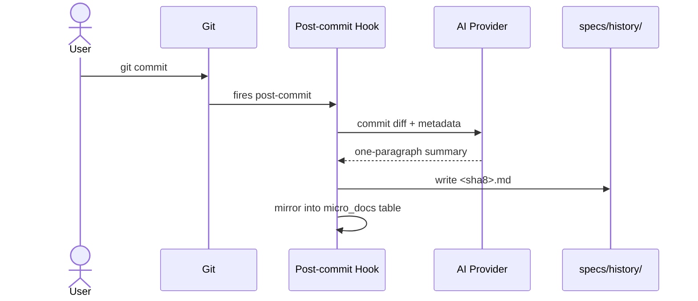

# Documentation — Auto Commit Docs

## What It Does

Every commit you make automatically gets a one-paragraph AI-generated summary describing what changed and why. The summary is saved as a markdown file keyed by commit SHA and stored in the repository's specs/history/ folder for easy lookup and indexing.

## How It Works

1. **Configure AI provider** — Run `specky init` and choose your AI backend (Anthropic, OpenAI-compatible — e.g. DeepSeek — or a local command). Specky validates the choice with a test call before saving it to specky.toml.

2. **Install git hook** — Run `specky install-git-hook` to register a post-commit hook that fires automatically after every commit, regardless of which agent (or none) created it.

3. **Automatic summary generation** — After each commit, the hook calls your configured AI provider with the commit details and writes the generated summary to `specs/history/<sha8>.md` (where sha8 is the first 8 characters of the commit SHA).

4. **Index for search** — Summaries are mirrored into a local SQLite `micro_docs` table, keyed by full commit SHA, so they're searchable during Phase 3 indexing and Phase 4 chat.

Per-commit runtime flow, once steps 1-2 are set up once:

## Outcomes

| Outcome | When | Result |
|---------|------|--------|
| **Summary created** | Commit hook runs successfully | One-paragraph doc written to `specs/history/<sha8>.md`; entry added to `micro_docs` table |
| **Hook skipped** | `specky install-git-hook` not yet run | Commits proceed normally; no summary generated |
| **Generation fails** | AI provider misconfigured or unreachable | Commit succeeds; summary is skipped; user sees error in terminal (if debugging) |
| **Provider not set** | `specky init` not yet run | Commits proceed; hook attempts to load config and fails gracefully |

## Acceptance Tests

| Given | When | Then |
|-------|------|------|
| `specky.toml` has valid `[ai]` config and git hook is installed | A commit is made | Within seconds, `specs/history/<sha8>.md` exists with a one-paragraph summary of the commit changes |
| `specky.toml` has valid Anthropic config | `specky init` is run with Anthropic selected | A live API call is made; if successful, config is written; if it fails, setup aborts and user sees the error |
| Git hook is installed but `specky.toml` is missing or invalid | A commit is made | Commit succeeds; no summary is written; no error shown to user (fails silently) |
| `specky init` is run with a local command provider | Provider is configured and validated | User is prompted to enter a shell command; Specky pipes a test prompt to it and verifies non-empty output before saving |
