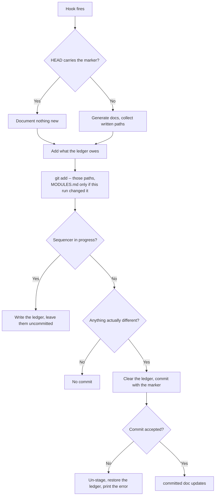

# Documentation — Auto Doc Commit

## What It Does
After generating documentation, the git hooks stage and commit it as a separate follow-up commit, identified by the marker message `docs: sync specky docs [skip specky]` to prevent infinite recursion. Instead of leaving generated files as uncommitted changes, the docs land in the repository on their own. Only the files this run actually wrote are committed, and nothing is committed at all while git is midway through a multi-commit operation — but what couldn't be committed then is remembered and committed by the next fire, because a doc left uncommitted forever is worse than no doc at all.

## How It Works
1. **A hook fires**: `post-commit`, `post-merge` or `post-rewrite` runs (see [documentation/auto-commit-docs.md](auto-commit-docs.md)).
2. **Check marker**: If `HEAD`'s message starts with the auto-commit marker, nothing new is documented — this is the hook's own auto-commit, and documenting it would recurse forever. The run still continues to the staging steps below, because a rebase replays doc-sync commits too, so this is exactly the state a rebase's own rename arrives in.
3. **Generate docs**: The run reconciles the backlog, writing a history file (`specs/history/<sha8>.md`) per commit plus any feature/workflow docs, and returns the list of paths it wrote. A `post-rewrite` fire adds both halves of each renamed history doc: the new file, and the old path it has to record as deleted.
4. **Add what an earlier fire owes**: Paths a previous fire wrote but couldn't commit are read back from a ledger in `.specky/` and joined to this run's. A path recorded as *deleted* whose file has since reappeared — a fast-forward or a checkout restoring the committed old-sha doc — is deleted again, so the commit removes the orphan instead of resurrecting it.
5. **Stage exactly those paths**: `git add -- <written paths>`. `specs/MODULES.md` is one of them only when this run changed it: it's edited as a side effect of writing a feature doc, so the run compares it before and after rather than staging it on every fire — which committed whatever edit a developer had pending in the index under the marker. A bare `git add specs` would sweep up a human's half-finished doc edit — somebody mid-sentence in a feature doc when a commit lands would find their draft committed under specky's name, and reverting the bot's commit would take their work with it. A path that neither exists nor is tracked is dropped first: handing git the deletion of a path it never knew fails the whole commit with `pathspec did not match any files`. This protects docs this fire didn't write, and only those — see [What Staging By Path Cannot Do](#what-staging-by-path-cannot-do).
6. **Refuse mid-sequencer**: If a rebase, cherry-pick, revert, merge or bisect is in progress, write the paths to the ledger, print that the docs were written but left uncommitted, naming the operation, and stop. A `git commit` inside someone else's replay confuses the sequencer at best.
7. **Check for changes**: If nothing was written, or the docs came out byte-for-byte identical to what's already committed, the process ends without creating a commit.
8. **Commit updates**: `git commit -m <marker> -- <the same paths>`. The pathspec makes it a partial commit, so anything else the user had staged stays staged. The ledger is cleared *before* the commit: that commit fires the hook again, and a nested fire that still saw a full ledger would report the lock it cannot take as a problem. A failed commit writes it back.
9. **Un-stage after a rejected commit**: If the commit is turned down — a `pre-commit` gate rejecting it is the ordinary case, since the pre-commit framework's `end-of-file-fixer` and `trailing-whitespace` both match `.md` — the paths staged in step 5 are dropped from the index again, leaving the files on disk for the ledger's retry. Without that, the docs stay staged and the developer's *next* commit sweeps them into their own feature commit under their name; the ledger's retry is a fire too late to prevent it, because the human commits before the next hook fires. A path the human had already staged themselves before the fire is left alone: their staged content is gone either way, and un-staging it would compound the loss rather than undo it.
10. **Report result**: On success the user sees "specky commit-doc: committed doc updates". A failure (another hook rejecting the commit) is printed and does not affect the original commit.

## What Staging By Path Cannot Do
Step 5's pathspec is what keeps a human's unrelated drafts out of the bot's commit, but it protects *files*, not *edits*. `git add -- <path>` stages that file's whole working-tree content, so a doc the fire rewrites is committed as it now stands — including whatever the human had already changed in it and not committed. `specs/MODULES.md` is in the same position whenever the fire adds a row to it. There is no narrower thing to stage: `git commit -- <paths>` commits each path's working-tree content, so even a hunk staged on its own with `git apply --cached` would be committed whole.

Seen on a trial repo where `specky tag` had added frontmatter to 43 docs without committing it: a `post-commit` fire updated three of those docs, and its `docs: sync specky docs [skip specky]` commit carried their frontmatter along with its own section splices — one of the three appears in that commit as five lines of frontmatter and nothing else. The docs the fire didn't write stayed dirty, as designed.

Nothing is destroyed — the content is committed rather than dropped, and the rewrite itself is still held to the content-loss gate in [documentation/feature-sync.md](feature-sync.md). What's wrong is the attribution: the marker says specky wrote this commit, and for those docs it also carries work specky didn't write. Anyone reverting the bot's commit to undo a bad doc update takes that work with it.

**Proposed, not implemented:** before rewriting a doc, compare it against `HEAD`, and when it already differs, leave it alone and print that it was skipped for having uncommitted edits — parking the draft the way a refused rewrite is parked. That would keep authorship clean, at the price of a doc going un-updated for as long as somebody has edits sitting in it, and of a new way for the backlog to stall quietly. It changes what the hook *writes* rather than what this doc *says*, so it deserves its own decision instead of arriving with this paragraph.

## Outcomes
| Scenario | Result |
|----------|--------|
| Docs generated successfully | New commit created with marker message, containing only the written docs, plus MODULES.md if the run changed it; original commit unaffected |
| Nothing written (e.g. every commit skipped by classification) | No auto-commit created, original commit unaffected |
| Docs regenerated byte-for-byte identical | Nothing staged is different, so no commit is created; HEAD unchanged |
| A rebase, cherry-pick, revert, merge or bisect is in progress | Docs stay on disk uncommitted; the operation is named; their paths go to the `.specky/` ledger |
| A later fire runs with the sequencer finished | The ledger's paths are committed and the ledger removed; a deletion whose file came back is re-applied |
| A `post-rewrite` renamed a history doc | The commit carries the new file and the deletion of the old one, so the old sha's doc leaves the tree |
| A human has uncommitted edits in a doc this fire does **not** write | Those edits are neither staged nor committed |
| A human has uncommitted edits in a doc this fire **does** write | They are committed too, under the marker message, beside specky's own changes to that doc — staging by path stages the file's whole content, not specky's changes to it |
| The user had unrelated staged work | It is still staged after the doc commit |
| Auto-commit attempt fails | Error printed to output, original commit unaffected; the docs are un-staged, stay on disk, and their paths go to the ledger for the next fire |
| Hook detects its own marker | Nothing new is documented; a rename or a ledger debt is still committed |

## Edge Cases

| Situation | What happens | Why |
|---|---|---|
| `HEAD` already carries the marker | Nothing new is documented, but staging still runs | Documenting the hook's own commit would recurse forever; a rebase replays doc-sync commits too, and that is exactly the state a rebase's rename arrives in |
| A rebase, cherry-pick, revert, merge or bisect is in progress | The paths go to the `.specky/` ledger, the operation is named, nothing is committed | A `git commit` inside someone else's replay confuses the sequencer at best — and a doc left uncommitted forever is worse than no doc, which is why the ledger exists rather than dropping them |
| A previous fire left a debt in the ledger | This fire commits those paths too | The fire that wrote them couldn't; a path recorded as deleted whose file has since reappeared is deleted again, so the commit removes the orphan rather than resurrecting it |
| A human has uncommitted edits in a doc this fire **doesn't** write | They are neither staged nor committed | Staging is by path, never a bare `git add specs` — someone mid-sentence would otherwise find their draft committed under specky's name |
| A human has uncommitted edits in a doc this fire **does** write | They are committed too, under the marker | `git add -- <path>` stages that file's whole working-tree content; git has no way to commit specky's changes to a file without the human's. See [What Staging By Path Cannot Do](#what-staging-by-path-cannot-do) |
| A human has uncommitted edits in `MODULES.md` and this fire adds no row to it | They are neither staged nor committed | `MODULES.md` is staged only when the run changed it. It used to be staged on every fire, and a feature's pending index rows landed in a `docs: sync specky docs` commit that way |
| A human has uncommitted edits in `MODULES.md` and this fire adds a row to it | They are committed too, under the marker | The same limit as any doc the fire writes: the file is committed whole |
| The docs regenerate byte-for-byte identical | No commit is created | There is nothing staged that differs, and an empty commit says a change happened when none did |
| A `pre-commit` gate rejects the doc commit | The paths are un-staged and left on disk for the ledger's retry | Left staged, the developer's *next* commit would sweep them into their feature commit under their name — and the retry is a fire too late to prevent it |
| The human had already staged one of those paths themselves | It is left staged | Their staged content is gone either way, and un-staging it would compound the loss rather than undo it |
| The user had unrelated staged work | It is still staged afterwards | The commit is a partial one, made with a pathspec |
| The commit fails for any other reason | The error is printed; the original commit is untouched | A hook must never be able to undo the commit that triggered it |

## Acceptance Tests
| Given | When | Then |
|-------|------|------|
| User makes a regular commit | A hook runs | Docs are generated, staged by path, and a follow-up commit with the marker message is created |
| A hook creates the auto-commit with the marker | The hook runs for that auto-commit | The marker is detected, no provider call is made, and no second commit appears |
| A rebase replays a work commit and a doc-sync commit | `post-rewrite` fires with the marker on HEAD | The renamed doc is committed anyway and the working tree is left clean |
| A rename was deferred by a sequencer file | The next ordinary fire runs | The rename is committed, the tree is clean, and the ledger file is gone |
| No docs are generated (commit filtered by classification) | The hook stages nothing | No commit is created |
| The docs regenerate identically | A hook runs twice over the same commit | HEAD is the same sha after the second run as after the first |
| A half-written feature doc is uncommitted in the docs root | A hook writes docs and commits | The draft is absent from the commit and still holds its uncommitted edits |
| Two docs carry uncommitted edits, and this fire rewrites one of them | The doc commit is made | The rewritten doc is in the commit and carries the human's uncommitted text; the doc the fire didn't write is absent from it and still shows as modified |
| `src.py` is staged when a hook fires | The doc commit is made | `git status --porcelain` still shows `A  src.py` |
| `.git/CHERRY_PICK_HEAD` exists | A hook writes docs | The history doc exists, HEAD is unchanged, and the output says the docs were left uncommitted |
| Another hook rejects the doc commit | The hook attempts to commit | The original user commit remains; the error is printed; the user sees "doc updates written but not committed" |
| A `pre-commit` gate rejects every doc commit | A hook writes docs and the commit is refused | The docs are on disk but `git diff --cached` is empty, so the developer's next commit contains only their own work |
| The human had `src.py` staged and the doc commit is rejected | The un-staging runs | `src.py` is still staged |
| `MODULES.md` has an uncommitted edit and the fire writes only a history doc | The doc commit is made | `MODULES.md` is absent from it, still holds the edit, and still shows as modified |
| `MODULES.md` has an uncommitted edit and the fire writes a new feature doc | The doc commit is made | The committed `MODULES.md` has the new doc's row and the human's edit, and the working tree is clean for it |
