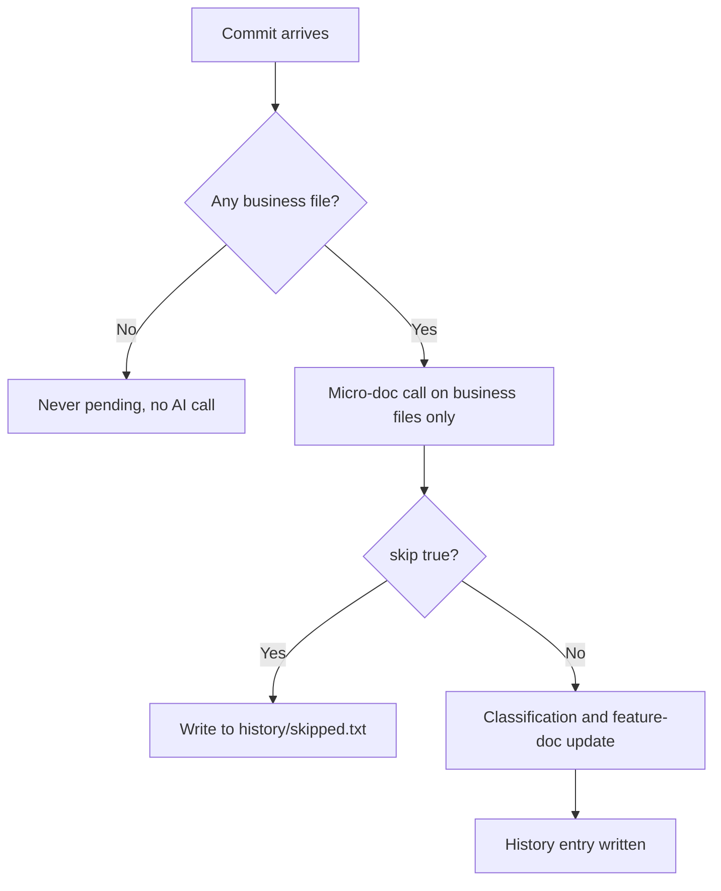

# Documentation — Business Logic Filtering

## What It Does
When specky looks at a repository's commits to write history documentation, this filtering decides which commits actually deserve an AI call and a written entry. It exists so that version bumps, tests, docs plumbing, CI, infrastructure and similar non-product changes are left out — saving provider calls and keeping the manual cleanup of `impact: internal` entries to a minimum. The result is a history that only records commits that change the product's rules or behaviour.

## How It Works
1. **Filter by files first.** Before anything is queued, a commit whose changed files are all non-business (docs, tests, CI, infrastructure, manifests, lockfiles, editor and agent config, docs root) is discarded — it is never pending and costs no AI call.
2. **Ask the provider for a micro-doc.** For every remaining commit, the micro-doc call runs with only the business files' part of the diff and a list of those files.
3. **Accept a skip.** The call may answer `{"skip": true}`, which ends the commit there: no classification, no feature-doc update, no entry.
4. **Write the skip to the ledger.** A skipped commit is appended to `<docs root>/history/skipped.txt` so it is never asked about again.
5. **Document the rest.** Any commit that does not return `{"skip": true}` continues to classification and, where relevant, the feature-doc update, and becomes a history entry.

## Outcomes
| Outcome | What it means |
|---|---|
| Non-business commit discarded | Commit touched no business file; never pending, no AI call made. |
| Commit skipped by provider | Micro-doc answered `{"skip": true}`; recorded in `history/skipped.txt`, no entry, no call again. |
| Commit documented | Micro-doc did not skip; commit continues to classification, feature-doc update and history entry. |

## Constants & Invariants
- A commit with no business file costs **0 AI calls** and is **never pending**.
- `specky sync`'s estimate is **one to three AI calls per commit** (was two to three).
- The built-in non-business list covers: docs, tests, CI, infrastructure, manifests and lockfiles, editor and agent config, and the docs root.
- `[history] paths` narrows which files can count at all — e.g. `["api/*"]`.
- `[history] exclude_paths` adds globs, with `!glob` to re-include.
- The `document-commits` skill works through **at most 5 commits** unless the user asked for more.
- A skipped commit's ledger line travels with an amend or rebase; deleting the line re-queues the commit.
- Precedence: file filter runs before the micro-doc call; the `{"skip": true}` answer runs before classification and the feature-doc update.

## Edge Cases
| Situation | What happens | Why |
|---|---|---|
| Commit touches no business file | Never pending; no AI call. | Saves the call entirely. |
| Micro-doc returns `{"skip": true}` | No classification, no feature-doc update, no entry; commit added to `history/skipped.txt`. | Stops the work before any further calls. |
| Commit would have extended an existing entry | The existing entry is left as it was. | A skip writes nothing. |
| Commit is amended or rebased | Its line in `skipped.txt` is carried along. | Keeps the skip applied to the same change. |
| The skipped line is deleted | The commit is re-queued. | Manual escape hatch. |
| An entry has already been written for a commit now considered internal | The skip ledger is what prevents future calls; the entry is not retroactively removed by this flow. | Ledger only suppresses future asks. |

## Maintainer Notes
- The `document-commits` skill records a skip with `specky record-commit <sha>` and `{"skip": true}` on stdin.
- The activity brief ignores commits with no business logic — no business file, or present in the skip ledger — the same way it ignores skip-tagged commits.
- `specky pending --json` already omits commits that touch only tests, docs, CI, infrastructure, lockfiles and the like.
- Step 4 of the skill stages `specs/history/skipped.txt` when a commit was skipped, and the commit message lists only the shas that received entries (not the skipped ones).

## Acceptance Tests
| Given | When | Then |
|---|---|---|
| A commit whose files are all non-business | It is considered for documentation | It is never pending and no AI call is made. |
| A business commit whose micro-doc returns `{"skip": true}` | The call answers | No classification, no feature-doc update, no entry, and the sha is in `history/skipped.txt`. |
| A commit already in `history/skipped.txt` | Documentation runs again | It is not asked about again. |
| A skipped commit is amended or rebased | History is recomputed | Its line in `skipped.txt` is carried along. |
| A line is deleted from `skipped.txt` | Documentation runs | The commit is re-queued. |
| A commit returning `{"skip": true}` would have extended an existing entry | The call answers | The existing entry is left as it was. |
| A commit with a business file and no skip answer | The call returns a normal micro-doc | It continues to classification and the feature-doc update, and an entry is written. |
