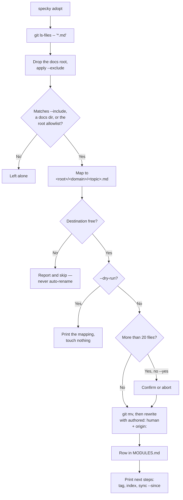

# Documentation — Doc Adoption

## What It Does

Two things make adopting specky on a repo that is already documented safe, rather than the fastest
way to double its documentation.

**`specky adopt`** imports the markdown a repo already has — `docs/`, `adr/`, `ARCHITECTURE.md` —
into the docs tree as `<docs root>/<domain>/<topic>.md`. Without it, the first `specky sync` is blind
to those files: classification only ever sees the docs root, so it invents `specs/billing/refunds.md`
next to the `docs/billing/refunds.md` that already says the same thing — and specky's own
classification prompt calls a second doc on one subject a defect. Adoption *imports* rather than
merely noting the files exist, and that is the point: once they're under the docs root, every part
of specky sees them at once — classification, the index, `specky check`, the viewer, `specky export`.

**A configurable docs root** covers the other collision. `specs/` is only the default name; plenty of
repos already use that directory for OpenAPI documents, a Rust `specs` crate, or an ECS module, and
specky generating into it would mix two unrelated trees together in a way no command can unpick
afterwards. The root is read from config, and `specky init` notices the collision and offers a
different name before anything is written.

Three properties of `adopt`, each a deliberate decision:

- **No AI call, ever.** It's discovery, `git mv` and frontmatter. Filling in `type:` and `tags:` is
  `specky tag`'s job and stays there, so adoption is free, instant, and easy to trust.
- **Adopted docs are frozen.** Each gets `authored: human`, the marker feature sync already honours
  (see [documentation/feature-sync.md](feature-sync.md)), so a doc somebody wrote by hand isn't
  rewritten by the hook the week after it's imported. Deleting the line opts back in.
- **Nothing is committed.** A one-time import that rearranges where a repo's documentation lives is
  exactly the change a human should read in `git status` first.

## How It Works

1. **Discover** — One `git ls-files -- '*.md' '*.markdown'`. Asking git rather than walking the
   filesystem is the load-bearing choice: anything untracked or gitignored is invisible by
   construction, so `node_modules/`, a `.venv/`, a vendored dependency's docs and specky's own
   `.specky/` are excluded without a denylist that needs a new entry per ecosystem. Kept are files
   under `docs/`, `doc/`, `documentation/`, `adr/`, `rfc/`, `rfcs/`, anything under a nested
   `adr/`, `adrs/`, `decisions/`, `rfc/`, `rfcs/`, and the root-level allowlist `ARCHITECTURE.md`,
   `DESIGN.md`, `RUNBOOK.md`, `OPERATIONS.md`. The docs root itself is skipped — it's already home.
2. **Filter** — `--exclude GLOB` wins over everything, so a repo can adopt `docs/` while leaving
   `docs/vendor/` where it is. `--include GLOB` adds paths the conventions wouldn't have found and
   overrides the furniture rule. Both are repeatable.
3. **Map to a destination** — The old tree's structure is someone's considered filing decision, so
   it's preserved rather than re-derived (re-deriving it would need the AI call this command doesn't
   make):

   | Source | Destination | Why |
   |---|---|---|
   | `docs/billing/refunds.md` | `billing/refunds.md` | The segment below the docs directory is the domain — the same thing specky's classification means by one |
   | `docs/billing/api/refunds.md` | `billing/api-refunds.md` | A domain is one level by definition, so deeper nesting folds into the topic instead of being dropped (which would collide two docs on one name) |
   | `docs/billing/README.md` | `billing/overview.md` | A folder's index doc is about the folder, so the folder names the domain |
   | `docs/refunds.md` | `docs/refunds.md` | Nothing between the directory and the file, so the directory's own name is the domain. A flat `docs/` tree is where `--domain` earns its keep |
   | `ARCHITECTURE.md` | `architecture/overview.md` | Same idea one level up |
   | `RefundFlow.md` | `refund-flow.md` | Kebab-casing splits before an interior capital, which is most of what an older tree is named like |

4. **Skip a taken destination** — A destination that already exists, or that two sources both claim,
   is reported and skipped. Never renamed to a free name: an automatic `-2` suffix would produce
   exactly the duplicate this command exists to prevent, only harder to spot. The human picks
   `--domain`, a rename, or a merge.
5. **Write the frontmatter** — Every existing key is preserved (an older tree may already carry
   `owner:` or `related:`, which are the fields specky would otherwise ask a human for), plus
   `authored: human` and `origin: <old path>` so a stale link to the old path can be resolved.
   `origin:` is in the set of keys a later regeneration carries through, so the provenance pointer
   survives. `type`/`tags` are left unset for `specky tag`.
6. **Dispose of the source** — `--move` (the default) runs `git mv` *before* rewriting the file, so
   git records a rename rather than a delete plus an unrelated add — which is what keeps
   `git log --follow`, and therefore specky's staleness dates, working across the import. `--keep`
   copies instead, leaving two live copies to keep in step. `--stub` moves and leaves a one-line
   link behind for anything pointing at the old path.
7. **Add the index row** — `specs/MODULES.md` gains a row per adopted doc, with the purpose taken
   from the doc's own H1. Free, no provider.
8. **Confirm and report** — Above 20 files it stops to confirm (not about money — nothing here is
   billable — but about scale: someone who meant to adopt one directory should find out before 300
   files move). `--dry-run` prints the mapping and touches nothing. `--yes` skips the prompt, and is
   required when stdin isn't a terminal.
9. **Print the next steps** — `specky tag`, `specky index`, then `specky sync --since <a recent
   revision>`. The last one is narrow on purpose: this repo is already documented, so a full-history
   sync would pay to describe commits these docs already cover.

The docs root itself is resolved in one place, which every other module asks instead of hardcoding
`specs`:

- `[docs] root` in **specky.toml** wins, so a developer can point somewhere else locally.
- `[tool.specky.docs] root` in **pyproject.toml** is the fallback, and the one that matters for CI:
  `specky init` writes a *gitignored* specky.toml, so a root kept only there is absent in CI — where
  `specky check` and `specky index` have to resolve the identical tree or the gate reads an empty
  one. So `specky init` prints the pyproject lines to commit when it records a custom root.
- Otherwise `specs`.
- A root that is absolute or escapes the repo falls back to the default rather than being obeyed:
  every consumer assumes docs live inside the repo, since paths are stored in the index relative to
  the repo root and handed to git as pathspecs. `specky init` rejects such an answer outright
  instead — there's a human there to retype it.
- `history/` inside the root is not configurable. It's an implementation detail of the per-commit
  trail, not a layout choice a repo has an opinion about.

`specky init` also looks before it writes: any non-markdown file under `specs/` means the directory
already belongs to something else (specky's own tree is `<domain>/<topic>.md` and nothing else), so
it names the offending files and offers a different root. On the overwhelming majority of repos,
where `specs/` is free, the question never appears.

## Outcomes

| Outcome | When | Result |
|---------|------|--------|
| **Imported** | A tracked doc matches the conventions and its destination is free | `git mv` into `<docs root>/<domain>/<topic>.md`, frontmatter gains `authored: human` + `origin:`, a row is added to MODULES.md |
| **Skipped — taken** | The destination exists, or two sources map onto it | Reported with the reason; nothing is moved; the human resolves it |
| **Left alone** | Untracked, gitignored, vendored, or repo furniture (`README.md`, `CONTRIBUTING.md`, `CHANGELOG.md`) | Not adopted; furniture is adoptable anyway with an explicit `--include` |
| **Nothing found** | The repo has no existing docs outside the docs root | An empty report; no next-steps block |
| **Preview only** | `--dry-run` | The full mapping and skip list are printed; no file is created, moved or modified |
| **Stopped to confirm** | More than `ADOPT_CONFIRM_THRESHOLD` (20) files, no `--yes` | Prompts; with stdin not a terminal it errors and suggests `--yes` or `--include`/`--exclude` |
| **Frozen on arrival** | Any adopted doc | Feature sync won't regenerate it while `authored: human` is there, though the commit is still linked to it |
| **Never committed** | Always | The import sits in the working tree; `--move` is one `git checkout` away from undone |
| **Custom root honoured** | `[docs] root` or `[tool.specky.docs] root` is set | Index, search, check, render, export, testgen, doctor and both doc-generation paths all read that tree |
| **Bad root ignored** | The configured root is absolute, escapes the repo, or is empty | Falls back to `specs` rather than writing outside the repo |
| **Collision caught at init** | `specs/` holds non-markdown files | `specky init` names them, offers another root, writes `[docs] root`, and prints the pyproject lines to commit for CI |

## Acceptance Tests

| Given | When | Then |
|-------|------|------|
| A repo with tracked `docs/billing/refunds.md` | Run `specky adopt` | `specs/billing/refunds.md` exists with `authored: human` and `origin: docs/billing/refunds.md`; the body is unchanged |
| The same | After the run | `git status` records a rename from the old path, so `git log --follow` still reaches the doc's history |
| A tracked `docs/billing/README.md` | Run `specky adopt` | It lands at `specs/billing/overview.md` |
| A tracked `docs/billing/api/refunds.md` | Run `specky adopt` | It lands at `specs/billing/api-refunds.md` — the domain stays one level deep |
| A tracked root-level `ARCHITECTURE.md` | Run `specky adopt` | It lands at `specs/architecture/overview.md` |
| A tracked `docs/RefundFlow.md` | Run `specky adopt` | The topic is `refund-flow.md`, not `refundflow.md` |
| An existing `specs/billing/refunds.md` and a `docs/billing/refunds.md` | Run `specky adopt` | The source is reported as skipped naming the destination; no file is moved and no `-2` suffix is invented |
| Two sources that map onto one destination | Run `specky adopt` | The first is imported, the second is reported as taken by the first |
| A gitignored `docs/ignored.md` and an untracked `docs/untracked.md` | Run `specky adopt` | Neither is adopted — discovery only sees tracked files |
| A root-level `README.md`, `CONTRIBUTING.md` and `CHANGELOG.md` | Run `specky adopt` | None is adopted; `--include README.md` adopts it as `<repo-name>/overview.md` |
| A repo with `docs/` and `docs/vendor/` | Run `specky adopt --exclude 'docs/vendor/*'` | The vendor files stay where they are; the rest is imported |
| A doc already carrying `owner:` frontmatter | Run `specky adopt` | `owner:` survives, `authored`/`origin` are added, and `type`/`tags` are left for `specky tag` |
| A flat `docs/a.md`, `docs/b.md` | Run `specky adopt --domain Billing` | Both land under `specs/billing/`, kebab-cased from the override |
| Any adoptable repo | Run `specky adopt --dry-run` | The mapping is printed and the source files are untouched — the docs root is not created |
| An adoptable repo | Run `specky adopt --keep` | The original stays in place and the destination is a copy |
| An adoptable repo | Run `specky adopt --stub` | The original holds a one-line link whose relative path resolves to the new location |
| An adopted doc whose H1 is `# Refund flow` | Read `specs/MODULES.md` | It has a row linking `billing/refunds.md` with `Refund flow` as the purpose, taken from the doc's own heading rather than from a provider call |
| An adopted doc | Load the existing-docs block classification sees | The doc's `domain/topic` is absent before adoption and present after — which is what stops sync writing a duplicate |
| More than 20 adoptable files, stdin not a terminal | Run `specky adopt` without `--yes` | It errors, names the threshold, and moves nothing |
| A repo with no config | Ask for the docs root | It is `specs` |
| `[tool.specky.docs] root = "documentation"` in pyproject.toml | Ask for the docs root | It is `documentation`, so CI resolves the same tree the developer does |
| Both files set a root | Ask for the docs root | specky.toml's `[docs]` wins; a specky.toml with no `[docs]` table falls through to pyproject.toml |
| `root = "  documentation/  "` | Ask for the docs root | Whitespace and trailing slashes are trimmed to `documentation` |
| `root` is `/etc/specs`, `../outside`, `docs/../../outside` or empty | Ask for the docs root | Each falls back to `specs` |
| A repo whose root is `documentation/`, with docs and history docs in it | Run index, search, check, render-html, export and doctor | Each reads `documentation/`: search finds the doc, check reports a violation against it, the viewer page is named after the doc rather than the directory, export skips `history/`, and doctor's backlog count is right |
| `specs/openapi.yaml` exists | Run `specky init` | It names the file, offers another root, writes `[docs] root` to specky.toml, and prints the `[tool.specky.docs]` lines to commit |
| The same, answering with an absolute path | Run `specky init` | It refuses with an error rather than silently treating it as relative |
| `specs/` is free | Run `specky init` | No docs-root question is asked and no `[docs]` table is written |
