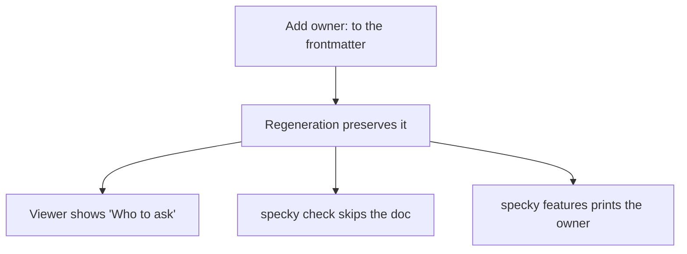

# Documentation — Doc Ownership

## What It Does

Each generated document can include an `owner:` field in its frontmatter — a name, team, or Slack channel — so readers know who to ask if they have questions. The viewer displays it as a "Who to ask" line under the document header, and `specky check` alerts you when documents in your change don't have one assigned yet.

## How It Works

1. **Add an owner to the frontmatter**: Edit any classified document and add an `owner:` line (free text: a name, team, Slack channel, or any contact) to the YAML frontmatter at the top.

2. **Owner persists across regenerations**: Both the git hook (`specky sync`) and the document-domain skill preserve your owner line exactly as written when regenerating a document. The skill never generates an owner — it's always hand-authored.

3. **Viewer shows "Who to ask"**: When rendered in the HTML viewer, the owner appears as a "Who to ask" line under the document header so readers know where to direct questions.

4. **`specky check` advises on missing owners**: When you run `specky check`, it scans classified documents in the changed range and reports which ones lack an `owner:` as a note (advice only — never a failure).

5. **`specky features` lists owners**: The `specky features` command prints the owner field for each document in the classified registry.

## Outcomes

| State | Behavior |
|-------|----------|
| Document has `owner:` filled in | Viewer displays "Who to ask: [owner]"; `specky check` skips it |
| Document has `owner:` empty or missing | Viewer shows nothing; `specky check` lists it as unowned advice |
| Document is a history doc (specs/history/) | Owner field is ignored; history docs are never checked |
| Range touches many unowned docs | `specky check` lists up to 10, then summarizes the rest |

## Edge Cases

| Situation | What happens | Why |
|---|---|---|
| The doc has no `owner:` at all | The viewer shows no "Who to ask" line and `specky check` lists it as advice | An owner is a fact about the team, so no diff can be said to have broken it — failing the build over one would block work nobody can unblock |
| A model is asked to write a doc | It never fills in `owner:` | The model has no way to know who to ask, and a guessed owner is worse than none: readers would direct questions at someone who never agreed to take them |
| The doc is under `specs/history/` | It is never checked for an owner | There is one per commit, its owner is the commit's author, and nobody hand-edits them — asking would be thousands of lines of advice about docs that don't want it |
| More than ten unowned docs are in the range | The first ten are listed and the rest counted | A list long enough to scroll buries the part of the report that is about the change in front of you |
| A regeneration rewrites the whole doc | The `owner:` line survives it | `owner:` is hand-authored and is carried through explicitly, alongside `related`, `authored` and `origin` |

## Acceptance Tests

| Given | When | Then |
|-------|------|------|
| A classified document with no `owner:` line | I view it in the HTML viewer | No "Who to ask" line appears |
| A classified document with `owner: Payments team` | I view it in the HTML viewer | "Who to ask: Payments team" appears under the header |
| A classified document with `owner: #support` | I run `specky check` | The document is not flagged; check reports it as advice only |
| Two classified docs in my change, neither with an owner | I run `specky check` | Output includes a note listing both paths as unowned |
| Five unowned docs in the changed range | I run `specky check` | All five are listed (limit applies only after ten) |
| I regenerate a document with an existing `owner:` line using the hook | The hook runs `specky sync` | The owner line is preserved unchanged in the regenerated doc |
| I regenerate a document with an existing `owner:` line using the skill | The document-domain skill updates the doc | The owner line is preserved unchanged |
| A history doc (specs/history/abc123.md) exists | I run `specky check` | It is never flagged for missing owner, regardless of its frontmatter |
