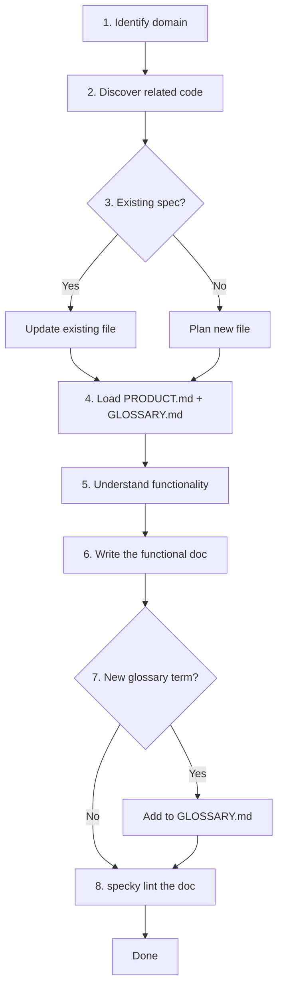

# Domain Documentation Workflow

## What It Does
When you need to document a feature, module, or domain in the codebase, this workflow guides you through discovering related code, understanding the functionality, and writing a functional spec that non-technical stakeholders can read. The result is a markdown file in `specs/` that stays consistent with the project's glossary and product framing.

## How It Works

1. **Identify the domain** — you provide the module name (e.g., "billing", "search", "auth") or specific files to document.
2. **Discover related code** — search the codebase for all files matching the domain name and identify the key services, components, routers, or jobs.
3. **Check existing specs** — look in `specs/<domain>/` to see if this topic is already documented; if so, update it instead of creating a duplicate.
4. **Load the shared vocabulary** — read `specs/PRODUCT.md` (product framing), `specs/GLOSSARY.md` (canonical term definitions), `specs/TAGS.md` if the repo keeps one (the tag vocabulary), and the parts of the docs sharing this doc's tags that touch its subject — so a rule another doc already states is linked to, not restated.
5. **Understand the functionality** — read the main implementation files to identify: what the feature does, the sequence of steps it follows, and what outcomes it produces.
6. **Write the functional doc** — create or update a markdown file in `specs/<domain>/` using kebab-case topic names (not `README.md`) with sections for: What It Does, How It Works, Outcomes or Statuses, Constants & Invariants, optional Maintainer Notes, and Acceptance Tests. A doc classified as a *workflow* has a stricter shape — How It Works carries the happy path only, a mermaid diagram of it sits directly under the steps, and an Edge Cases table gathers the branches off it.
   - **Constants & Invariants** holds every threshold, weight, limit, formula and precedence order the code applies, verbatim. "Focus on what, not implementation" was read by every model and agent writing from the template as licence to turn `+1000 within tolerance` into "a high score"; a migration of one real repo lost dozens of constants that way while every doc read well. The numbers are the *what*, and the template now says so where the style rule is stated.
   - **Maintainer Notes** is the one section where implementation detail belongs: who reads a field, implementations that must change together (a function and its SQL twin), operational steps tied to the feature. Before it existed, that content had no home and was dropped.
   - **One owner per rule** — a tie-break, a trigger, a threshold is stated in the doc whose subject it is; other docs link to it, or copy its wording exactly. Agents writing docs in parallel shipped three contradictions in one migration, each doc individually plausible.
7. **Update shared glossary if needed** — if the domain introduces a genuinely new term other specs will need, add it to `specs/GLOSSARY.md`. A status or outcome name other docs also use is shared vocabulary too.
8. **Lint the doc set** — run `specky lint <doc>`. It lists terms used across docs that the glossary doesn't define, tags outside the vocabulary, and numbers two docs sharing a tag disagree on. Fix what the new doc caused; the rest is advice.

## Outcomes

| Outcome | Meaning |
|---------|---------|
| New spec created | `specs/<domain>/<topic>.md` written with all required sections |
| Existing spec updated | Found and updated `specs/<domain>/<topic>.md` to reflect current implementation |
| New glossary term added | Domain introduced a concept that is now defined in `specs/GLOSSARY.md` |
| Consistency verified | All terms used match existing glossary; product framing aligns with `PRODUCT.md`; `specky lint` reports nothing the doc caused |

## Edge Cases

| Situation | What happens | Why |
|---|---|---|
| The topic is already documented | The existing doc is updated in place rather than a second one written | A second doc on one subject is a defect: it reads as authoritative, it is the copy nobody updates, and the two drift apart |
| A neighbouring doc owns what happens upstream or downstream | It is linked to, not retold | Retelling a neighbour's territory is the same defect as a duplicate. A doc that says less because its neighbour says the rest is the better doc |
| The concept already has a glossary term | That exact term is reused, never a synonym | Shared vocabulary is the whole point of the glossary; a synonym splits one concept into two that no search connects |
| The domain introduces a genuinely new shared term | It is added to `specs/GLOSSARY.md` | Only for vocabulary other docs will reuse — a term local to one doc belongs in that doc |
| The code doesn't settle something | The doc says so plainly instead of guessing | A confident sentence about behaviour that does not exist is the one failure nobody can spot by reading the doc |
| The subject is a multi-step process with an outcome per step | It is classified `type: workflow` and owes a diagram and an `## Edge Cases` table | A sequence's whole value is the order, which a numbered list and a diagram state and a prose paragraph buries |
| The subject is a bounded capability, or a single scenario | It is a `type: feature`, and gets a diagram only if it earns one | Classification follows what the document is *about*, not whether some pipeline exists upstream of it — a set of commands for querying data is a feature, even though something had to produce the data |
| A doc name like `utils`, `helpers` or `README` suggests itself | It is rejected as a domain or topic | Those name a layer, not something the system does for its users, and nobody looking for a behaviour would search for them |
| The code applies thresholds, weights or formulas | They go in `## Constants & Invariants`, verbatim | A summary of a rule can't answer the question a reader came with; a rewrite that states them less exactly has lost them, and `specky check` lists each one a later update drops |
| The code applies none | The Constants section is left out | An empty section is noise |
| A field's consumers, a lockstep implementation or an operational step matters to maintainers | It goes in `## Maintainer Notes` | The rest of the doc is for readers who never touch the code; this is the one section exempt from that |
| A rule is already stated in a doc sharing this one's tags | This doc links to it, or copies it word for word | Two paraphrases of one rule are how two docs come to disagree |
| The repo keeps a `TAGS.md` | Tags come from it; a needed new tag is proposed, not coined | A tag on one doc groups nothing, and agents that couldn't see the vocabulary invented one per doc |

## Acceptance Tests

| Scenario | Given | When | Then |
|----------|-------|------|------|
| First-time domain doc | No existing `specs/<domain>/` | User requests docs for "billing" | Workflow discovers billing code, creates `specs/billing/`, writes markdown with all sections; non-technical reader understands what the feature does |
| Existing doc update | `specs/billing/invoicing.md` exists but is outdated | User requests docs for "billing" | Workflow finds existing file, updates How It Works and Acceptance Tests to match current implementation |
| New term introduced | Domain uses concept "pro-rata credit" not in `specs/GLOSSARY.md` | Doc is written | Workflow prompts to add "pro-rata credit" to glossary; term is defined and used consistently in both the new doc and glossary |
| Glossary reuse | "pro-rata credit" already in `specs/GLOSSARY.md` | Domain doc references the concept | Workflow reuses the exact glossary definition; no synonym or alternate wording is invented |
| Constants kept | Code scores a pair +1000 within tolerance, else `500 − Δ% × 5` | Doc is written | `## Constants & Invariants` states both, verbatim, with the formula in a code block |
| Maintainer content has a home | `effective_total` is read by matching and the UI, and has a SQL twin | Doc is written | `## Maintainer Notes` names the consumers and the lockstep pair |
| Shared rule linked | The best-deal tie-break is stated in `comparison/by-category.md`, which shares the `comparison` tag | A workflow doc mentioning it is written | It links to `by-category.md` rather than paraphrasing the rule |
| Registered tag | `specs/TAGS.md` lists `matching` | A matching doc is written | Its `tags:` uses `matching`, and any other needed tag is proposed in the summary, not added |
