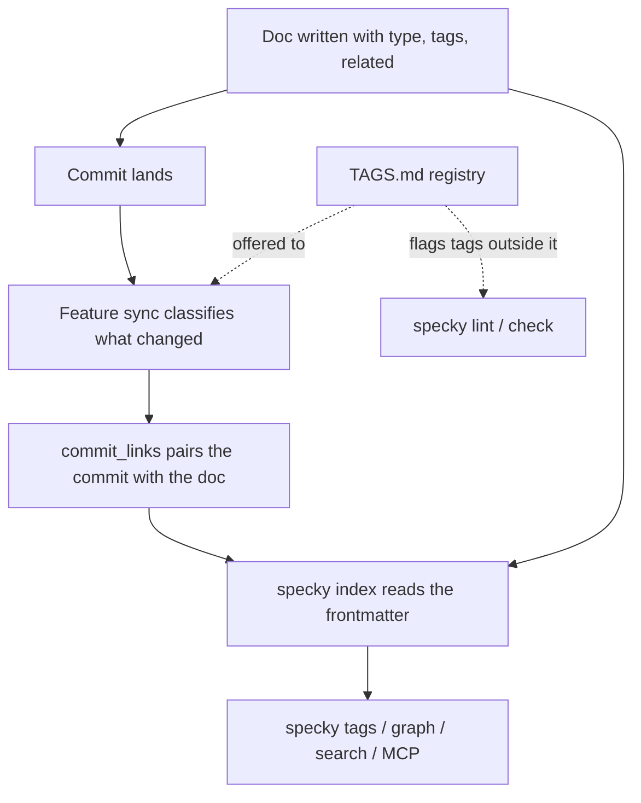

# Documentation — Feature Classification And Tags

## What It Does
Spec docs get metadata frontmatter (`type`, `tags`, `related`). Every commit is AI-classified to link it to the docs it affects; a doc's `type` and `tags` come from that classification when the doc is first written, and are kept after that. Shared tags enable grouping and search across features; optional cross-links connect unrelated docs. All relationships live in SQLite, queryable via CLI and MCP — see [catalog/feature-graph.md](../catalog/feature-graph.md) for what those queries return.

## How It Works

1. **Frontmatter structure**: Each spec doc starts with YAML declaring `type` (feature or workflow), `tags` (1-3 kebab-case business/domain concepts, not implementation details), and optionally `related` (hand-authored cross-links to other docs). List values may be written inline (`tags: [billing, refunds]`) or as a YAML block list (`sources:` followed by `  - api/x.py` lines); both forms are read back as lists, so an agent that writes one style doesn't lose the doc's `type` and `tags` with it.

2. **Tag vocabulary**: Tags are deliberately shared across docs for the same business concept (e.g., `billing`, `refunds`) — they only work for search and grouping if they're consistent across docs. A repo can pin the vocabulary down in a **tag registry**: `TAGS.md` in the docs root, a `| **tag** | meaning |` table in the same shape as `GLOSSARY.md`. It's a plain file on purpose — an agent writing docs can read it without running anything, where `specky tags` needs a shell and an index (agents in one real migration couldn't run it, and invented fifteen single-doc tags). `specky tags --write` seeds or extends it from the tags in use, additively, each new row's meaning a placeholder naming the docs that carry it for a human to replace. With a registry, the classifier and `specky document` are offered its tags — not whatever docs happen to carry, which is how sprawl reproduces — and `specky lint`/`specky check` flag a tag outside it. Without one, they flag a tag only one doc carries.

3. **AI classification**: After each commit, feature sync examines what changed and classifies which documented features/workflows are affected, storing the link in `commit_links` table.

4. **Preserved cross-links**: The `related:` field is hand-authored and preserved across automatic doc regeneration — the AI classifier never overwrites it, so you can manually link two docs that share no tag.

5. **Queryable index**: Frontmatter metadata feeds `specky tags` (list all tags), `specky graph` (draw the docs and the links between them — nodes and edges only, no commits), tag-based search in `specky search`, and MCP endpoints for features, workflows, tags and commit info. Which pairs actually earn an edge is narrower than it sounds and is covered in [catalog/feature-graph.md](../catalog/feature-graph.md).

## Edge Cases

| Situation | What happens | Why |
|---|---|---|
| Two features carry the same tag | `specky tags` lists both, `specky graph` draws no edge between them | An edge is drawn only from a **workflow** to a **feature** — two features sharing a tag are siblings, not a dependency |
| A doc is regenerated | `related:` survives it untouched | It is hand-authored, and the classifier is never asked for it — regenerating it would quietly delete somebody's cross-link |
| The classifier decides a commit documents nothing | No `commit_links` row is written | A link to a doc the commit didn't change is worse than no link: it is what `specky check` later enforces |
| The doc names a tag no other doc uses, and there's no `TAGS.md` | `specky lint` and `specky check` note it as a tag that groups nothing; nothing fails | A first use has to start somewhere, but a tag on one doc is usually a synonym for an existing one |
| There's a `TAGS.md` and a doc carries a tag it doesn't list | `specky lint` and `specky check` note it as unregistered, however many docs carry it; nothing fails | The registry is the decision about what a tag may be; adding a row is how a new one is accepted |
| `specky tags --write` runs on a registry someone curated | Only tags missing from it are added; existing rows and their meanings are untouched | It's a file people edit, like the glossary |

## Acceptance Tests

| Given | When | Then |
|-------|------|------|
| New commit touching a documented feature | Feature sync runs after commit | A `commit_links` row pairs the commit with that feature's **doc**; its tags are read from the doc when something asks |
| Existing doc with hand-written `related:` list | Feature sync regenerates the doc body | `related:` field stays unchanged; only content above/below frontmatter updates |
| Multiple docs with tag `billing` | `specky tags` runs | The tag is listed once, with every doc carrying it. `specky graph` is narrower: a shared tag draws an edge only from a **workflow** to a **feature**, so two features both tagged `billing` are not connected |
| Two docs sharing no tag | User manually adds `related: [domain/topic]` to frontmatter | `specky graph` shows the cross-link; link persists if doc regenerates later |
| User queries `specky search refunds` | Search runs over FTS5 index | Results include docs tagged `refunds` and commits affecting them |
| Docs tagged `matching`, `billing` and `manual-linking`, no `TAGS.md` | `specky tags --write` | `TAGS.md` lists all three, each meaning "Used by <the docs carrying it>" |
| The same, after a human rewrote `matching`'s meaning, plus a new `invoicing` doc | `specky tags --write` again | Only `invoicing` is added; `matching` keeps the curated meaning |
| `TAGS.md` lists `matching` and `billing` | The classifier builds its prompt | The tags offered are exactly the registry's, flagged as the only ones to use |
| `TAGS.md` lists `matching` and `billing`; a doc carries `manual-linking` | `specky lint` | `manual-linking` is reported as not in TAGS.md |
| No `TAGS.md`; one doc carries `manual-linking` | `specky lint` | `manual-linking` is reported as carried by one doc only |
