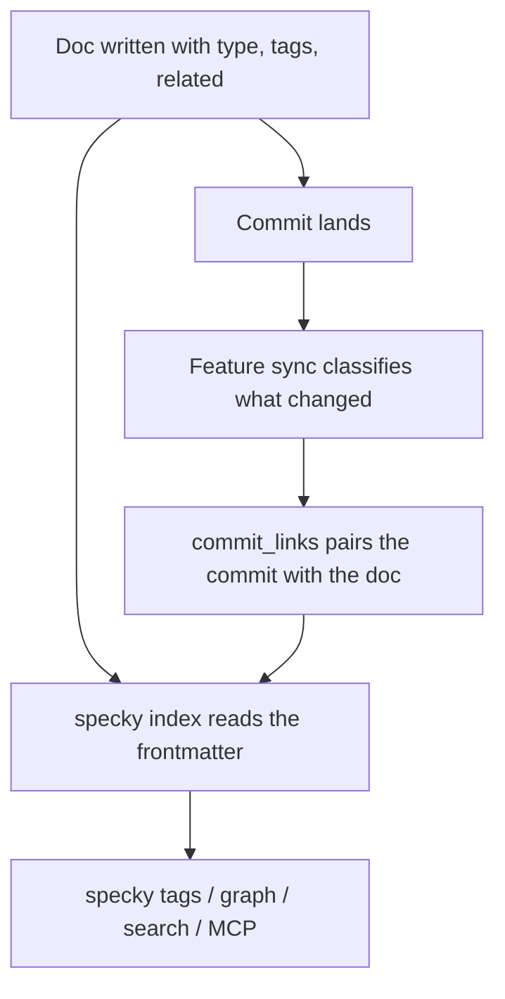

# Documentation — Feature Classification And Tags

## What It Does
Spec docs get metadata frontmatter (`type`, `tags`, `related`). Every commit is AI-classified to link it to the docs it affects; a doc's `type` and `tags` come from that classification when the doc is first written, and are kept after that. Shared tags enable grouping and search across features; optional cross-links connect unrelated docs. All relationships live in SQLite, queryable via CLI and MCP — see [catalog/feature-graph.md](../catalog/feature-graph.md) for what those queries return.

## How It Works

1. **Frontmatter structure**: Each spec doc starts with YAML declaring `type` (feature or workflow), `tags` (1-3 kebab-case business/domain concepts, not implementation details), and optionally `related` (hand-authored cross-links to other docs).

2. **Tag vocabulary**: Tags are deliberately shared across docs for the same business concept (e.g., `billing`, `refunds`). Run `specky tags` first and reuse an existing tag if one fits — tags only work for search and grouping if they're consistent across docs.

3. **AI classification**: After each commit, feature sync examines what changed and classifies which documented features/workflows are affected, storing the link in `commit_links` table.

4. **Preserved cross-links**: The `related:` field is hand-authored and preserved across automatic doc regeneration — the AI classifier never overwrites it, so you can manually link two docs that share no tag.

5. **Queryable index**: Frontmatter metadata feeds `specky tags` (list all tags), `specky graph` (draw the docs and the links between them — nodes and edges only, no commits), tag-based search in `specky search`, and MCP endpoints for features, workflows, tags and commit info. Which pairs actually earn an edge is narrower than it sounds and is covered in [catalog/feature-graph.md](../catalog/feature-graph.md).

## Edge Cases

| Situation | What happens | Why |
|---|---|---|
| A tag is invented for one doc | It is recorded, and is useless | Tags only work for search and grouping when they are shared; `specky tags` exists so an existing one can be reused before a new one is coined |
| Two features carry the same tag | `specky tags` lists both, `specky graph` draws no edge between them | An edge is drawn only from a **workflow** to a **feature** — two features sharing a tag are siblings, not a dependency |
| A doc is regenerated | `related:` survives it untouched | It is hand-authored, and the classifier is never asked for it — regenerating it would quietly delete somebody's cross-link |
| The classifier decides a commit documents nothing | No `commit_links` row is written | A link to a doc the commit didn't change is worse than no link: it is what `specky check` later enforces |
| The doc names a tag no other doc uses | Nothing fails | A first use has to start somewhere; the advice is to check `specky tags` first, not a rule the tooling enforces |

## Acceptance Tests

| Given | When | Then |
|-------|------|------|
| New commit touching a documented feature | Feature sync runs after commit | A `commit_links` row pairs the commit with that feature's **doc**; its tags are read from the doc when something asks |
| Existing doc with hand-written `related:` list | Feature sync regenerates the doc body | `related:` field stays unchanged; only content above/below frontmatter updates |
| Multiple docs with tag `billing` | `specky tags` runs | The tag is listed once, with every doc carrying it. `specky graph` is narrower: a shared tag draws an edge only from a **workflow** to a **feature**, so two features both tagged `billing` are not connected |
| Two docs sharing no tag | User manually adds `related: [domain/topic]` to frontmatter | `specky graph` shows the cross-link; link persists if doc regenerates later |
| User queries `specky search refunds` | Search runs over FTS5 index | Results include docs tagged `refunds` and commits affecting them |
