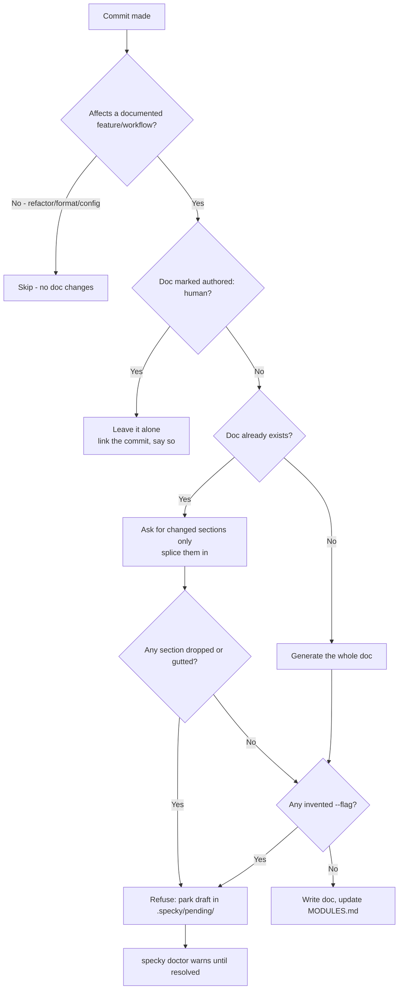

# Documentation — Feature Sync

## What It Does

On each commit, feature sync decides whether the change affects a documented feature or workflow, and if it does, brings that feature's reference doc (`specs/<domain>/<topic>.md`) up to date in place. Routine changes — refactors, formatting, dependency bumps, config-only edits — are skipped, so the docs stay about behaviour rather than churn.

Because it runs unattended on every commit, it is deliberately hard for it to make things worse. An update replaces only the sections the change actually affects; everything else is copied through byte for byte. A regeneration that would drop or gut a section is **refused** rather than written, and so is one naming a `--flag` this CLI doesn't have. A doc marked `authored: human` is never regenerated at all. A refused draft isn't thrown away: it's parked where a person can read it against the doc it would have replaced.

## How It Works

1. **Classify the commit** — The commit's message and diff go to the AI provider with the list of docs that already exist. It answers either "skip" or a `domain`/`topic` pair, and is steered toward naming an existing doc rather than inventing a sibling on the same subject. The request is sent in two halves: the instructions and that doc list are identical for every commit in a run and go as a cacheable prefix, and only the commit's own message and diff follow. That list grows with the doc set and is resent per commit, which makes it the largest thing this pass pays for on a mature repo — see [ai/provider-cost-controls.md](../ai/provider-cost-controls.md). Classification is never batched: it is fed the running list of docs written so far, and answering a whole backlog against one frozen list is how a run ends up with three docs about one subject.
2. **Check for a freeze** — If the target doc's frontmatter says `authored: human`, stop here. Nothing is generated, so a frozen doc costs only the classification call — but the commit is still linked to it, because a change to this feature is exactly when its owner should take a look.
3. **Update by section, or write from scratch** — An existing doc is sent in full with its heading list, and the provider is asked for `{"sections": {...}}` containing **only** the sections this change touches. A doc that doesn't exist yet is written whole from this commit alone. A response that isn't the JSON shape asked for is read as a whole replacement body instead of failing. What counts as that shape is read leniently, because the fallback is quiet and the near-misses are common: only the JSON object the response *starts with* has to parse, so trailing commentary, an unopened closing fence, or one closing brace too many still splice, and a frontmatter block echoed from the doc the model was shown is stripped before the parse rather than hiding the envelope behind it. Every JSON answer specky asks for is read this way, including the classification and `specky tag`.
4. **Splice the sections in** — Named sections replace their old content; unnamed sections are carried through unchanged, so `git diff specs/` shows what actually changed rather than every paragraph reflowed. A heading the doc doesn't have yet is appended.
5. **Measure what the update would cost** — Compare old and new section by section. A section that disappeared, or one over 400 characters that kept less than 80% of them, means this is a rewrite rather than an update. A whole-doc ratio backstops a rewrite that restructures the headings entirely.
6. **Check the flags it names** — Every `--flag` in the new body is compared against the real options `argparse` reports, then against tracked source outside `specs/`, ignoring comment lines. A flag that appears in neither is invented.
7. **Write, or refuse and park** — With no problem found, the doc is written with frontmatter rendered from this run's classification (hand-written `related`, `owner`, `authored` and `origin` values are carried over — the AI is never asked to produce any of them, and `origin` is where [documentation/doc-adoption.md](doc-adoption.md) recorded the path a doc was imported from; `sources:` is carried over for a different reason — it isn't hand-written but recorded by [cli/bootstrap.md](../cli/bootstrap.md), and it is the only thing giving a bootstrapped repo `specky check` coverage, so dropping it here would silently lose that within a day), and `specs/MODULES.md` gains a row if the doc is new. That index is a file humans edit too, so a row is only ever added when the doc is linked nowhere in it, and the domain's section is found by comparing headings on letters and digits alone — a hand-written `## N-Way Match` is the section for domain `nway-match`, not a near-miss to append a `## Nway Match` twin beside. Punctuation is all that's ignored: `## Docs` and `## Documents` stay separate sections. With a problem, the doc on disk is left untouched and the draft goes to `.specky/pending/<domain>/<topic>.md` — gitignored, so a refused rewrite can never reach a commit — with one line saying what it would have cost.

Why the guards are measured rather than guessed: across 33 honest doc updates in this repo's history, no section ever fell below 98% of its previous size, while the two rewrites that destroyed hand-written content ran 46–71% with sections missing outright. The 80% threshold sits in that gap. A false positive costs a refused write and a warning; a false negative costs prose nobody notices is gone.

## Where A Refusal Shows Up

A refusal is printed once by the hook, into terminal output nobody scrolls back to, so it is surfaced in two places that outlive that moment:

- **`specky doctor`** warns for as long as a draft is waiting, naming the first three. It stays a `warn` and never a `fail` — nothing is broken and nothing was lost; a doc is knowingly behind its code until someone reads the draft and then keeps it or deletes it.
- **`specky pr-comment`** carries a block for it, louder than its other notes: every other line in that comment describes a doc change that happened, and this one describes one that was stopped. The draft is gitignored, so it exists on the machine that generated it and nowhere else — which makes it the one thing about the range a reviewer cannot see anywhere else.

## Outcomes

| Outcome | When | Result |
|---------|------|--------|
| **Doc updated** | Commit affects a documented feature; the update passes every guard | Only the named sections change; `specs/MODULES.md` updated if needed |
| **Doc created** | Commit affects a feature with no existing doc | New file at `specs/<domain>/<topic>.md`; row added to `specs/MODULES.md` |
| **Skipped** | Refactor, formatting, dependency bump or config-only edit | No feature doc is generated or modified |
| **Frozen** | Target doc's frontmatter says `authored: human` | Body untouched, no generation call; the commit is still linked, and the hook says the doc may need a look |
| **Refused — content loss** | The regeneration drops a section, or guts one over 400 characters below 80% of its size | Doc on disk untouched; draft parked in `.specky/pending/`; one line names what would have gone |
| **Refused — invented flag** | The new body names a `--flag` neither `argparse` nor real source knows | Same treatment; the line names the flag |
| **Generation fails** | AI provider misconfigured or unreachable | Commit succeeds; the doc isn't updated; the error is reported |
| **Index row reused** | `specs/MODULES.md` already links the doc, under any heading | Nothing is added — the file is left byte-identical |
| **Index section reused** | The domain's section is titled differently but matches on letters and digits (`## N-Way Match` for `nway-match`) | The row goes into that section; no second section is created |
| **Conflict on index** | `specs/MODULES.md` has unusual formatting, or a heading carrying extra words (`## Billing (legacy)`) | Best-effort attempt to find or create the matching section; a heading with extra words is a different section and may need a manual fix |

## Acceptance Tests

| Given | When | Then |
|-------|------|------|
| An existing feature doc and a valid `specky.toml` | A commit changes behaviour that doc describes | The doc is revised in place; `specs/MODULES.md` is unchanged |
| No doc for a new feature, hook installed and configured | A commit adds a significant new feature | A new doc is created; a new row is added to `specs/MODULES.md` |
| A hand-written `specs/MODULES.md` with a `## N-Way Match` section | A doc under `nway-match/` is indexed | The row joins that section; no `## Nway Match` section is created |
| A `specs/MODULES.md` already linking a doc from a section named nothing like its domain | That doc is indexed again | The file is unchanged — no second row for a doc already indexed |
| A `specs/MODULES.md` with a `## Docs` section | A doc under `documents/` is indexed | A separate `## Documents` section is created — normalizing ignores punctuation, not letters |
| A doc with three sections | The provider names one of them in `{"sections": {...}}` | That section changes; the other two are byte-identical to before |
| A doc with three sections | The provider closes the envelope with one brace too many, or adds a sentence after it | Still spliced: the named section changes, and no `{"sections": ...}` text reaches the doc |
| A doc with three sections | The provider returns the same envelope behind an echoed `---` frontmatter block | Still spliced |
| A classification response with a trailing brace | The commit is documented | The doc is named and written rather than the commit being skipped as unparseable |
| A doc with three sections | The provider's response omits one of them entirely | Nothing is written; a draft appears in `.specky/pending/`; the note names the missing section |
| A doc whose `## How It Works` is 400+ characters | The provider returns that section at a third of its length, every heading intact | Nothing is written; the note reports the percentage kept |
| A doc with no `##` sections at all | The provider returns a much shorter body | Nothing is written; the whole-doc ratio is reported |
| Any doc | The generated body names `--not-a-real-flag` | Nothing is written; the note names the flag; a draft is parked |
| Any doc | The generated body names a real flag such as `specky doctor --json` | The doc is written |
| A doc whose frontmatter says `authored: human` | A commit affects that feature | The body is untouched; exactly one provider call is made (the classification); the note says `authored: human` |
| The same, written as `authored: Human ` with a trailing space | A commit affects that feature | Still frozen — the marker is read case-insensitively and trimmed |
| A doc carrying `related:` or `owner:` frontmatter | A regeneration is written | Those keys survive; `type`/`tags` come from this run's classification |
| A doc adopted from an old path, carrying `origin:` | A regeneration is written | `origin:` survives, so the provenance pointer isn't stripped the first time the doc is updated |
| An honest tightening of a doc's prose | Compared against the original | No content loss is reported |
| A short section (under 400 characters) that shrinks | Compared against the original | No content loss is reported — the ratio only applies to sections big enough for the loss to matter |
| A repo with a draft in `.specky/pending/` | Run `specky doctor` | The pending section is `warn` naming that doc; nothing is a `fail` |
| A repo with a draft in `.specky/pending/` | Run `specky pr-comment` | The comment carries a refused-draft block, even when the range changed no docs at all |
| A repo with an empty `.specky/pending/` | Run `specky pr-comment` | No refused-draft block appears |
| Several feature-affecting commits since the last sync | Run `specky sync` | Each affected doc is updated or refused individually; the run completes |
| `specky.toml` missing, or the provider endpoint unreachable | A commit is made | The commit succeeds; doc generation is skipped; the user sees the error |
