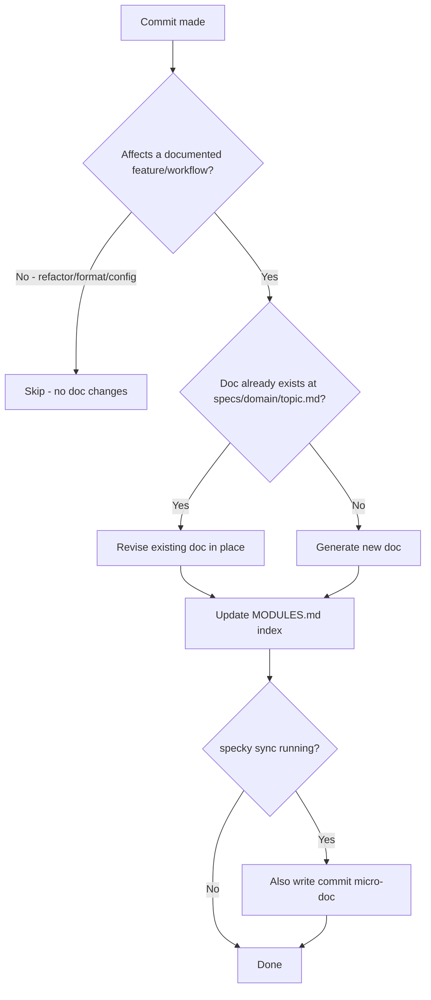

# Documentation — Feature Sync

## What It Does

On each commit, feature sync automatically detects whether your changes affect any documented features or workflows. If they do, it updates the living reference documentation (the `specs/<domain>/<topic>.md` file) to reflect the new behavior—revising the existing content rather than appending to it. Routine changes like refactoring, formatting, or config-only updates are skipped, keeping the docs focused on feature-level changes.

## How It Works

1. **Classify the commit** — The system examines each commit's diff and asks the AI provider: "Does this change affect a documented feature or workflow?" Refactors, formatting changes, and config-only edits are classified as non-feature changes and skipped.

2. **Identify the affected feature** — If the change is feature-affecting, the system determines which feature domain and topic it belongs to (e.g., `documentation/auto-commit-docs`).

3. **Fetch existing documentation** — The current content of `specs/<domain>/<topic>.md` (if it exists) is retrieved and passed to the AI provider for revision context.

4. **Generate or update the doc** — The AI provider revises the existing doc content to reflect the new behavior, or generates new documentation if the feature doc doesn't exist yet.

5. **Write and index** — The updated doc is written to `specs/<domain>/<topic>.md` in place. The `specs/MODULES.md` index is also updated to list the doc if it's new.

6. **Optional: Update commit changelog** — If `specky sync` is running, a corresponding micro-doc (commit summary) is also generated.

## Outcomes

| Outcome | When | Result |
|---------|------|--------|
| **Doc updated** | Commit affects a documented feature | `specs/<domain>/<topic>.md` is revised in place; `specs/MODULES.md` updated if needed |
| **Doc created** | Commit affects a new feature with no existing doc | New file created at `specs/<domain>/<topic>.md`; section added to `specs/MODULES.md` |
| **Skipped** | Commit is a refactor, formatting change, or config-only edit | No feature doc is generated or modified |
| **Generation fails** | AI provider misconfigured or unreachable | Commit succeeds; feature doc is not updated; error logged (if visible) |
| **Conflict on index** | `specs/MODULES.md` has unusual formatting | Best-effort attempt to find or create matching section; may need manual fix |

## Acceptance Tests

| Given | When | Then |
|-------|------|------|
| Repo with existing feature doc `specs/documentation/auto-commit-docs.md` and valid `specky.toml` | Commit modifies behavior described in that doc | Doc is revised in place to reflect new behavior; `specs/MODULES.md` unchanged |
| Repo with no feature doc for a new feature, hook installed and configured | Commit adds significant new feature | New doc created at `specs/<domain>/<topic>.md`; new section added to `specs/MODULES.md` |
| Repo with feature docs, hook installed | Pure refactor commit (no behavior change) | Feature docs unchanged; no new files written |
| Repo with feature docs, hook installed | Formatting or config-only commit | Feature docs unchanged; no new files written |
| `specky sync` runs on repo with existing feature docs and new commits | Multiple feature-affecting commits since last sync | Each affected feature doc is updated; sync completes without error |
| `specky.toml` missing or AI provider endpoint unreachable | Commit is made | Commit succeeds; feature doc generation is skipped; user sees error message |
