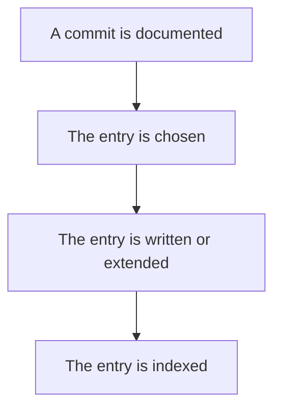

# Documentation — History Consolidation

## What It Does
When specky documents a commit, it usually writes one history entry per commit, which makes "wip" and "fix typo" each get their own page. History consolidation folds a branch's recent commits into a single entry that each new commit rewrites to describe the change as a whole. The result is a history trail that reads as changes rather than steps.

## How It Works
1. **A commit is documented.** Specky's git hook (or the document-commits skill) hands the pending commit to specky to record.
2. **The entry is chosen.** Specky decides whether the commit joins an existing entry or starts a new one; `extends` is `null` for a new entry, a path for an entry it joins by file, or a sha for an entry recorded earlier in the same pending list.
3. **The entry is written or extended.** A new entry is written from `rules`; a commit joining an entry follows `rules_extend`, describing the whole change (entry so far plus this commit), not this commit alone.
4. **The entry is indexed.** `record-commit` writes or extends the entry, indexes it, and prints its path.

## Outcomes
| Outcome | Meaning |
| --- | --- |
| Entry created | The commit got its own history entry under `specs/history/`. |
| Entry extended | The commit joined an existing entry, which was rewritten to describe the whole change. |
| Commit left pending | More than 5 commits were waiting; older ones stay pending until `specky sync` catches up. |

## Constants & Invariants
- One entry per branch, or on `main`/`dev` one entry named for the first commit's subject.
- An entry takes new commits for **4 days** after its first one (`[history] window_days`).
- On a long-lived branch, only one author's commits share an entry; integration branches belong in `[history] long_lived = ["sprint"]`.
- Only a branch's own first-parent commits fold in, never what a merge brought.
- `[history] consolidate = "off"` gives one entry per commit.
- Existing `<sha8>.md` docs are read as before and never renamed.
- At most 5 commits are worked through unless the user asked for more.
- Doc-sync commits carry a `Specky-Documents:` trailer naming the commits they document; `specky check` reads it for its coverage map.
- `record-commit` is the only writer under `specs/history/`.

## Edge Cases
| Situation | What happens | Why |
| --- | --- | --- |
| Commit on `main` or `dev` | Entry is named for the first commit's subject. | No branch name to use. |
| More than 4 days since the entry's first commit | Commit starts a new entry. | A week of hotfixes on `main` shouldn't pile into one file. |
| Second author on a long-lived branch | Only one author's commits share an entry. | Keeps one author's trail coherent. |
| Integration branch (e.g. `sprint`) | Belongs in `[history] long_lived = ["sprint"]`. | Integration branches need their own handling. |
| Merge brought in commits | Not folded in. | Only a branch's own first-parent commits fold in. |
| `[history] consolidate = "off"` | One entry per commit. | Opt out of folding. |
| Existing `<sha8>.md` docs | Read as before, never renamed. | Preserves prior history. |
| `extends` is a sha | Commit joins the entry recorded for that earlier commit in this list; read the path `record-commit` printed for it. | Links commits in the same pending batch. |
| `extends` is a path | Commit joins that entry; read it first. | Entry already exists on disk. |
| `commits` is empty | Say so and stop. | Nothing to document. |
| More than 5 pending commits | Older ones stay pending; `specky sync` catches up a long backlog. | Bounds work per run. |
| Commit message and diff state no motivation | Leave `why` empty. | Don't invent motivations. |

## Maintainer Notes
- Doc-sync commits must list the full shas of recorded commits in a `Specky-Documents:` trailer; `specky check` reads it for its coverage map.
- The `document-commits` skill and the git-hook path both rely on `record-commit` as the sole writer of `specs/history/`.
- The hook recognizes the `docs: sync specky docs [skip specky]` subject and doesn't document the docs commit itself.

## Acceptance Tests
| Given | When | Then |
| --- | --- | --- |
| A branch with a recent entry | A new commit is documented | The entry is extended to describe the whole change. |
| A commit whose `extends` is `null` | It is documented | It gets its own entry. |
| A commit on `main` or `dev` | It is documented | Its entry is named for the first commit's subject. |
| 5 days since the entry's first commit | A new commit is documented | It starts a new entry. |
| A merge brought a commit in | The branch's commits are documented | The merged commit is not folded in. |
| `[history] consolidate = "off"` | A commit is documented | It gets its own entry. |
| An existing `<sha8>.md` doc | History is read | It is read as before and never renamed. |
| More than 5 pending commits | Documentation runs | Older commits stay pending until `specky sync`. |
| `commits` is empty | Documentation runs | It reports so and stops. |
