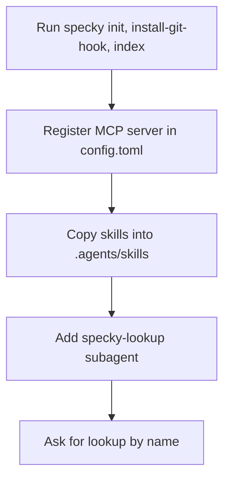

# Integration — Codex Setup

## What It Does
Connects the specky documentation tool to Codex, which has no plugin system and so must be wired up by hand. Running this setup gives Codex access to specky's docs, skills and an optional lookup helper, so Codex can answer "what does X do?" from the docs before reading code.

## How It Works
1. **Run the base commands** — run `specky init`, `specky install-git-hook` and `specky index` in the repo, the same three commands other integrations use.
2. **Register the MCP server** — add the `specky-mcp` server to `.codex/config.toml` in the repo, or to `~/.codex/config.toml` to make it available in every repo.
3. **Copy the skills** — place the `find-feature`, `explore-docs` and `document-domain` skills into `.agents/skills/`, the location Codex reads from.
4. **Add the lookup subagent (optional)** — place the `specky-lookup` subagent in `.codex/agents/` so doc lookups can run on a low-cost model.
5. **Ask for it by name** — request lookups explicitly, for example *"use the specky-lookup subagent to tell me what X does"*.

## Outcomes
| Outcome | What it means |
| --- | --- |
| Codex connection active | The MCP server and skills are in place and Codex can answer from specky's docs. |
| Lookup subagent available | The optional `specky-lookup` subagent is installed and can be invoked by name. |

## Edge Cases
| Situation | What happens | Why |
| --- | --- | --- |
| No plugin available | Setup must be done by hand rather than installed automatically. | Codex has no plugin system. |
| Config scope choice | The MCP server is registered either per-repo or for every repo. | `.codex/config.toml` is repo-scoped; `~/.codex/config.toml` is user-wide. |
| Subagent not added | Lookups still work, but no low-cost model handles them. | The `specky-lookup` subagent step is optional. |
| Subagent present but unused | Codex will not route work to it on its own. | Codex only uses the subagent when asked for it by name. |

## Acceptance Tests
| Given | When | Then |
| --- | --- | --- |
| A repo with `specky init`, `specky install-git-hook` and `specky index` already run | The MCP server is added to `.codex/config.toml` and the skills are copied into `.agents/skills/` | Codex can answer doc questions from specky's docs. |
| A user who wants specky available in every repo | The MCP server is added to `~/.codex/config.toml` | The server is available across all repos, not just one. |
| A user who skips the optional subagent step | Codex is asked a doc lookup question | The lookup still resolves through the MCP server and skills. |
| The `specky-lookup` subagent is installed | A lookup is requested without naming the subagent | Codex does not route the work to it; the user must ask for it by name. |
| The `specky-lookup` subagent is installed | The user asks *"use the specky-lookup subagent to tell me what X does"* | The lookup is answered by the subagent on a low-cost model. |
