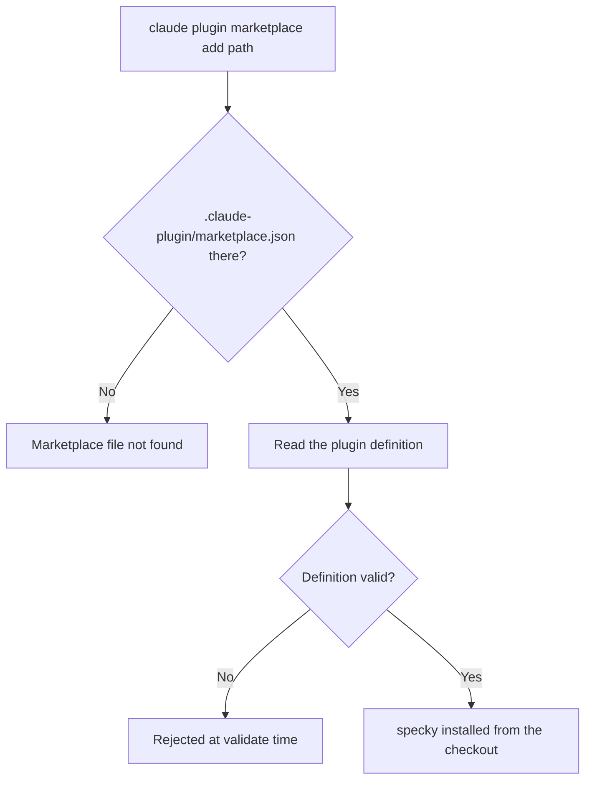

# Integration — Marketplace Installation

## What It Does

Makes specky installable into Claude Code using the standard plugin installation command. Without the marketplace manifest, the documented installation workflow failed with "Marketplace file not found." The manifest is a single-plugin marketplace that points to the checkout directory, enabling the install flow to work as documented.

## How It Works

1. **User runs the install command** — From a specky checkout, `claude plugin marketplace add /path/to/specky` tells Claude Code to register specky as an available plugin.

2. **Claude Code locates the manifest** — It reads `.claude-plugin/marketplace.json` from the provided path.

3. **Manifest describes the plugin** — The file declares specky as a documentation plugin, with a source path pointing to the checkout root (`./`).

4. **Installation completes** — Claude Code resolves the plugin definition and installs specky into the user's Claude Code environment.

## Outcomes

| Scenario | Outcome |
|----------|---------|
| Manifest present and valid | Installation succeeds; specky available as a Claude Code plugin |
| Manifest missing | `claude plugin marketplace add` fails with "Marketplace file not found" |
| Plugin definition invalid | `claude plugin validate` catches it during initial setup |

## Edge Cases

| Situation | What happens | Why |
|---|---|---|
| The path has no `.claude-plugin/marketplace.json` | The add fails with "Marketplace file not found" | The manifest is what makes a directory a marketplace; without it there is nothing to describe the plugin, and this was the failure the manifest was added to fix |
| The plugin definition is malformed | `claude plugin validate` rejects it during setup rather than at install time | A manifest that parses but describes nothing installable would fail later, further from the mistake |
| specky is already installed | The add is idempotent or says so | Re-running an install command is the ordinary response to an unclear first run |
| The checkout is moved after installing | The plugin stops resolving | `source` points at the checkout directory (`./`), so the install is a reference to a path on this machine, not a copy of it |

## Acceptance Tests

| Given | When | Then |
|-------|------|------|
| A specky checkout with `.claude-plugin/marketplace.json` present | User runs `claude plugin marketplace add /path/to/specky` | Installation completes without error |
| The marketplace.json references `source: "./"` | Claude Code resolves the plugin | specky loads from the checkout directory |
| User has already installed specky once | User runs the marketplace add command again | The operation is idempotent or reports that specky is already installed |
