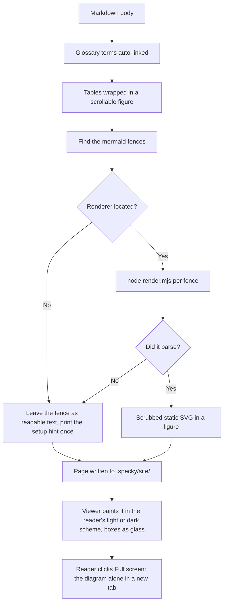

# Rendering — Diagram Support

## What It Does

Static diagram rendering at build time using Mermaid (SVG output via Node), auto-linking of glossary terms to hover tooltips, and styled markdown tables. Diagrams degrade to plain-text source if dependencies aren't installed; glossary linking and table styling always work. In the viewer, a diagram follows the reader's light or dark scheme, its boxes drawn as frosted glass panes over a softly tinted backdrop, and any rendered diagram can be opened on its own in a new tab, fitted to the window, to zoom and pan around it.

## How It Works

1. **Diagram fences identified** — `diagram_render.py` finds ` ```mermaid ` blocks in markdown source.
2. **The renderer is located** — The Node tool that draws diagrams is looked up at render time: `$SPECKY_MERMAID_DIR` first, then `~/.cache/specky/mermaid-render` (what `specky setup-diagrams` fills in, and the only copy that survives upgrading specky), then the copy inside the installed package (which is where a source checkout's own `npm install` puts it). A location holding the script but not its dependencies is skipped rather than tried and failed.
3. **Mermaid diagrams render to SVG** — Node + beautiful-mermaid converts each diagram to static `<svg>` at `render-html` time. Doc titles in diagram nodes are escaped (e.g., `]` becomes `#93;`, `"` becomes `#quot;`) to prevent special characters from breaking the mermaid syntax; if the renderer isn't installed anywhere, diagram source stays as plain text and the render completes anyway, with one printed hint naming `specky setup-diagrams`.
4. **Glossary terms auto-linked** — `link_glossary()` finds first mention of each `specs/GLOSSARY.md` term on each page, wraps it in a tooltip trigger; subsequent mentions left plain.
5. **Markdown tables wrapped** — `_wrap_tables()` nests each table in a scrollable `<figure class="tw">` with zebra-stripe CSS.
6. **Static site output** — Resulting HTML with embedded SVGs, tooltips, and styled tables written to `.specky/site/index.html`, opens via `file://` with zero client JS for diagram rendering.
7. **The viewer paints it in the reader's scheme** — The SVG carries light colors of its own; the viewer's stylesheet re-points them at the site's light or dark palette and draws every box (flowchart and state nodes, sequence actors and notes, class and ER boxes, subgraphs) as a translucent glass pane with rounded corners, a soft sheen and a hairline edge, lifted off a backdrop washed with the site's own colors by a small two-layer shadow. The figure carries no border and its backdrop is the page's own color, so the diagram reads as part of the page rather than a gray panel; the washes of accent, feature and tag color are faint enough to be a hint of tint behind the text. Diamonds, hexagons and sequence notes are polygons and keep their points. Arrowheads are gray rather than the link blue; a chart's bars keep the accent.
8. **A reader opens a diagram full screen** — Every rendered diagram in the viewer carries a Full screen button (shown on hover or keyboard focus); it opens that diagram alone in a new tab, fitted to the window and in the same scheme and glass as the page, where the mouse wheel zooms about the cursor, dragging pans, and a double-click fits it back to the window.



## Outcomes

| Condition | Behavior |
|-----------|----------|
| Node installed and `specky setup-diagrams` has run | Diagrams render to SVG; everything works |
| Node missing, or the renderer's dependencies never installed | Diagrams stay as plain ` ```mermaid ` fenced text; glossary + tables still work; one hint printed |
| specky upgraded after `setup-diagrams` | Diagrams keep rendering — the cache copy outlives the package directory |
| `specky setup-diagrams` run twice | Second run reports "already up to date" and calls npm again only if the tool's `package.json` changed |
| Doc title contains `]` or `"` | Title rendered intact; special characters escaped to mermaid entity codes in diagram |
| Glossary term appears multiple times on a page | First mention linked to tooltip; rest stay plain text |
| Markdown table in doc | Wrapped in scrollable `<figure>`; readable on any viewport |
| Diagram narrower than its column | Shown at its natural size |
| Diagram 600px wide or less that doesn't fit its column | Shrunk to the column's width |
| Diagram wider than 600px that doesn't fit its column | Keeps its natural size and scrolls sideways rather than being shrunk until its labels are unreadable |
| Reader clicks a diagram's Full screen button | The diagram opens alone in a new tab, fitted to the window, with wheel zoom, drag to pan and double-click to refit |
| Reader's system is in dark mode | Diagrams use the site's dark palette — light text on dark glass panes — in the page and in the full-screen tab |
| Reader has asked for reduced transparency or more contrast | Diagram boxes are solid and the backdrop plain: the same diagram without the glass, still rounded and raised |
| Doc exported with `specky export` (single page or PDF) | Diagrams keep the flat light colors they were rendered with, for print |

## Edge Cases

| Situation | What happens | Why |
|---|---|---|
| Node isn't installed, or the renderer's dependencies never were | Every fence stays as readable text and the render still completes, with one hint naming `specky setup-diagrams` | A missing optional tool should cost you the pictures, not the site — and the source of a mermaid diagram reads perfectly well as text |
| A directory holds `render.mjs` but no `node_modules` | It is skipped and the next candidate tried | Trying it would fail at run time, which looks like a broken diagram rather than an incomplete install |
| specky is upgraded after `setup-diagrams` | Diagrams keep rendering | The `~/.cache/specky` copy is searched before the package's own, and it is the only one that outlives an upgrade |
| A diagram doesn't parse | That one fence stays as text; the rest of the page renders | One bad diagram is not a reason to fail a whole site build, and the source is the most useful thing to show instead |
| A doc title contains `]` or `"` | It is escaped to a mermaid entity and renders intact | Those characters end a node label, so an unescaped title breaks the diagram that quotes it |
| The same glossary term appears several times on a page | Only the first is wrapped | Marking every mention turns a paragraph into a field of underlines |
| A glossary term appears inside code, a link or a diagram | It is left alone | There it is a literal or already has its own behaviour |
| The doc has no diagrams, no tables and no glossary matches | It renders unchanged | Every step is a no-op on content that has nothing for it to do |
| A diagram appears in a Spec Assistant answer | It gets the same Full screen button | Answers can carry diagrams too, and the panel is the narrowest place one is ever shown |
| The site is opened straight from disk (`file://`) | Full screen works as it does under `specky serve` | The new tab is built in the browser from the diagram already on the page, so there is nothing to fetch and no file per diagram to write |
| A diagram is copied out of the viewer (the export, a PDF) | It shows the light colors it was rendered with | The viewer's theme comes from its stylesheet and is never written into the SVG, so the diagram still stands on its own anywhere that stylesheet isn't |
| A diagram colors its own boxes (`classDef` or `style`, as `specky graph`'s does) | Those boxes keep their colors and get no glass, but are rounded and raised like the rest; their labels stay dark in both schemes | The colors were picked against the light diagram, and the dark scheme's light text would all but vanish on them |
| A Spec Assistant answer contains a bar or line chart | Its bars keep the accent color while every other diagram's arrowheads are gray | Arrowheads and chart series are drawn through the same color; gray arrows keep blue meaning "you can click this", but a gray chart would lose its data |
| Reader's browser asks for reduced transparency | Subgraphs fall back to the secondary surface rather than the page color | The backdrop is now the same color as a node, so a solid node needs the secondary surface to still stand apart from the group it sits in |
| The full-screen tab | Opens in the reader's scheme, glass included | It has no stylesheet of its own, so it is handed the page's colors as they resolve at the moment the button is clicked |
| The full-screen tab is reloaded after the page that opened it is closed | It no longer loads | Its address is a temporary `blob:` link that belongs to the page that made it; open the diagram again from the doc |

## Acceptance Tests

| Given | When | Then |
|-------|------|------|
| Workflow doc with ` ```mermaid flowchart ` block + Node installed | `render-html` runs | Output contains static `<svg>`; no errors in render log |
| Workflow doc with ` ```mermaid flowchart ` block + Node NOT installed | `render-html` runs | Fenced block stays as plain text; render completes; `doctor.sh` warns setup missing |
| Renderer installed in the cache dir and in the package | `render-html` runs | The cache copy is used, so a specky upgrade can't silently disable diagrams |
| A directory holding `render.mjs` but no `node_modules` | Renderer is located | That directory is skipped; the next candidate is tried |
| Doc titled "Billing [v2] (draft)" in diagram graph | `render-html` runs | SVG node label reads "Billing [v2] (draft)" complete; nothing truncated |
| Doc title contains `"` character | Diagram builds | Title rendered correctly; `"` escaped to `#quot;` in mermaid syntax |
| Glossary term appears in doc twice | `link_glossary()` runs | First mention wrapped in tooltip; second mention plain |
| Markdown table in feature doc | `_wrap_tables()` runs | Table inside `<figure class="tw">` with `overflow-x: auto`; no layout break on mobile |
| Document with no diagrams + no glossary matches + no tables | `render-html` runs | Doc renders unchanged; no errors |
| A 900px-wide diagram in a column too narrow for it | The page is viewed | The diagram keeps its natural size inside a sideways-scrolling strip |
| A rendered diagram in the viewer | Reader clicks Full screen | A new tab shows only that diagram, fitted to the window; the doc page is unchanged |
| The full-screen tab | Reader scrolls the wheel, drags, then double-clicks | The diagram zooms about the cursor, pans with the pointer, then fits back to the window |
| A Spec Assistant answer containing a diagram | The answer appears | Its diagram has a Full screen button too |
| The site opened via `file://` | Reader clicks Full screen | The tab opens and works as it does under `specky serve` |
| A rendered diagram, reader's system in dark mode | The page is viewed | Diagram text is light on a dark backdrop; no light box sits on the dark page |
| Reader's browser set to reduce transparency | The page is viewed | Diagram boxes are solid, the backdrop plain |
| A doc with a diagram | `specky export` writes the single page | The diagram has its flat light colors and no glass |
