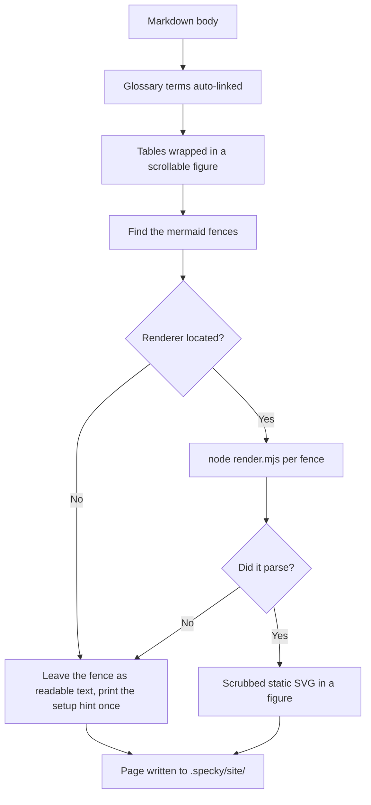

# Rendering — Diagram Support

## What It Does

Static diagram rendering at build time using Mermaid (SVG output via Node), auto-linking of glossary terms to hover tooltips, and styled markdown tables. Diagrams degrade to plain-text source if dependencies aren't installed; glossary linking and table styling always work.

## How It Works

1. **Diagram fences identified** — `html_render.py` finds ` ```mermaid ` blocks in markdown source.
2. **The renderer is located** — The Node tool that draws diagrams is looked up at render time: `$SPECKY_MERMAID_DIR` first, then `~/.cache/specky/mermaid-render` (what `specky setup-diagrams` fills in, and the only copy that survives upgrading specky), then the copy inside the installed package (which is where a source checkout's own `npm install` puts it). A location holding the script but not its dependencies is skipped rather than tried and failed.
3. **Mermaid diagrams render to SVG** — Node + beautiful-mermaid converts each diagram to static `<svg>` at `render-html` time. Doc titles in diagram nodes are escaped (e.g., `]` becomes `#93;`, `"` becomes `#quot;`) to prevent special characters from breaking the mermaid syntax; if the renderer isn't installed anywhere, diagram source stays as plain text and the render completes anyway, with one printed hint naming `specky setup-diagrams`.
4. **Glossary terms auto-linked** — `link_glossary()` finds first mention of each `specs/GLOSSARY.md` term on each page, wraps it in a tooltip trigger; subsequent mentions left plain.
5. **Markdown tables wrapped** — `_wrap_tables()` nests each table in a scrollable `<figure class="tw">` with zebra-stripe CSS.
6. **Static site output** — Resulting HTML with embedded SVGs, tooltips, and styled tables written to `.specky/site/index.html`, opens via `file://` with zero client JS for diagram rendering.



## Outcomes

| Condition | Behavior |
|-----------|----------|
| Node installed and `specky setup-diagrams` has run | Diagrams render to SVG; everything works |
| Node missing, or the renderer's dependencies never installed | Diagrams stay as plain ` ```mermaid ` fenced text; glossary + tables still work; one hint printed |
| specky upgraded after `setup-diagrams` | Diagrams keep rendering — the cache copy outlives the package directory |
| `specky setup-diagrams` run twice | Second run reports "already up to date" and calls npm again only if the tool's `package.json` changed |
| Doc title contains `]` or `"` | Title rendered intact; special characters escaped to mermaid entity codes in diagram |
| Glossary term appears multiple times on a page | First mention linked to tooltip; rest stay plain text |
| Markdown table in doc | Wrapped in scrollable `<figure>`; readable on any viewport |

## Edge Cases

| Situation | What happens | Why |
|---|---|---|
| Node isn't installed, or the renderer's dependencies never were | Every fence stays as readable text and the render still completes, with one hint naming `specky setup-diagrams` | A missing optional tool should cost you the pictures, not the site — and the source of a mermaid diagram reads perfectly well as text |
| A directory holds `render.mjs` but no `node_modules` | It is skipped and the next candidate tried | Trying it would fail at run time, which looks like a broken diagram rather than an incomplete install |
| specky is upgraded after `setup-diagrams` | Diagrams keep rendering | The `~/.cache/specky` copy is searched before the package's own, and it is the only one that outlives an upgrade |
| A diagram doesn't parse | That one fence stays as text; the rest of the page renders | One bad diagram is not a reason to fail a whole site build, and the source is the most useful thing to show instead |
| A doc title contains `]` or `"` | It is escaped to a mermaid entity and renders intact | Those characters end a node label, so an unescaped title breaks the diagram that quotes it |
| The same glossary term appears several times on a page | Only the first is wrapped | Marking every mention turns a paragraph into a field of underlines |
| A glossary term appears inside code, a link or a diagram | It is left alone | There it is a literal or already has its own behaviour |
| The doc has no diagrams, no tables and no glossary matches | It renders unchanged | Every step is a no-op on content that has nothing for it to do |

## Acceptance Tests

| Given | When | Then |
|-------|------|------|
| Workflow doc with ` ```mermaid flowchart ` block + Node installed | `render-html` runs | Output contains static `<svg>`; no errors in render log |
| Workflow doc with ` ```mermaid flowchart ` block + Node NOT installed | `render-html` runs | Fenced block stays as plain text; render completes; `doctor.sh` warns setup missing |
| Renderer installed in the cache dir and in the package | `render-html` runs | The cache copy is used, so a specky upgrade can't silently disable diagrams |
| A directory holding `render.mjs` but no `node_modules` | Renderer is located | That directory is skipped; the next candidate is tried |
| Doc titled "Billing [v2] (draft)" in diagram graph | `render-html` runs | SVG node label reads "Billing [v2] (draft)" complete; nothing truncated |
| Doc title contains `"` character | Diagram builds | Title rendered correctly; `"` escaped to `#quot;` in mermaid syntax |
| Glossary term appears in doc twice | `link_glossary()` runs | First mention wrapped in tooltip; second mention plain |
| Markdown table in feature doc | `_wrap_tables()` runs | Table inside `<figure class="tw">` with `overflow-x: auto`; no layout break on mobile |
| Document with no diagrams + no glossary matches + no tables | `render-html` runs | Doc renders unchanged; no errors |
